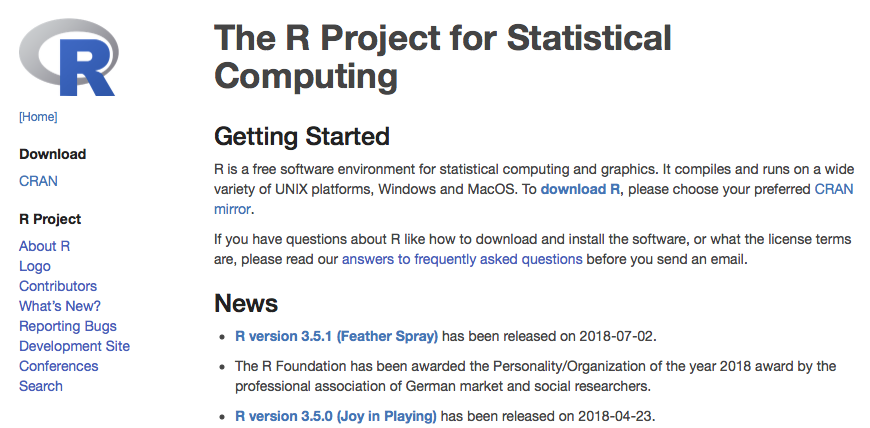
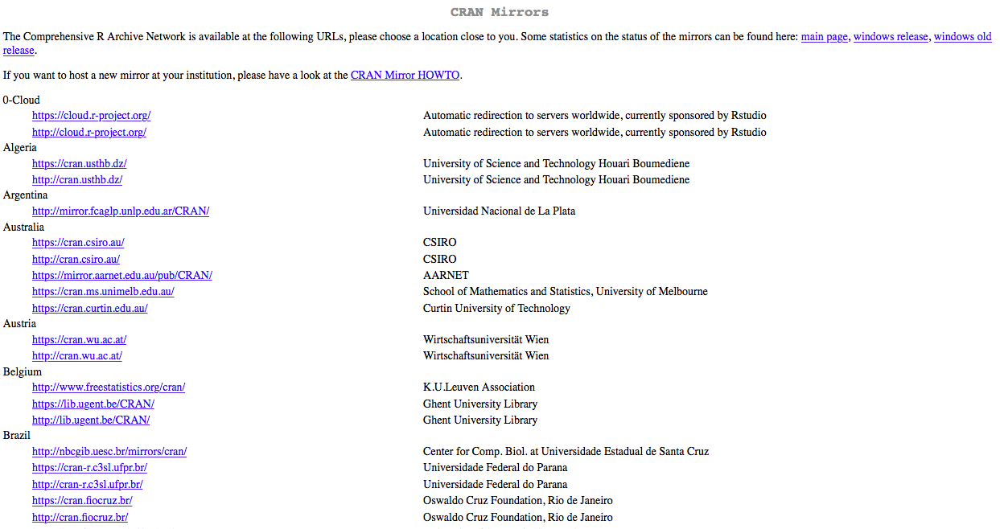
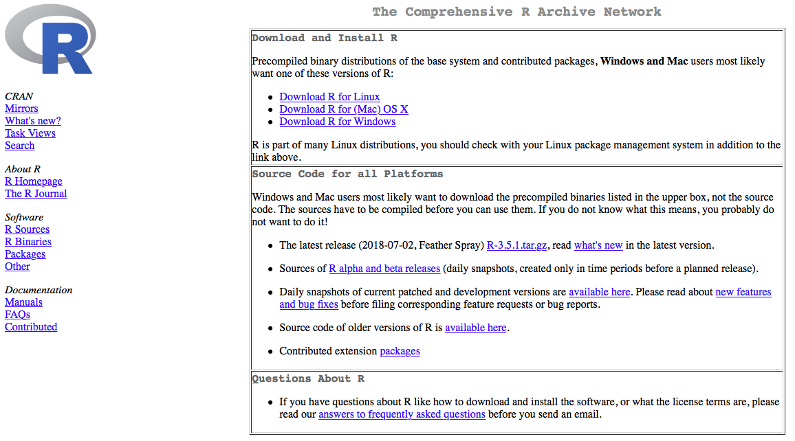
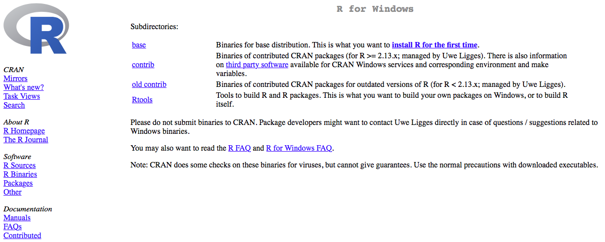
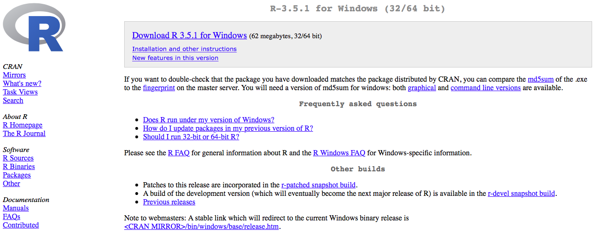
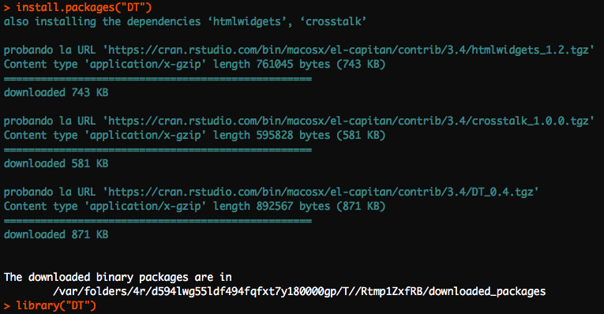
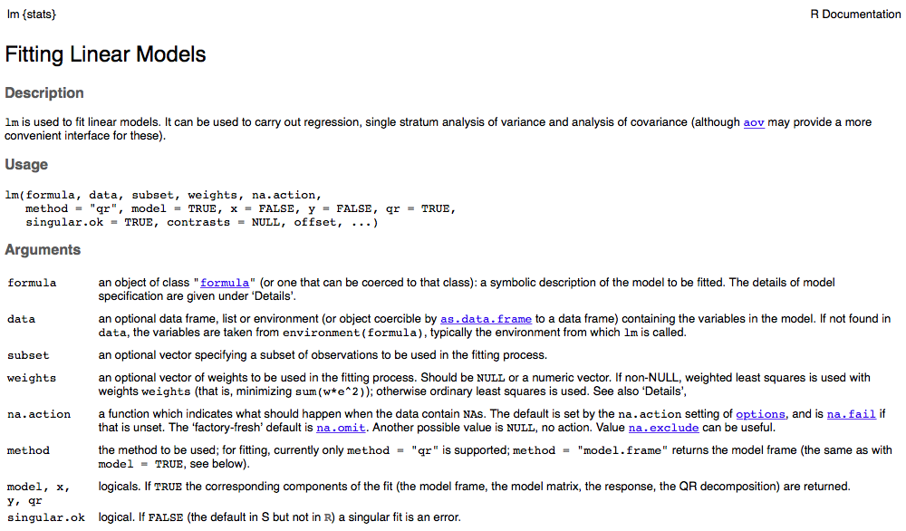
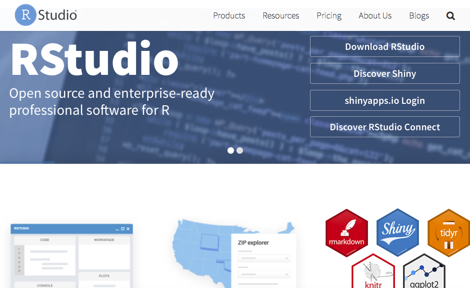

# Introducción

En su definición más amplia, __R__ es un lenguaje de programación que permite al usuario programar y utilizar todas las librerías y algoritmos que han sido programadas por otros. Con R se pueden escribir funciones, hacer cálculos, aplicar técnicas estadísticas, crear gráficos sencillos o complejos, e incluso compartir tus propias funciones en una librería. Un amplio grupo de usuarios lo utiliza en todo el mundo, incluso muchos institutos de investigación, empresas y universidades están utilizando el lenguaje y entorno R. En los últimos cinco años, muchos libros se han publicado sobre R, una de las razones fundamentales es que R está disponible de forma gratuita.

Fue inicialmente diseñado por _Robert Gentleman_ y _Ross Ihaka_, miembros de la universidad de Auckland, en Nueva Zelanda. _Robert Gentleman_ es un estadístico Canadiense y bioinformático, actualmente es vicepresidente de Biología computacional en _23andMe_. _Ross Ihaka_ estadístico graduado en la universidad de California Berkeley en 1985, actualmente es profesor asociado de la universidad de Auckland. 

__R__ se considera como la versión libre de otro programa llamado __S__ o __S-Plus__ (GNU S, software libre de S) desarrollado en los laboratorios Bell (Bell Labs es una compañia estado unidense encargada en la investigación y desarrollo cientifico, perteneciente a la empresa filandesa _NOKIA_, su sede se encuentra en New Jersey, entre sus patentes más importantes tenemos: La libreta de un solo uso, el transitor, el láser, la fibra óptica, la tecnología DSL, la telefonía móvil, los satélites de comunicación, el sistema operativo UNIX, el lenguaje de programación C y C++.). __S__ es un sistema desarrollado para el análisis de datos desarrollado por _John Chambers_, _Rick Beckler_ y diferentes colaboradores desde finales de 1970, en esa época los análisis estadísticos se desarrollaban mediante subrutinas en __Fortran__ (Lenguaje de programación de alto nivel, modular, y usado principalmente en aplicaciones científicas y matemáticas), por lo tanto éstos desarrollaron un conjunto de bibliotecas de macros Fortran, permitiendo la automatización de tareas repetitivas pudiendo hacer mediante una sola llamada u orden de ejecución una serie de intrucciones.

Entonces ¿Por qué no todo el mundo lo está utilizando? Esta es una pregunta fácil de responder: __R__ amerita una curva de aprendizaje, su uso requiere de conocimientos programación, y, aunque existen varias interfaces gráficas para los usuarios, ninguna es lo suficientemente amplia como para evitar por completo la programación. Sin embargo, una vez que se domina el uso básicos de __R__, es poco probable que utilice cualquier otro paquete de software con funcionalidades similares.

La programación en __R__ es homogénea, en el sentido de que la forma de trabajar con distintas librerías es similar, se siguen patrones de trabajo que facilitan el uso de todas sus funcionalidades. Por lo tanto, una vez que se aprende a aplicar un método como la regresión lineal, modificar el código para generalizar un modelo lineal, solo requiere la modificación de algunas opciones y pequeños cambios en el modelo y las fórmulas. Además, __R__ cuenta con excelentes paquetes estadísticos. Gran parte de los métodos estadísticos más populares y también algunos más nuevos, ya están programados y disponibles (ya sea como parte del paquete principal o como un paquete aportado por la comunidad de usuarios).

## Características principales del lenguaje __R__

- Sintaxis similar a __S__.

- Semántica similar a __S__.

- Corre en cualquier sistema operativo (Windows, MAC OS, Linux y Unix), adicionalmente tiene constantemente cambios de versiones.

- Tamaño muy pequeño. Las funcionalidades se le agregan utilizando paquetes.

- Es un lenguaje orientado a objetos.

- Buena capacidad para la generación de gráficos.

- Se puede usar de modo iterativo para probar modelos, es también usado para realizar nuevas herramientas.

- Existe una comunidad activa y que estimula constantemente paquetes y funciones. Generalmente está orientado a la Ciencia de los Datos, facilitando el procesamiento y análisis de datos. Más de 8.000 paquetes desarrollados y disponibles en CRAN: <http://cran.r-project.org/>

- Es totalmente gratis.

- Es un software libre (__GNU S__, sofware libre de __S__). Con esto los usuarios tienen la libertad de ejecutar, copiar, distribuir, modificar y mejorar el software.

## Desventajas del lenguaje __R__

- Tiene un sistema integrado de gráficos 3D, el cual no esta completamente integrado en el sistema.

- El procesamiento es con datos en memoria RAM (los datos deben estar en la memoria RAM para ser procesados). Para grandes volúmenes de datos es necesario contar con un computador con suficiente memoria RAM, en el caso de tener un computador con poca memoria RAM se podrían tener problemas.

- Las funciones que se usan estan basadas en los usuarios, si se quiere un nuevo análisis, como la implementación de un nuevo modelo o simplemente querer probar nuevas tecnologías, se debe esperar a que la comunidad las implemente o se tendría que desarrollar para lo que generalmente se necesite un manejo superior en programación.

- No es ideal para usarlo con todo, aun es un nicho muy pequeño.

## El diseño del lenguaje __R__

Este lenguaje de programación está constituido por un sistema base y de paquetes adicionales que extienden su funcionalidad.

El diseño fundamental de este lenguaje se basa en los tres pilares siguientes:

- __R Base Core__: Contiene las funcionalidades del lenguaje, los paquetes bases que nos ayudan a manipular datos con algunos métodos básicos. Entre los paquetes bases tenemos _utils, stats, datasets, compiler, parallel, tools, methods, splines, tcltk, graphics, grDevices, grid, splines, statS4_.

- __Paquetes Recomendados__: Estos paquetes son los más utilizados para realizar cualquier cálculo estadístico. Entre estos paquetes encontramos _boot, class, cluster, codetools, foreign, KernSmooth, lattice, mgcv, name, rpart, survival, MASS, nnet, Matrix_. 

- __Paquetes del CRAN__: El CRAN (Comprehensive R Archive Network) es una red de sitios web, en todo el mundo, que actuan como distribuidores de los archivos de R, extensión de paquetes y documentación. En el CRAN podemos encontrar más de 8000 paquetes contribuidos y subidos por los usuarios. El sitio web es el siguiente <https://cran.r-project.org/mirrors.html>

## Instalación de __R__ y de paquetes de __R__

Para descargar __R__, el primer paso es dirigirse a la página oficial [http://www.r-project.org/](http://www.r-project.org/), luego dirigirse a la sección "download R"  o "CRAN", ver figura \ref{fig:img001}.

Una vez allí, se le solicitará que elija un "CRAN mirror”, las palabras "CRAN mirrors” se debe a que estos enlaces actuan como espejos de los archivos localizados en servidores por todo el mundo, lo cual facilita la descarga de la información, se recomienda utilizar la "0-Cloud”, o nube original, desde la que se envía la información a los otros servidores, a continuación la lista de espejos que se mostrará. Ver figura \ref{fig:img002}.

Luego de seleccionar la Nube original o "0-Cloud” se tendrá la pantalla de dicho CRAN, donde se tendrá el material disponible sobre R, en la parte izquierda se tendrá ayudas, manuales, e información general sobre el software, en la parte superior los link para la descarga del lenguaje dependiendo el sistema operativo y en la parte inferior el código fuente para todas las plataformas. Ver figura \ref{fig:img003}.

Para instalar __R__ se debe hacer clic en el enlace según el sistema operativo en que se esté trabajando, supongamos que se tiene Windows. Ver figura \ref{fig:img004}.

En los subdirectorios se tendrá la opción de instalar __R__ por primera vez (install __R__ for the first time), daremos clic en dicho enlace, en la pantalla que se mostrará se debe seleccionar en la parte superior del link que contiene la última versión de __R__ al momento de consulta, de igual manera en la parte inferior se dispone de un link para acceder a versiones previas "Previous releases”. Ver Figura \ref{fig:img005}

En la sección "Previous releases” se tendrá la lista completa de las versiones de __R__ y sus fechas de salida, es importante resaltar lo frecuente con que se publican las actualizaciones, ya que muchos elementos utilizados para el funcionamiento correcto de __R__ depende de la versión que se esté utilizando, y en algunos casos se recomienda no trabajar con la última versión del software.

Cuando ya se tenga descargado el software se abre el instalador y se ejecuta seleccionando el lenguaje con el que se quiera trabajar.

Para la instalación de paquetes se usa el comando `install.packages()`, donde el nombre del paquete va dentro de comillas como argumento, luego que el paquete esté instalado se debe cargar dicho paquete para poder hacer uso de las funciones que el mismo contiene, esto se hace con el comando `library()`. En la figura \ref(fig:img006) se muestra la instalación del paquete llamado "DT".

## Ayuda en __R__

La primera función que utilizaremos para la opción de ayuda es `help.start()`, cuando la colocamos en la consola se nos despliega una ayuda en la cual se muestra información general de __R__, como manuales relacionados al lenguaje, la importación y exportación de datos, la instalación y administración de __R__, enlaces hacia los paquetes, información sobre __R__ como su licencia GNU, sobre los autores, entre otros.

Ahora si estamos interesados en otros comando, o buscando un comando que realice cierto trabajo en particular, utilizamos la función `help()` o su equivalente que es `?`. 

La figura \ref{fig:img007} muestra la ventana que se nos desplega cuando colocamos el comando `help(lm)`, `lm` son las iniciales que se usan para los modelos de regresión lineal.

En la primera línea se observa el comando que buscamos y dentro de `{ }` el paquete al cual pertenece dicha función o operador.
Luego tenemos el título, que corresponde a la función principal que tiene el comando, seguido de esto se tiene información específica sobre la misma, algunas de estas pueden ser las siguientes:

- __Description__: Se tiene una breve descripción de lo que cálcula la función o lo que realiza el operador.

- __Usage__: En el caso de tener una función, nos da el nombre con todos los argumentos que usa, mostrando los valores por defecto que estos toman; en el caso de un operador describe su uso típico.

- __Arguments__: Cuando se tiene una función en esta sección se describe de manera detallada cada uno de sus argumentos, o parámetros de entrada; en el caso de un operador se explican los tipos de objetos que se usan para usar dicho operador.

- __Details__: En esta sección se muestra una descripción detallada de la función u operador.

- __Value__: Se explica los valores que retorna la función o el resultado que se tendrá si se aplica el operador.

- __See Also__: Generalmente se muestran enlaces a otras páginas de ayuda con funciones u operadores similares.

- __Examples__: Algunos ejemplos usando la función o el operador.

Si se desea buscar una función que realice un cálculo específico podemos usar palabras claves sobre dicho cálculo usando el comando `help.search()`, este mostrará todas las funciones, con el paquete al que pertenecen, que tienen en su título las palabras colocadas como argumentos en dicho comando. Por ejemplo si se quiere conseguir una instrucción para realizar una regresión lineal, la palabra clave podría ser “lineal”. 

Otros comandos relacionados con la ayuda serían los siguientes:

`apropos("mean")`: Lista los objetos cuyos nombres coincidan con “mean”.

`example("mean")`: muestra un ejemplo encontrado en la página de ayuda para la función “mean”.

Otras opciones que suelen ser muy utiles a la hora de solicitar ayuda es consultar a alguien con más experiencia. La comunidad que conforma __R__ tiene una lista de correos para solicitar ayuda sobre __R__ en español y se entiende como un complemento social a la documentación, libros, etc. En el siguiente enlace se encuentra una descripción detallada de como hacer uso de esto <https://stat.ethz.ch/mailman/listinfo/r-help-es>.

## RStudio

Antes de explicar que es RStudio, vamos hablar de que es un ambiente de desarrollo integrado o entorno de desarrollo interactivo, IDE por sus siglas en ingles (integrated development environment), estos son aplicaciones que facilitan a los desarrolladores o programadores el desarrollo de sofware. Normalmente consiste de un editor de código fuente, construcciones automaticas de herramientas y un depurador.

El límite entre un IDE y otras partes del entorno de desarrollo de software más amplio no está bien definido. Muchas veces, a los efectos de simplificar la construcción de la interfaz gráfica de usuario (GUI, por sus siglas en inglés) se integran un sistema controlador de versión y varias herramientas. Muchos IDE modernos también cuentan con un navegador de clases, un buscador de objetos y un diagrama de jerarquía de clases, para su uso con el desarrollo de software orientado a objetos.

El proyecto __RStudio__ ofrece actualmente la mayor parte de las características deseadas para un IDE de una manera novedosa, haciendo más fácil y más productivo utilizar __R__. Algunos puntos destacados son:

- Los principales componentes de un IDE están muy bien integrados en un diseño de cuatro paneles que incluye una consola para sesiones interactivas __R__, una con pestañas para organizar los archivos de un proyecto, y los paneles para organizar los diferentes elementos menos centrales.

- La consola y editor de código fuente están estrechamente vinculados al sistema de ayuda interna de __R__ a través de la implementación del tabulador y el componente visor de páginas de ayuda.

- La creación de diferentes proyectos es muy fácil, y cambiar entre ellos es aún más fácil.

- __RStudio__ ofrece muchas herramientas administrativas convenientes y fáciles de usar para la gestión de paquetes, el espacio de trabajo, archivos y más.

- El IDE está disponible para los tres sistemas operativos principales y se puede ejecutar a través de un navegador web para el acceso remoto.

- __RStudio__ es mucho más fácil de aprender que Emacs / ESS, más fácil de configurar e instalar que Eclipse / Statet, tiene un mejor editor que JGR, es mejor organizado que Sciviews, y a diferencia de Notepad ++ y Rgui, está disponible en más plataformas que sólo la de Windows, es decir entre las diversas alternativas de IDE para __R__ es la más versátil.

__RStudio__ es un proyecto construido sobre muchos otros proyectos de código abierto. Su objetivo declarado -que ya se está cumpliendo- es desarrollar una herramienta gratuita de gran alcance que apoya las prácticas y técnicas requeridas para la realización de análisis estadístico de alta calidad. 

En resumen __RStudio__ es un entorno de desarrollo integrado para __R__. Con él se proporciona un lugar centralizado y bien organizado para hacer casi cualquier cosa que usted quiera hacer con __R__.

Al igual que __R__, __RStudio__ es sencillo de instalar, para ello el paso inicial es acceder a la página oficial <https://www.rstudio.com/> y luego hacer clic en “Download Rstudio”, luego en la parte inferior hacer clic en “Download Rstudio Desktop” y escoger la aplicación según el sistema operativo con el que trabaje su equipo. Ver la Figura \ref{fig:img008}

