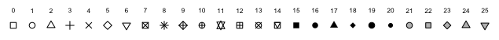

# Gráficos

Las funciones de gráficos que conforman el sistema de gráficos tradicional del lenguaje de programación __R__ están en el paquete llamado `graphics`, el cual es un paquete que se encuentra en la base del programa. En esta sección presentaremos algunas funciones que trae dicho paquete para realizar los gráficos elementales.

Existen otros paquete más vanzados para realizar gráficos entre ellos tenemos `lattice` y `ggplot2`, estos están basados en el sistema de cuadrícula.

## Gráfico de Puntos

La función más utilizada para realizar gráficos es `plot()`, el gráfico que da por defecto está función es el gráfico de puntos, donde cada punto corresponde a cada coordenada de valores introducido en los parámetros de entrada, a este tipo de gráfico generalemente se le denomina diagrama de dispersión de puntos de $y$ frente a $x$.

La mayoria de sus argumentos de entrada son compartidos con el resto de las funciones para realizar gráficos. Para un uso simple de dicha función basta con pasar dos vectores del mismo tamaño con las coordenadas o valores correspondientes para los ejes $x$ y $y$.

```{r}
valores_x <- c(1.2,3.4,1.3,-2.1,5.6,2.3,3.2,2.4,2.1,1.8,1.7,2.2)
valores_y <- c(2.4,5.7,2.0,-3,13,5,6.2,4.8,4.2,3.5,3.7,5.2)
plot(x=valores_x,y=valores_y)
```

Entre sus parámetros de entrada tenemos:

- `x` e `y` : Vectores con los valores correspondientes a cada par ordenado de puntos.

- `pch` : Este argumento cambia la forma de los puntos para realizar la nube de puntos, en la figura \ref{fig:img009} podemos ver algunos ejemplos de estas formas.



- `col` : Carácter que específica el color que van a tener los puntos (o cualquier forma seleccionada) en el gráfico. La manera más usual para colocarlo es con el nombre respectivo en ingles.

- `xlab` , `ylab` : Reciben una cadena de caracteres con los nombres respectivos para etiquetar los ejes del gráfico.

- `main` : Recibe una cadena de caracteres con el título del gráfico.

```{r}
plot( x=valores_x, y=valores_y, pch=8, col="blue", xlab = "Eje de las x",
      ylab = "Eje de las y", main = "Mi primer gráfico")
```

En caso de que se quieran agregar puntos adicionales al gráfico que ya hemos construido podemos usar la función `points()`, esta función recibe los mismos parámetros de entrada que la función `plot()`.

```{r}
x_1 <- c(-1,0,-1.5,0.2,0.4)
y_1 <- c(2,3,4,5,6)
plot( x=valores_x, y=valores_y, pch=8, col="blue", xlab = "Eje de las x",
      ylab = "Eje de las y", main = "Mi primer gráfico")
points( x=x_1, y=y_1, pch=16, col='red')
```

Para agregar una leyenda usamos la función `legend()`, ésta tiene como parámetros de entrada los siguientes:

  - `x` e `y`: las coordenadas donde se quiere que aparezca la leyenda.
  
  - `legend` : Un vector de caracteres con las leyendas respectivas. 
  
  - `type` : El tipo o forma que tiene gráfico, puede ser un gráfico de puntos `p`, de línea `l` o de ambos `o`.
  
  - `bty` : Para colocar la leyenda dentro de una caja, toma dos valores `o` para que aparezca dentro de una caja y `n` para que no.
  
  - También se le puede específicar el color `col` la forma de los puntos `pch`.
  
```{r}
plot( x=valores_x, y=valores_y, pch=8, col="blue", xlab = "Eje de las x",
      ylab = "Eje de las y", main = "Mi primer gráfico")
points( x=x_1, y=y_1, pch=16, col='red')
legend(x=4, y=0, col=c('blue','red'), pch=c(8,16),legend = c('Puntos azules', 'Puntos rojos'),bty = 'n')
```
  
## Gráfico de líneas

Los gráficos de líneas son un caso particular de la función `plot()`, esta función tiene argumento de entrada llamado `type`, éste parámetro de entrada puede ser:

  - `p` para puntos, el cual es el valor que toma por defecto.
  
  - `l` para lineas.
  
  - `b` para ambos lineas y puntos.
  
  - `c` para las lineas entre cada punto.
  
  - `o` para ambos ‘overplotted’.
  
  - `h` para un histograma.
  
  - `s` para gráfico de saltos.
  
  - `S` Para otro tipo de gráfico de escaleras.
  
  - `n` para no dibujarlos.

Entonces simplemente colocamos los valores respectivos de las coordenadas de los ejes en la función `plot()` y en el argumento `type` lo colocamos igual a `l`.

```{r}
plot( x=sort(valores_x), y=valores_y, type = "l", xlab = "Eje de las x",
      ylab = "Eje de las y", main = "Gráfico de Línea", col="blue")
```

Si se quiere agregar otra línea al gráfico ya construido se usa la función `lines()`, está función recibe los mismos argumentos que la función `plot()`.

```{r}
plot( x=sort(valores_x), y=valores_y, type = "l", xlab = "Eje de las x",
      ylab = "Eje de las y", main = "Gráfico de Línea", col="blue")
x_1<- c(-2,0,0.5,1,3,5.6)
y_1<- c(2,5,7,6,8,9)
lines(x=x_1, y=y_1, col='red')
```

## Gráfico de Tortas

Los gráficos de tortas se usan para representar las frecuencias de las diferentes clases dentro de un conjunto de datos, la función que se usa para realizar este tipo de gráfico es `pie()`, entre los argumentos de entrada encontramos:

- `x` : Se le asignará un vector que contenga las frecuencias respectivas a cada clase.

- `labels` : Un vector de caracteres con los nombres correspondientes a cada clase, es decir, con las etiquetas.

- `col` : Un vector de caracteres con los colores que se quieran para cada clase.

- Muchos de los parámetros gráficos que usa la función `plot()`.

```{r}
slices <- c(10, 12,4, 16, 8)
lbls <- c("US", "UK", "Australia", "Germany", "France")
pie(x=slices, labels = lbls, main="Gráfico de Torta de las Ciudades")
```

## Barplot

Comunmente llamados gráficos de barra, estos suelen ser muy utiles para visualizar las frecuencias de clases cuando se tienen pocas, los representa en barras rectangulares de longitudes proporcionales a los valores representados. La función que se utiliza para la construcción de estos es `barplot()`, ésta comparte la mayoria de los parámetros de entrada de las funciones anteriores, en el parámetro `height` se deben pasar los valores que tomarán cada barra, este puede ser un vector con los valores correspondientes para cada barra, o una matriz; con el parámetro `horiz` (toma los valores `TRUE` o `FALSE`) indicamos si las barras se muestran en sentido horizontal o vertical; para colocarle etiquetas a las barras se debe usar el parámetro `names.arg`, donde se le debe asignar un vector con las etiquetas, o se puede usar la función `names()`.

```{r}
large.islands <- head(sort(islands, decreasing=TRUE), 10)
barplot( height=large.islands, col='blue', names.arg = c('As','A','NA','SA','An','E','Au','G','NG','B'),
         main = "Superficie terrestre de los continentes e islas",
         ylab = "Superficie en millas cuadradas")

barplot( height=large.islands, col='blue', horiz = TRUE,  
         main = "Superficie terrestre de los continentes e islas", 
         ylab = "Superficie en millas cuadradas")
```

## Boxplot

Este es un gráfico muy usado cuando se realizan estudios estadísticos, debido a que muestra características muy representativas de los datos, estos valores son el mínimo, el máximo, el primer cuartil, la mediana y el tercer cuartil; este gráfico también muestra valores que distan considerablemente del resto de los datos, llamados datos outliers, que pueden ser errores de medición y suelen eliminarse para evitar distorsión en las conclusiones. La función que usaremos para realizar estos gráficos es `boxplot()`, este comparte los parámetros de la función `plot()`.

Como ejemplo usaremos los datos guardades en `airquality`, el cual es un data.frame con seis variables, estos datos contienen las mediciones diarias de la calidad del aire en Nueva York entre los meses de Mayo a Septiembre de 1973.

```{r}
boxplot( x = airquality$Ozone,col = "orange", border = "blue",
         main = "Media del Ozono en partes por millon en Roosevelt Island",
         xlab = "Partes por millon", ylab = "Ozone")
```

Estos gráficos son muy utiles cuando se quieren comparar distintas poblaciones, para este caso se deben pasar los vectores correspondientes a cada variable o muestra, veamos un ejemplo con los datos de `airquality`. 

```{r}
boxplot( airquality$Ozone, airquality$Solar.R,
         col = c('blue','orange'), names = c("ozone", "Solar"),
         main = "Media del Ozono en partes por millon en Roosevelt Island",
         xlab = "Partes por millon", ylab = "Ozone")
```

## Histogramas

Los histogramas son la representación gráfica de las frecuencias (absolutas o relativas) de los valores de un vector, ésta representación se muestra en barras cuyo tamaño es proporcional a la cantidad de datos de la muestra que hay en cada clase o ventana; la función que usamos para construir los histogramas es `hist()` y este comparte la mayoria de los argumentos de la función `plot()`, entre los argumentos que se destacan para dicha función son:

- `breaks` : Número de ventanas o celdas que tendrá el histograma.

- `freq` : Es un valor lógico, en caso de ser verdadero muestra en cada barra la frecuencia adsoluta, es decir, la cantidad de datos de la muestra que caen en la misma, si es falsa muestra la frecuencia relativa, es la división de la cantidad de datos que caen en dicha celda dividido por la cantidad total de datos.

```{r}
hist( x = airquality$Ozone, col = "orange", border = "blue",
      freq = FALSE,
      main = "Histograma de la Media del Ozono", 
      xlab = "Partes por millon", ylab = "Ozone")
```

## Multiple gráficos por ventanas

Supongamos que queremos mostrar más de un gráfico en una ventana, esto lo hacemos con la función `par()` específicando el argumento `mfrom` al cual se le debe asignar un vector con dos elementos, esta orden construira una ventana y hará la división de la ventana tomando el primer elemento del vector para el número de filas y el segundo para el número de columnas, y en cada cuadrícula ira colocando los gráficos.

```{r}
par(mfrow=c(1,2))
hist(airquality$Ozone, col='blue', main = "Histograma datos de Ozono")
hist(airquality$Solar.R, col='orange', main = "Histograma datos de Solar")
```

## Guardar gráficos

Muchas veces se desean guardar los gráficos que generamos con el lenguaje de programación __R__, la manera de hacerlo es usando el comando `jpeg()`, en el cual le específicamos la ruta donde guardaremos dicha imagen con su respectivo nombre (argumento `file`), dentro de los argumentos de entrada de esta función podemos especificar la altura y el ancho de la imagen en pixels con `height` y `width`, respectivamente, también se le puede específicar la calidad de compresión en el argumento `quality` el cual toma un valor entre 0 y 100. Seguido de dicha instrucción debe colocarse el gráfico que se quiere guardar y para cerrar dicho gráfico se usa el comando `dev.off()`.

```{r}
jpeg(file="imagen.jpg", quality = 60)
plot(x=1:20,y=21:40)
dev.off()
```

```{r tut=TRUE, ex="graf", type="pre-exercise-code"}
x <- 1:5
cars <- c(1, 3, 6, 4, 9)
trucks <- c(2, 5, 4, 5, 12)
```

```{r tut=TRUE, ex="graf", type="sample-code"}
# En el ambiente de trabajo hay un vector llamado cars que contiene 5 valores y en x hay
# una sucesión de valores entre 1 y 5.
# Contruir un gráfico de nube de puntos, con título igual a "Autos", type = 'o',
# de color azul y con la forma de puntos igual a 2, también establecer los límites de los
# ejes x igual a c(1,6) y eje y c(-1,13).

# También hay cargado otro vector que se llama trucks
# Agregar una linea de color naranja con dicho vector, del mismo tipo que el anterior y
# colocar pch = 6.

# Agregar la leyenda en el punto (2,3)

# Realizar un gráfico de barrar para los valores del vector cars

# Para el siguiente vector construir un histograma
suvs <- c(4,4,6,6,16)

# Mostrar en una sola ventana una nube de puntos para el vector suvs y el histograma

```

```{r tut=TRUE, ex="graf", type="solution"}
# En el ambiente de trabajo hay un vector llamado cars que contiene 5 valores y en x hay
# una sucesión de valores entre 1 y 5.
# Contruir un gráfico de nube de puntos, con título igual a "Autos", type = 'o',
# de color azul y con la forma de puntos igual a 2, también establecer los límites de los
# ejes x igual a c(1,6) y eje y c(-1,13).
plot(x,cars, type="o", col="blue", main = "Autos", xlim = c(-1,6), ylim = c(-1,13), pch=2)
# También hay cargado otro vector que se llama trucks
# Agregar una linea de color naranja con dicho vector, del mismo tipo que el anterior y
# colocar pch = 6.
lines(x,trucks,type='o', col="orange",pch=6)
# Agregar la leyenda en el punto (2,3)
legend(x=2,y=3,c("cars","trucks"), col=c("blue","orange"),pch = c(2,6), bty = 'n')
# Realizar un gráfico de barrar para los valores del vector cars
barplot(cars)
# Para el siguiente vector construir un histograma
suvs <- c(4,4,6,6,16)
hist(suvs)
# Mostrar en una sola ventana una nube de puntos para el vector suvs y el histograma
par(mfrow=c(1,2))
plot(suvs)
hist(suvs)
```
