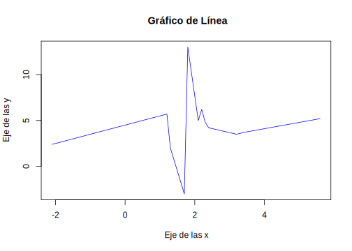
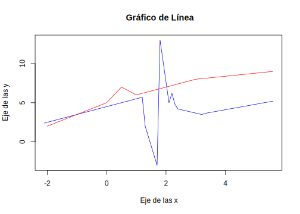
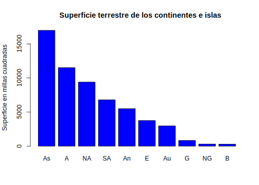
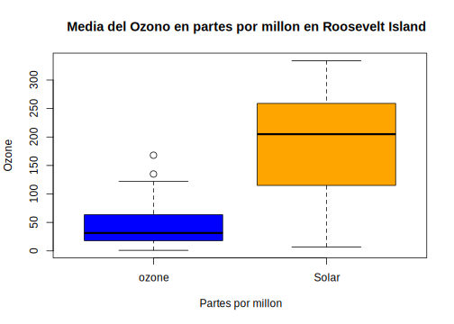
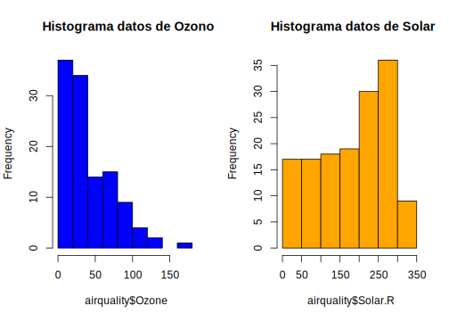

<script src="https://cdn.datacamp.com/datacamp-light-latest.min.js"></script>

--- 
title: "Programación Científica en R"
subtitle: "Ciencia de los Datos Financieros"
author: "Synergy Vision"
date: "2018-07-12"
knit: "bookdown::render_book"
documentclass: krantz
bibliography: [book.bib, packages.bib]
biblio-style: apalike
link-citations: yes
colorlinks: yes
lot: yes
lof: yes
fontsize: 12pt
monofontoptions: "Scale=0.8"
keep_md: yes
site: bookdown::bookdown_site
description: ""
url: 'http\://synergy.vision/Programacion-Cientifica-en-R/'
github-repo: synergyvision/Programacion-Cientifica-en-R/
cover-image: images/cover.png
---


# Prefacio {-}

<a href="https://synergy.vision/LibrosInteractivos/" target="_blank"></a>


  
La versión en línea de este libro se comparte bajo la licencia [Creative Commons Attribution-NonCommercial-ShareAlike 4.0 International License](http://creativecommons.org/licenses/by-nc-sa/4.0/).

## ¿Por qué  leer este libro? {-}

Este libro es el resultado de enfocarnos en proveer la mayor cantidad de material sobre Probabilidad y Estadística Matemática con un desarrollo teórico lo más explícito posible, con el valor agregado de incorporar ejemplos de las finanzas y la programación en `R`. Finalmente tenemos un libro interactivo que ofrece una experiencia de aprendizaje distinta e innovadora.

El un mundo abierto, ya no es tanto el acceso a la información, sino el acceso al conocimiento. Este libro es la base teórica para nuestro Diplomado en Probabilidades y Estadística Matemática aplicado a las Finanzas. Aunque es un material de corte general, hay ejemplos específicos traido de las finanzas. En el Diplomado nos enfocamos en el participante, el propósito es que el instructor ocupa a lo sumo el 20% del tiempo y el resto del tiempo los participantes se dedican a practicar y resolver ejercicios, tanto teóricos como de programación y modelaje en `R` al nivel de un curso de Postgrado. Ésta es la base de un programa en Ciencia de los Datos Financieros.

Es mucha la literatura, pero son pocas las opciones donde se pueda navegar el libro de forma amigable y además contar con ejemplos en `R` y ejercicios interactivos, además del contenido multimedia. Esperamos que ésta sea un contribución sobre nuevas prácticas para publicar el contenido y darle vida, crear una experiencia distinta, una experiencia interactiva y visual. El reto es darle vida al contenido asistidos con las herramientas de Internet.

Finalmente este es un intento de ofrecer otra visión sobre la enseñanza y la generación de material más accesible. Estamos en un mundo multidisciplinado, es por ello que ahora hay que generar contenido que conjugue en un mismo lugar las matemáticas, estadística, finanzas y la computación.

Lo dejamos público ya que las herramientas que usamos para ensamblarlo son abiertas y públicas.

## Estructura del libro {-}

TODO: Describir la estructura

## Información sobre los programas y convenciones {-}

Este libro es posible gracias a una gran cantidad de desarrolladores que contribuyen en la construcción de herramientas para generar documentos enriquecidos e interactivos. En particular al autor de los paquetes Yihui Xie xie2015.

## Prácticas interactivas con R {-}

Vamos a utilizar el paquete [Datacamp Tutorial](https://github.com/datacamp/tutorial) que utiliza la librería en JavaScript [Datacamp Light](https://github.com/datacamp/datacamp-light) para crear ejercicios y prácticas con `R`. De esta forma el libro es completamente interactivo y con prácticas incluidas. De esta forma estamos creando una experiencia única de aprendizaje en línea.

<div data-datacamp-exercise data-height="300" data-encoded="true">eyJsYW5ndWFnZSI6InIiLCJwcmVfZXhlcmNpc2VfY29kZSI6ImIgPC0gNSIsInNhbXBsZSI6IiMgQ3JlYSB1bmEgdmFyaWFibGUgYSwgaWd1YWwgYSA1XG5cbiMgTXVlc3RyYSBlbCB2YWxvciBkZSBhIiwic29sdXRpb24iOiIjIENyZWEgdW5hIHZhcmlhYmxlIGEsIGlndWFsIGEgNVxuYSA8LSA1XG5cbiMgTXVlc3RyYSBlbCB2YWxvciBkZSBhXG5hIiwic2N0IjoidGVzdF9vYmplY3QoXCJhXCIpXG50ZXN0X291dHB1dF9jb250YWlucyhcImFcIiwgaW5jb3JyZWN0X21zZyA9IFwiQXNlZ3VyYXRlIGRlIG1vc3RyYXIgZWwgdmFsb3IgZGUgYGFgLlwiKVxuc3VjY2Vzc19tc2coXCJFeGNlbGVudGUhXCIpIn0=</div>


## Agradecimientos {-}

A todo el equipo de Synergy Vision que no deja de soñar. Hay que hacer lo que pocos hacen, insistir, insistir hasta alcanzar. Lo más importante es concretar las ideas. La idea es sólo el inicio y solo vale cuando se concreta.


\BeginKnitrBlock{flushright}<p class="flushright">Synergy Vision, Caracas, Venezuela</p>\EndKnitrBlock{flushright}


<!--chapter:end:index.Rmd-->


# Acerca del Autor {-}

Este material es un esfuerzo de equipo en Synergy Vision, (<http://synergy.vision/nosotros/>).		 

El propósito de este material es ofrecer una experiencia de aprendizaje distinta y enfocada en el estudiante. El propósito es que realmente aprenda y practique con mucha intensidad. La idea es cambiar el modelo de clases magistrales y ofrecer una experiencia más centrada en el estudiante y menos centrado en el profesor. Para los temas más técnicos y avanzados es necesario trabajar de la mano con el estudiante y asistirlo en el proceso de aprendizaje con prácticas guiadas, material en línea e interactivo, videos, evaluación contínua de brechas y entendimiento, entre otros, para procurar el dominio de la materia.
  		  
Nuestro foco es la Ciencia de los Datos Financieros y para ello se desarrollará material sobre: **Probabilidad y Estadística Matemática en R**, **Programación Científica en R**, **Mercados**, **Inversiones y Trading**, **Datos y Modelos Financieros en R**, **Renta Fija**, **Inmunización de Carteras de Renta Fija**, **Teoría de Riesgo en R**, **Finanzas Cuantitativas**, **Ingeniería Financiera**, **Procesos Estocásticos en R**, **Series de Tiempo en R**, **Ciencia de los Datos**, **Ciencia de los Datos Financieros**, **Simulación en R**, **Desarrollo de Aplicaciones Interactivas en R**, **Minería de Datos**, **Aprendizaje Estadístico**, **Estadística Multivariante**, **Riesgo de Crédito**, **Riesgo de Liquidez**, **Riesgo de Mercado**, **Riesgo Operacional**, **Riesgo de Cambio**, **Análisis Técnico**, **Inversión Visual**, **Finanzas**, **Finanzas Corporativas**, **Valoración**, **Teoría de Portafolio**, entre otros.

Nuestra cuenta de Twitter es (https://twitter.com/bysynergyvision) y nuestros repositorios están en GitHub (https://github.com/synergyvision).
  		  
 **Somos Científicos de Datos Financieros**

<!--chapter:end:000-author.Rmd-->

# Introducción

En su definición más amplia, __R__ es un lenguaje de programación que permite al usuario programar y utilizar todas las librerías y algoritmos que han sido programadas por otros. Con R se pueden escribir funciones, hacer cálculos, aplicar técnicas estadísticas, crear gráficos sencillos o complejos, e incluso compartir tus propias funciones en una librería. Un amplio grupo de usuarios lo utiliza en todo el mundo, incluso muchos institutos de investigación, empresas y universidades están utilizando el lenguaje y entorno R. En los últimos cinco años, muchos libros se han publicado sobre R, una de las razones fundamentales es que R está disponible de forma gratuita.

Fue inicialmente diseñado por _Robert Gentleman_ y _Ross Ihaka_, miembros de la universidad de Auckland, en Nueva Zelanda. _Robert Gentleman_ es un estadístico Canadiense y bioinformático, actualmente es vicepresidente de Biología computacional en _23andMe_. _Ross Ihaka_ estadístico graduado en la universidad de California Berkeley en 1985, actualmente es profesor asociado de la universidad de Auckland. 

__R__ se considera como la versión libre de otro programa llamado __S__ o __S-Plus__ (GNU S, software libre de S) desarrollado en los laboratorios Bell (Bell Labs es una compañia estado unidense encargada en la investigación y desarrollo cientifico, perteneciente a la empresa filandesa _NOKIA_, su sede se encuentra en New Jersey, entre sus patentes más importantes tenemos: La libreta de un solo uso, el transitor, el láser, la fibra óptica, la tecnología DSL, la telefonía móvil, los satélites de comunicación, el sistema operativo UNIX, el lenguaje de programación C y C++.). __S__ es un sistema desarrollado para el análisis de datos desarrollado por _John Chambers_, _Rick Beckler_ y diferentes colaboradores desde finales de 1970, en esa época los análisis estadísticos se desarrollaban mediante subrutinas en __Fortran__ (Lenguaje de programación de alto nivel, modular, y usado principalmente en aplicaciones científicas y matemáticas), por lo tanto éstos desarrollaron un conjunto de bibliotecas de macros Fortran, permitiendo la automatización de tareas repetitivas pudiendo hacer mediante una sola llamada u orden de ejecución una serie de intrucciones.

Entonces ¿Por qué no todo el mundo lo está utilizando? Esta es una pregunta fácil de responder: __R__ amerita una curva de aprendizaje, su uso requiere de conocimientos programación, y, aunque existen varias interfaces gráficas para los usuarios, ninguna es lo suficientemente amplia como para evitar por completo la programación. Sin embargo, una vez que se domina el uso básicos de __R__, es poco probable que utilice cualquier otro paquete de software con funcionalidades similares.

La programación en __R__ es homogénea, en el sentido de que la forma de trabajar con distintas librerías es similar, se siguen patrones de trabajo que facilitan el uso de todas sus funcionalidades. Por lo tanto, una vez que se aprende a aplicar un método como la regresión lineal, modificar el código para generalizar un modelo lineal, solo requiere la modificación de algunas opciones y pequeños cambios en el modelo y las fórmulas. Además, __R__ cuenta con excelentes paquetes estadísticos. Gran parte de los métodos estadísticos más populares y también algunos más nuevos, ya están programados y disponibles (ya sea como parte del paquete principal o como un paquete aportado por la comunidad de usuarios).

## Características principales del lenguaje __R__

- Sintaxis similar a __S__.

- Semántica similar a __S__.

- Corre en cualquier sistema operativo (Windows, MAC OS, Linux y Unix), adicionalmente tiene constantemente cambios de versiones.

- Tamaño muy pequeño. Las funcionalidades se le agregan utilizando paquetes.

- Es un lenguaje orientado a objetos.

- Buena capacidad para la generación de gráficos.

- Se puede usar de modo iterativo para probar modelos, es también usado para realizar nuevas herramientas.

- Existe una comunidad activa y que estimula constantemente paquetes y funciones. Generalmente está orientado a la Ciencia de los Datos, facilitando el procesamiento y análisis de datos. Más de 8.000 paquetes desarrollados y disponibles en CRAN: <http://cran.r-project.org/>

- Es totalmente gratis.

- Es un software libre (__GNU S__, sofware libre de __S__). Con esto los usuarios tienen la libertad de ejecutar, copiar, distribuir, modificar y mejorar el software.

## Desventajas del lenguaje __R__

- Tiene un sistema integrado de gráficos 3D, el cual no esta completamente integrado en el sistema.

- El procesamiento es con datos en memoria RAM (los datos deben estar en la memoria RAM para ser procesados). Para grandes volúmenes de datos es necesario contar con un computador con suficiente memoria RAM, en el caso de tener un computador con poca memoria RAM se podrían tener problemas.

- Las funciones que se usan estan basadas en los usuarios, si se quiere un nuevo análisis, como la implementación de un nuevo modelo o simplemente querer probar nuevas tecnologías, se debe esperar a que la comunidad las implemente o se tendría que desarrollar para lo que generalmente se necesite un manejo superior en programación.

- No es ideal para usarlo con todo, aun es un nicho muy pequeño.

## El diseño del lenguaje __R__

Este lenguaje de programación está constituido por un sistema base y de paquetes adicionales que extienden su funcionalidad.

El diseño fundamental de este lenguaje se basa en los tres pilares siguientes:

- __R Base Core__: Contiene las funcionalidades del lenguaje, los paquetes bases que nos ayudan a manipular datos con algunos métodos básicos. Entre los paquetes bases tenemos _utils, stats, datasets, compiler, parallel, tools, methods, splines, tcltk, graphics, grDevices, grid, splines, statS4_.

- __Paquetes Recomendados__: Estos paquetes son los más utilizados para realizar cualquier cálculo estadístico. Entre estos paquetes encontramos _boot, class, cluster, codetools, foreign, KernSmooth, lattice, mgcv, name, rpart, survival, MASS, nnet, Matrix_. 

- __Paquetes del CRAN__: El CRAN (Comprehensive R Archive Network) es una red de sitios web, en todo el mundo, que actuan como distribuidores de los archivos de R, extensión de paquetes y documentación. En el CRAN podemos encontrar más de 8000 paquetes contribuidos y subidos por los usuarios. El sitio web es el siguiente <https://cran.r-project.org/mirrors.html>

## Instalación de __R__ y de paquetes de __R__

Para descargar __R__, el primer paso es dirigirse a la página oficial [http://www.r-project.org/](http://www.r-project.org/), luego dirigirse a la sección "download R"  o "CRAN", ver figura \ref{fig:img001}.


Una vez allí, se le solicitará que elija un "CRAN mirror”, las palabras "CRAN mirrors” se debe a que estos enlaces actuan como espejos de los archivos localizados en servidores por todo el mundo, lo cual facilita la descarga de la información, se recomienda utilizar la "0-Cloud”, o nube original, desde la que se envía la información a los otros servidores, a continuación la lista de espejos que se mostrará. Ver figura \ref{fig:img002}.


Luego de seleccionar la Nube original o "0-Cloud” se tendrá la pantalla de dicho CRAN, donde se tendrá el material disponible sobre R, en la parte izquierda se tendrá ayudas, manuales, e información general sobre el software, en la parte superior los link para la descarga del lenguaje dependiendo el sistema operativo y en la parte inferior el código fuente para todas las plataformas. Ver figura \ref{fig:img003}.


Para instalar __R__ se debe hacer clic en el enlace según el sistema operativo en que se esté trabajando, supongamos que se tiene Windows. Ver figura \ref{fig:img004}.


En los subdirectorios se tendrá la opción de instalar __R__ por primera vez (install __R__ for the first time), daremos clic en dicho enlace, en la pantalla que se mostrará se debe seleccionar en la parte superior del link que contiene la última versión de __R__ al momento de consulta, de igual manera en la parte inferior se dispone de un link para acceder a versiones previas "Previous releases”. Ver Figura \ref{fig:img005}


En la sección "Previous releases” se tendrá la lista completa de las versiones de __R__ y sus fechas de salida, es importante resaltar lo frecuente con que se publican las actualizaciones, ya que muchos elementos utilizados para el funcionamiento correcto de __R__ depende de la versión que se esté utilizando, y en algunos casos se recomienda no trabajar con la última versión del software.

Cuando ya se tenga descargado el software se abre el instalador y se ejecuta seleccionando el lenguaje con el que se quiera trabajar.

Para la instalación de paquetes se usa el comando `install.packages()`, donde el nombre del paquete va dentro de comillas como argumento, luego que el paquete esté instalado se debe cargar dicho paquete para poder hacer uso de las funciones que el mismo contiene, esto se hace con el comando `library()`. En la figura \ref(fig:img006) se muestra la instalación del paquete llamado "DT".


## Ayuda en __R__

La primera función que utilizaremos para la opción de ayuda es `help.start()`, cuando la colocamos en la consola se nos despliega una ayuda en la cual se muestra información general de __R__, como manuales relacionados al lenguaje, la importación y exportación de datos, la instalación y administración de __R__, enlaces hacia los paquetes, información sobre __R__ como su licencia GNU, sobre los autores, entre otros.

Ahora si estamos interesados en otros comando, o buscando un comando que realice cierto trabajo en particular, utilizamos la función `help()` o su equivalente que es `?`. 

La figura \ref{fig:img007} muestra la ventana que se nos desplega cuando colocamos el comando `help(lm)`, `lm` son las iniciales que se usan para los modelos de regresión lineal.


En la primera línea se observa el comando que buscamos y dentro de `{ }` el paquete al cual pertenece dicha función o operador.
Luego tenemos el título, que corresponde a la función principal que tiene el comando, seguido de esto se tiene información específica sobre la misma, algunas de estas pueden ser las siguientes:

- __Description__: Se tiene una breve descripción de lo que cálcula la función o lo que realiza el operador.

- __Usage__: En el caso de tener una función, nos da el nombre con todos los argumentos que usa, mostrando los valores por defecto que estos toman; en el caso de un operador describe su uso típico.

- __Arguments__: Cuando se tiene una función en esta sección se describe de manera detallada cada uno de sus argumentos, o parámetros de entrada; en el caso de un operador se explican los tipos de objetos que se usan para usar dicho operador.

- __Details__: En esta sección se muestra una descripción detallada de la función u operador.

- __Value__: Se explica los valores que retorna la función o el resultado que se tendrá si se aplica el operador.

- __See Also__: Generalmente se muestran enlaces a otras páginas de ayuda con funciones u operadores similares.

- __Examples__: Algunos ejemplos usando la función o el operador.

Si se desea buscar una función que realice un cálculo específico podemos usar palabras claves sobre dicho cálculo usando el comando `help.search()`, este mostrará todas las funciones, con el paquete al que pertenecen, que tienen en su título las palabras colocadas como argumentos en dicho comando. Por ejemplo si se quiere conseguir una instrucción para realizar una regresión lineal, la palabra clave podría ser “lineal”. 

Otros comandos relacionados con la ayuda serían los siguientes:

`apropos("mean")`: Lista los objetos cuyos nombres coincidan con “mean”.

`example("mean")`: muestra un ejemplo encontrado en la página de ayuda para la función “mean”.

Otras opciones que suelen ser muy utiles a la hora de solicitar ayuda es consultar a alguien con más experiencia. La comunidad que conforma __R__ tiene una lista de correos para solicitar ayuda sobre __R__ en español y se entiende como un complemento social a la documentación, libros, etc. En el siguiente enlace se encuentra una descripción detallada de como hacer uso de esto <https://stat.ethz.ch/mailman/listinfo/r-help-es>.

## RStudio

Antes de explicar que es RStudio, vamos hablar de que es un ambiente de desarrollo integrado o entorno de desarrollo interactivo, IDE por sus siglas en ingles (integrated development environment), estos son aplicaciones que facilitan a los desarrolladores o programadores el desarrollo de sofware. Normalmente consiste de un editor de código fuente, construcciones automaticas de herramientas y un depurador.

El límite entre un IDE y otras partes del entorno de desarrollo de software más amplio no está bien definido. Muchas veces, a los efectos de simplificar la construcción de la interfaz gráfica de usuario (GUI, por sus siglas en inglés) se integran un sistema controlador de versión y varias herramientas. Muchos IDE modernos también cuentan con un navegador de clases, un buscador de objetos y un diagrama de jerarquía de clases, para su uso con el desarrollo de software orientado a objetos.

El proyecto __RStudio__ ofrece actualmente la mayor parte de las características deseadas para un IDE de una manera novedosa, haciendo más fácil y más productivo utilizar __R__. Algunos puntos destacados son:

- Los principales componentes de un IDE están muy bien integrados en un diseño de cuatro paneles que incluye una consola para sesiones interactivas __R__, una con pestañas para organizar los archivos de un proyecto, y los paneles para organizar los diferentes elementos menos centrales.

- La consola y editor de código fuente están estrechamente vinculados al sistema de ayuda interna de __R__ a través de la implementación del tabulador y el componente visor de páginas de ayuda.

- La creación de diferentes proyectos es muy fácil, y cambiar entre ellos es aún más fácil.

- __RStudio__ ofrece muchas herramientas administrativas convenientes y fáciles de usar para la gestión de paquetes, el espacio de trabajo, archivos y más.

- El IDE está disponible para los tres sistemas operativos principales y se puede ejecutar a través de un navegador web para el acceso remoto.

- __RStudio__ es mucho más fácil de aprender que Emacs / ESS, más fácil de configurar e instalar que Eclipse / Statet, tiene un mejor editor que JGR, es mejor organizado que Sciviews, y a diferencia de Notepad ++ y Rgui, está disponible en más plataformas que sólo la de Windows, es decir entre las diversas alternativas de IDE para __R__ es la más versátil.

__RStudio__ es un proyecto construido sobre muchos otros proyectos de código abierto. Su objetivo declarado -que ya se está cumpliendo- es desarrollar una herramienta gratuita de gran alcance que apoya las prácticas y técnicas requeridas para la realización de análisis estadístico de alta calidad. 

En resumen __RStudio__ es un entorno de desarrollo integrado para __R__. Con él se proporciona un lugar centralizado y bien organizado para hacer casi cualquier cosa que usted quiera hacer con __R__.

Al igual que __R__, __RStudio__ es sencillo de instalar, para ello el paso inicial es acceder a la página oficial <https://www.rstudio.com/> y luego hacer clic en “Download Rstudio”, luego en la parte inferior hacer clic en “Download Rstudio Desktop” y escoger la aplicación según el sistema operativo con el que trabaje su equipo. Ver la Figura \ref{fig:img008}


<!--chapter:end:001-Introduccion.Rmd-->

# Objetos en __R__

Cuando nos referimos a objetos estamos hablando de entidades que combinan estado (atributo), comportamiento (método) e identidad; esto quiere decir, un objeto estará compuesto por datos también llamados atributos que tendrán valores concretos, con estos objetos se realizarán algunos procedimiento o método, esto corresponde al comportamiento que pueda tener dicho objeto, además todos los objetos se pueden identificar o diferenciar entre todos los demás a esto es lo que llamados identidad del mismo. Cuando los lenguajes de programación se basan en este paradigma es muy util a la hora de reutilizar códigos o métodos, logrando mejorar o simplemente flexibilizar, ajustar dicho código a situaciones particulares.

Los principales objetos con los que se trabajan con este lenguaje de programación son:

- Vector.

- Factor.

- Arreglo.

- Matriz.

- Data frame.

- Series de tiempo.

- Listas.

| **Objeto** |         **Tipos**         | **¿Varios tipos posibles?**|
|:----------:|:-------------------------:|:--------------------------:|
|   Vector   | N, C, Comp o Log          |            No              |
|   Factor   | N o C                     |            No              |
|   Arreglo  | N, C, Comp o Log          |            No              |
|   Matriz   | N, C, Comp o Log          |            No              |
| Data.frame | N, C, Comp o Log          |            Si              |
|   S.T      | N, C, Comp o Log          |            Si              |
|   Lista    | N, C, Comp,Log, Fun, Expr.|            Si              |

N = numérico  
C = caracter  
Comp = complejo  
Log = lógico  
Fun = función  
Expr = expresión 


## Tipos de objetos en __R__

Entre los principales objetos tenemos:

- __Datos Numéricos__: 

Dentro de los datos numéricos tenemos datos “numeric”, enteros “integer”,  complejo “complex”. La mayor parte del tiempo los números son “numeric”. 

Cualquier número real se puede expresar mediante notación científica, esto es diviendo o multiplicando por 10 tantas veces como sea necesario para que todos los dígitos aparezcan a la derecha del punto decimal y de modo que el primer dígito después del punto no sea cero, por ejemplo $7325.689=7.325689\times 10^4$. Con el lenguaje de programación __R__ la notación científica se imprime con una `e` para indicar el exponente, para continuar con el ejemplo anterior la notación en __R__ sería $7.325689e+4$. Esta notación se utiliza para almacenar los datos numéricos, lo que comumente se llama almacenamiento de punto flotante, el cual consta de tres partes: un signo (+1 ó -1), un exponente (un enteno $n$) y una precisión ($p$) $\pm 1\times p\times 10^n$.

Una de las maneras de trabajar con un dato entero es colocarle como sufijo la letra `L`, por ejemplo el entero uno se puede escribir como `1L`, también podemos tranformar valores numéricos a enteros con el comando `as.integer()`. 

Es importante acotar que la representación de punto flotante no puede almacenar todos los números con exactitud, por ejemplo, la raíz cuadrada de 2 es irracional y la representación en la computadora (de punto flotante) es una aproximación

- __Datos Categóricos__: 

__R__ tiene dos clases distintas para trabajar con datos categóricos: Factor y carácter.

Los datos de tipo **Factor** se utiliza cuando se tienen variables que se pueden registrar simplemente por medio de categorías, utilizadas para agrupar los datos, un ejemplo de este tipo de datos podría ser el historial de los distintos navegadores usados por los usuarios para acceder a un sitio web, así los datos se podrían agrupar dependendiendo del servidor que usaron los usuarios.

Los datos de tipo **carácter** son los que representan palabras o códigos únicos que identifican, como por ejemplo una dirección de un ordenador, también llamados _string_ por su traducción en ingles; este tipo de datos en __R__ se colocan utilizando comillas dobles `"` o simples `'` para delimitar un string.

- __Datos Lógico__: 

Estos datos también son llamados datos Booleanos, se caracterizan por tomar dos valores verdadero ó falso (TRUE o FALSE), generalmente se obtienen como el resultado de alguna función, por ejemplo podemos usar la función `is.numeric()` para saber si una variable o cualquier objeto que se introduzca cumple con las características de ser un valor numérico, en caso de ser cierto la función retornará `TRUE` y en caso contrario retornará `FALSE`.

- __Datos de Fecha y Hora__:

En la base del lenguaje de programación de __R__ se encuentran dos paquetes que trabajan los datos de tipo fecha y hora: `Date` (fechas) y `POSIXt` (fecha, hora y huso horario), las siglas POSIX se refieren a _Portable Operating System Interface_; esta última clase contiene dos subclases, `POSIXct` y `POSIXlt` que se diferencian simplemente en la forma en que almacenan internamente la fecha y la hora. Adicional a estos paquetes se encuentra el paquete `lubridate` el cual suele ser muy util para la extracción de componentes de un objeto fecha y hora de clase `POSIXct`.

- __Valores pérdidos, NA__:

Generalmente cuando se realizan encuestas o se toman datos se puede presentar la situación de que para ciertos individuos o categorias no se consigan datos, a este tipo de datos se les llama datos faltantes, o valores pérdidos; son valores que no están presentes. El lenguaje de programación __R__ los trata como `NA`, debido a las siglas en ingles de _not available_, cabe destacar que no es un string sino un tipo de objeto, estos valores pueden alterar los resultados que nos den algunas funciones.

- __Inf__:

Muchos cálculos nos pueden llevar a respuestas con valor infinito positivo o infinito negativo, en __R__ estos objetos se presentan por `Inf` y `-Inf`. Estos resultados se pueden tener cuando se realizan operaciones como 1/0

- __NaN__:

El nombre `NaN` se debe a su significado en ingles "not a number", es decir, no es un número. Este tipo de objeto se da cuando se realiza una operación que no da un valor numérico, por ejemplo una función indeterminada (como la división 0/0) o el resultado de una función evaluada en valores que no pertenecen a su dominio.

Un valor `NaN` es al mismo tiempo un valor `NA`, pero no al contrario. Tanto `NaN` como `NA` son ambos datos faltantes, la única diferencia es que `NaN` se produce de una operación matemática.

- __NULL__:

Generalmente indica que alguna acción no se puede ejecutar por no estar definida o disponible. Representa los objetos nulos.  Indica la ausencia del dato. Se utiliza para colocar una variable sin valor, como por ejemplo, para inicializar un vector que se va a utilizar como vector incremental.

Más adelante trabajaremos por separado otros objetos muy usados a la hora de programar en __R__.

## Manejo de Objetos

### Atributos de un Objeto

Los atributos de un objeto es la información específica sobre dicho objeto. Entre los principales encontramos:

- Nombres (`names`) : Este muestra las etiquetas de los elementos individuales de un vector o una lista.

- Dimensiones (`dimensions`): Dimensiones de los arrays (alguna puede ser cero).

- Dimnames (`dimnames`): Nombre correspondiente a las dimensiones de los arrays.

- Modo (`mode`): Tipo básico en un vector o array (lógico, entero, real, carácter, entre otros).

- Tipo (`typeof`): Tipo de los vectores o arrays (lógico, entero, double, complejo, carácter, entre otros).

- Clase (`class`): Vector alfanumérico con la lista de las clases del objeto.

- Otros: Otros atributos definidos por el usuario.

Todo objeto tiene dos atributos intrínsecos como tal; tipo y longitud.

- __Tipo__: Numérico, caracter, complejo y lógico (Verdadero o Falso).

- __Longitud__: Número de elementos en el objeto.
  
Para ver el tipo y la longitud de un objeto utilizamos las funciones `mode()` y `length()`.

Mediante la función `attributes()` podemos obtener una lista de los atributos no intrínsecos y con `attr()` podemos usar un atributo seleccionado.

### Nombres válidos para un objeto

Los nombres válidos para los objetos pueden ser el resultado de combinaciones entre letras números y el punto.

Estos son sensibles a las mayúsculas y minúsculas (`a` es diferente de `A`).  

Se recomienda usar nombres distintos a los usados ya en funciones creadas en los paquetes cargados, en especial a las de los paquetes base (por ejemplo `function`, `if`, `c`).

### Operador de asignación e igualdad

Las asignaciones de nombres a objetos se hace mediante el operador `<-` o equivalente `->`, hay que tomar en cuenta que estos símbolos no llevan espacio entre ellos. Por otra parte, se recomienda usar el símbolo `=` unicamente para los argumentos de las funciones.


```r
x <- 4
x
```

```
## [1] 4
```

```r
5 -> x
x
```

```
## [1] 5
```

<div data-datacamp-exercise data-height="300" data-encoded="true">eyJsYW5ndWFnZSI6InIiLCJzYW1wbGUiOiIjIENyZWEgdW5hIHZhcmlhYmxlIGEsIGlndWFsIGEgNVxuXG4jIENyZWEgdW5hIHZhcmlhYmxlIG4sIGlndWFsIGEgMjVcblxuIyBNdWVzdHJhIGVsIHZhbG9yIGRlIGEgeSBkZSBuIiwic29sdXRpb24iOiIjIENyZWEgdW5hIHZhcmlhYmxlIGEsIGlndWFsIGEgNVxuYTwtNVxuIyBDcmVhIHVuYSB2YXJpYWJsZSBuLCBpZ3VhbCBhIDI1XG5uPC0yNVxuIyBNdWVzdHJhIGVsIHZhbG9yIGRlIGEgeSBkZSBuXG5hXG5uIn0=</div>


## Principales funciones para trabajar en la consola

Entre las funciones más comunes y utilizadas tenemos:

- `ls()` -> Lista los elementos objetos creados en la consola. sólo muestra los nombres de los mismos.


```r
name <- "Carmen"
n1 <- 10
n2 <- 100
m <- 0.5
ls()
```

```
## [1] "m"    "n1"   "n2"   "name" "x"
```

<div data-datacamp-exercise data-height="300" data-encoded="true">eyJsYW5ndWFnZSI6InIiLCJzYW1wbGUiOiJuYW1lIDwtIFwiQ2FybWVuXCJcbm4xIDwtIDEwXG5uMiA8LSAxMDBcbm0gPC0gMC41XG5cbmxzKCkiLCJzY3QiOiJ0ZXN0X2Vycm9yKClcbnN1Y2Nlc3NfbXNnKFwiTXV5IGJpZW5cIikifQ==</div>


- `ls.str()` -> Muestra algunos detalles de los objetos en memoria.


```r
ls.str()
```

```
## m :  num 0.5
## n1 :  num 10
## n2 :  num 100
## name :  chr "Carmen"
## x :  num 5
```

<div data-datacamp-exercise data-height="300" data-encoded="true">eyJsYW5ndWFnZSI6InIiLCJwcmVfZXhlcmNpc2VfY29kZSI6ImE8LTVcbm48LTI1XG5uYW1lIDwtIFwiQ2FybWVuXCJcbm4xIDwtIDEwXG5uMiA8LSAxMDBcbm0gPC0gMC41Iiwic2FtcGxlIjoibHMuc3RyKCkiLCJzY3QiOiJ0ZXN0X2Vycm9yKClcbnN1Y2Nlc3NfbXNnKFwiQnVlbiB0cmFiYWpvXCIpIn0=</div>


- `rm()` -> Para borrar objetos en memoria.


```r
rm(n1) #Eliminar el objeto n1
ls()
```

```
## [1] "m"    "n2"   "name" "x"
```

```r
rm(list=ls()) #Eliminar todos los objetos creados
ls()
```

```
## character(0)
```

<div data-datacamp-exercise data-height="300" data-encoded="true">eyJsYW5ndWFnZSI6InIiLCJwcmVfZXhlcmNpc2VfY29kZSI6Im5hbWUgPC0gXCJDYXJtZW5cIlxubjEgPC0gMTBcbm4yIDwtIDEwMFxubSA8LSAwLjUiLCJzYW1wbGUiOiJscygpXG5cbiMgQm9ycmFyIGRlIG1lbW9yaWEgZWwgb2JqZXRvIG4xXG5cbiMgTGlzdGUgbG9zIG9iamV0b3MgZW4gbWVtb3JpYSIsInNvbHV0aW9uIjoibHMoKVxuXG4jIEJvcnJhciBkZSBtZW1vcmlhIGVsIG9iamV0byBuMVxucm0objEpXG5cbiMgTGlzdGUgbG9zIG9iamV0b3MgZW4gbWVtb3JpYVxubHMoKSJ9</div>


- `paste()`  -> Esta función une todos los vectores de caracteres que se le suministran y construye una sola cadena de caracteres.


```r
paste("Aprendiendo", "a", "programar","con","R") 
```

```
## [1] "Aprendiendo a programar con R"
```

<div data-datacamp-exercise data-height="300" data-encoded="true">eyJsYW5ndWFnZSI6InIiLCJzYW1wbGUiOiJjYXJ0XzEgPC0gJ01pJ1xuY2FydF8yIDwtICdwcmltZXJhJ1xuY2FydF8zIDwtICdDYWRlbmEgZGUgY2FyYWN0ZXJlcydcbiMgR3VhcmRlIGVuIGMgZWwgY2FyXHUwMGUxY3RlciBmb3JtYWRvIHBvciBjYXJ0XzEsIFxuIyBjYXJ0XzIsIGNhcnRfMyB1dGlsaXphbmRvIGxhIGZ1bmNpXHUwMGYzbiBwYXN0ZSgpIFxuIyB1dGlsaWNlIGVsIGFyZ3VtZW50byBzZXAgPVwiIFwiXG5cbiMgSW1wcmltYSBjIiwic29sdXRpb24iOiJjYXJ0XzEgPC0gJ01pJ1xuY2FydF8yIDwtICdwcmltZXJhJ1xuY2FydF8zIDwtICdDYWRlbmEgZGUgY2FyYWN0ZXJlcydcbiMgR3VhcmRlIGVuIGMgZWwgY2FyXHUwMGUxY3RlciBmb3JtYWRvIHBvciBjYXJ0XzEsIFxuIyBjYXJ0XzIsIGNhcnRfMyB1dGlsaXphbmRvIGxhIGZ1bmNpXHUwMGYzbiBwYXN0ZSgpXG4jIHV0aWxpY2UgZWwgYXJndW1lbnRvIHNlcCA9XCIgXCJcbmM8LSBwYXN0ZShjYXJ0XzEsIGNhcnRfMiwgY2FydF8zLCBzZXAgPSBcIiBcIilcbiMgSW1wcmltYSBjXG5jIn0=</div>


- `abs()` -> calcula el valor absoluto de un valor.


```r
y <- 5-8
abs(y)
```

```
## [1] 3
```

<div data-datacamp-exercise data-height="300" data-encoded="true">eyJsYW5ndWFnZSI6InIiLCJzYW1wbGUiOiIjIENhbGN1bGFyIGVsIHZhbG9yIGFic29sdXRvIGRlIDQtMjBcblxuI0NhbGN1bGFyIGVsIHZhbG9yIGFic29sdXRvIGRlIDZcblxuIyBDYWxjdWxhciBlbCB2YWxvciBhYnNvbHV0byBkZSAtMTAwIiwic29sdXRpb24iOiIjIENhbGN1bGFyIGVsIHZhbG9yIGFic29sdXRvIGRlIDQtMjBcbmFicyg0LTIwKVxuI0NhbGN1bGFyIGVsIHZhbG9yIGFic29sdXRvIGRlIDZcbmFicyg2KVxuIyBDYWxjdWxhciBlbCB2YWxvciBhYnNvbHV0byBkZSAtMTAwXG5hYnMoLTEwMCkifQ==</div>


- `round()` -> redondea un número a los decimales que se le indiquen.


```r
round(0.1475945131,digits =5)
```

```
## [1] 0.1476
```

<div data-datacamp-exercise data-height="300" data-encoded="true">eyJsYW5ndWFnZSI6InIiLCJzYW1wbGUiOiJ4PC0wLjE0NzU5NDUxMzFcbiMgUmVkb25kZWFyIGVsIG5cdTAwZmFtZXJvIHggY29uIHRyZXMgZFx1MDBlZGdpdG9zIGRlY2ltYWxlc1xuXG4jIFJlZG9uZGVhciBlbCBuXHUwMGZhbWVybyB4IGNvbiAxIGRcdTAwZWRnaXRvIGRlY2ltYWxcblxuIyBSZWRvbmRlYXIgZWwgblx1MDBmYW1lcm8geCBjb24gMiBkXHUwMGVkZ2l0b3MgZGVjaW1hbGVzIiwic29sdXRpb24iOiJ4PC0wLjE0NzU5NDUxMzFcbiMgUmVkb25kZWFyIGVsIG5cdTAwZmFtZXJvIHggY29uIHRyZXMgZFx1MDBlZGdpdG9zIGRlY2ltYWxlc1xucm91bmQoeCxkaWdpdHMgPSAzKVxuIyBSZWRvbmRlYXIgZWwgblx1MDBmYW1lcm8geCBjb24gMSBkXHUwMGVkZ2l0byBkZWNpbWFsXG5yb3VuZCh4LGRpZ2l0cyA9MSlcbiMgUmVkb25kZWFyIGVsIG5cdTAwZmFtZXJvIHggY29uIDIgZFx1MDBlZGdpdG9zIGRlY2ltYWxlc1xucm91bmQoeCxkaWdpdHMgPTIpIn0=</div>


- `sort()` -> ordena un vector que se le indique.


```r
sort(c(8,6,4,2,8,6,4,2))
```

```
## [1] 2 2 4 4 6 6 8 8
```

<div data-datacamp-exercise data-height="300" data-encoded="true">eyJsYW5ndWFnZSI6InIiLCJzYW1wbGUiOiJ4PC1jKDgsNiw0LDIsOCw2LDQsMilcbnk8LWMoLTEwLjUsNi45LC0wLjAwMSwyLDEuNTcsNiwtNCwyNS44LDIpXG4jIE9yZGVuYXIgZWwgdmVjdG9yIHggY29uIGxhIGZ1bmNpXHUwMGYzbiBzb3J0XG5cbiMgT3JkZW5hciBlbCB2ZWN0b3IgeSBjb24gbGEgZnVuY2lcdTAwZjNuIHNvcnQiLCJzb2x1dGlvbiI6Ing8LWMoOCw2LDQsMiw4LDYsNCwyKVxueTwtYygtMTAuNSw2LjksLTAuMDAxLDIsMS41Nyw2LC00LDI1LjgsMilcbiMgT3JkZW5hciBlbCB2ZWN0b3IgeCBjb24gbGEgZnVuY2lcdTAwZjNuIHNvcnRcbnNvcnQoeClcbiMgT3JkZW5hciBlbCB2ZWN0b3IgeSBjb24gbGEgZnVuY2lcdTAwZjNuIHNvcnRcbnNvcnQoeSkifQ==</div>


- `is.algo()` -> indica el tipo de estructura de datos y regresa un valor lógico.


```r
is.list(c(1,2,3))
```

```
## [1] FALSE
```

<div data-datacamp-exercise data-height="300" data-encoded="true">eyJsYW5ndWFnZSI6InIiLCJwcmVfZXhlcmNpc2VfY29kZSI6Ing8LWMoOCw2LDQsMiw4LDYsNCwyKVxueTwtYygtMTAuNSw2LjksLTAuMDAxLDIsMS41Nyw2LC00LDI1LjgsMikiLCJzYW1wbGUiOiIjIFZlcmlmaWNhciBzaSB4IGVzIHVuIHZlY3RvciBjb24gbGEgZnVuY2lcdTAwZjNuIGlzLnZlY3RvcigpXG5cbiMgVmVyaWZpY2FyIHNpIHkgZXMgdW5hIGxpc3RhIGNvbiBsYSBmdW5jaVx1MDBmM24gaXMubGlzdCgpIiwic29sdXRpb24iOiIjIFZlcmlmaWNhciBzaSB4IGVzIHVuIHZlY3RvciBjb24gbGEgZnVuY2lcdTAwZjNuIGlzLnZlY3RvcigpXG5pcy52ZWN0b3IoeClcbiMgVmVyaWZpY2FyIHNpIHkgZXMgdW5hIGxpc3RhIGNvbiBsYSBmdW5jaVx1MDBmM24gaXMubGlzdCgpXG5pcy5saXN0KHkpIn0=</div>


- `mean()` -> se utiliza para calcular el promedio aritmético de los elementos evaluados.


```r
mean(c(5,8,9,15,17,64,9,5,8,8,8,17,64,5))
```

```
## [1] 17.29
```

La forma general de usar la función `mean` es `mean(x, ...)`, donde `(...)` es llamado elipsis, y es la manera en que __R__ pasa a través de los argumentos de una función sin tener que nombrarlos ni especificarlos.  

Sin embargo el método por default `S3` es `mean(x, trim = 0, na.rm = FALSE, ...)`, donde `trim` y `na.rm` tienen valores por defecto, lo cual los hace argumentos opcionales. Sin embargo cada uno tiene su función específica.

Por ejemplo:


```r
linkedin <- c(16, 9, 13, 5, 2, 17, 14)
facebook <- c(17, 7, 5, 16, 8, 13, 14)
# Promedio simple de la suma
avg_sum <- mean(linkedin + facebook)

# Promedio truncado de la suma 
avg_sum_trimmed <- mean((linkedin + facebook), trim = 0.2)

# Evaluando ambos promedios
print(avg_sum)
```

```
## [1] 22.29
```

```r
print(avg_sum_trimmed)
```

```
## [1] 22.6
```


```r
linkedin <- c(16, 9, 13, 5, NA, 17, 14)
facebook <- c(17, NA, 5, 16, 8, 13, 14)

# Promedio simple de linkedin con argumentos por defecto
mean(linkedin)
```

```
## [1] NA
```

```r
# Promedio simple de linkedin con na.rm = TRUE
mean(linkedin, na.rm = TRUE)
```

```
## [1] 12.33
```

<div data-datacamp-exercise data-height="300" data-encoded="true">eyJsYW5ndWFnZSI6InIiLCJwcmVfZXhlcmNpc2VfY29kZSI6ImxpbmtlZGluIDwtIGMoMTYsIDksIDEzLCA1LCAyLCAxNywgMTQpXG5mYWNlYm9vayA8LSBjKDE3LCA3LCA1LCAxNiwgOCwgMTMsIDE0KSIsInNhbXBsZSI6IiMgQ2FsY3VsYXIgZWwgcHJvbWVkaW8gc2ltcGxlIGRlIGxpbmtlZGluIGNvbiBsYSBmdW5jaVx1MDBmM24gbWVhbigpXG4jIEd1YXJkYWxvIGVuIGxhIHZhcmlhYmxlIG1lYW5fbGlua2VkaW5cblxuIyBjYWxjdWxhciBlbCBwcm9tZWRpbyBzaW1wbGUgZGUgZmFjZWJvb2sgY29uIGxhIGZ1bmNpXHUwMGYzbiBtZWFuKClcbiMgR3VhcmRhbG8gZW4gbGEgdmFyaWFibGUgbWVhbl9mYWNlYm9va1xuXG4jIEltcHJpbWlyIGxvcyByZXN1bHRhZG9zIGRlIGxhcyBtZWRpYXMgeSBjYWxjdWxhciBsYSBzdW1hIGRlIGxvcyBkb3MgcHJvbWVkaW9zIiwic29sdXRpb24iOiIjIENhbGN1bGFyIGVsIHByb21lZGlvIHNpbXBsZSBkZSBsaW5rZWRpbiBjb24gbGEgZnVuY2lcdTAwZjNuIG1lYW4oKVxuIyBHdWFyZGFsbyBlbiBsYSB2YXJpYWJsZSBtZWFuX2xpbmtlZGluXG5tZWFuX2xpbmtlZGluIDwtIG1lYW4obGlua2VkaW4pXG4jIGNhbGN1bGFyIGVsIHByb21lZGlvIHNpbXBsZSBkZSBmYWNlYm9vayBjb24gbGEgZnVuY2lcdTAwZjNuIG1lYW4oKVxuIyBHdWFyZGFsbyBlbiBsYSB2YXJpYWJsZSBtZWFuX2ZhY2Vib29rXG5tZWFuX2ZhY2Vib29rIDwtIG1lYW4oZmFjZWJvb2spXG4jIEltcHJpbWlyIGxvcyByZXN1bHRhZG9zIGRlIGxhcyBtZWRpYXMgeSBjYWxjdWxhciBsYSBzdW1hIGRlIGxvcyBkb3MgcHJvbWVkaW9zXG5tZWFuX2xpbmtlZGluXG5tZWFuX2ZhY2Vib29rXG5tZWFuX2xpbmtlZGluK21lYW5fZmFjZWJvb2sifQ==</div>


- `median()` -> devuelve el valor de la mediana de los elementos evaluados.


```r
median(c(5,8,9,15,17,64,9,5,8,8,8,17,64,5))
```

```
## [1] 8.5
```

<div data-datacamp-exercise data-height="300" data-encoded="true">eyJsYW5ndWFnZSI6InIiLCJwcmVfZXhlcmNpc2VfY29kZSI6ImxpbmtlZGluIDwtIGMoMTYsIDksIDEzLCA1LCAyLCAxNywgMTQpXG5mYWNlYm9vayA8LSBjKDE3LCA3LCA1LCAxNiwgOCwgMTMsIDE0KSIsInNhbXBsZSI6IiMgQ2FsY3VsYXIgbGEgbWVkaWFuYSBkZWwgdmVjdG9yIGxpbmtlZGluIGNvbiBsYSBmdW5jaVx1MDBmM24gbWVkaWFuKClcblxuIyBDYWxjdWxhciBsYSBtZWRpYW5hIGRlbCB2ZWN0b3IgZmFjZWJvb2sgY29uIGxhIGZ1bmNpXHUwMGYzbiBtZWRpYW4oKVxuXG5cbnggPC0gYyg1LDgsOSwxNSwxNyw2NCw5LDUsOCw4LDgsMTcsNjQsNSlcbiMgQ2FsY3VsYXIgbGEgbWVkaWFuYSBkZSB4Iiwic29sdXRpb24iOiIjIENhbGN1bGFyIGxhIG1lZGlhbmEgZGVsIHZlY3RvciBsaW5rZWRpbiBjb24gbGEgZnVuY2lcdTAwZjNuIG1lZGlhbigpXG5tZWRpYW4obGlua2VkaW4pXG4jIENhbGN1bGFyIGxhIG1lZGlhbmEgZGVsIHZlY3RvciBmYWNlYm9vayBjb24gbGEgZnVuY2lcdTAwZjNuIG1lZGlhbigpXG5tZWRpYW4oZmFjZWJvb2spXG5cbnggPC0gYyg1LDgsOSwxNSwxNyw2NCw5LDUsOCw4LDgsMTcsNjQsNSlcbiMgQ2FsY3VsYXIgbGEgbWVkaWFuYSBkZSB4XG5tZWRpYW4oeCkifQ==</div>


- `Moda` -> No hay una función que realice este cálculo directamento por lo tanto tenemos que recurrir a otras dos funciones. La moda nos representa el valor que tiene mayor frecuencia absoluta en una distribución de datos. Para realizar su cálculo utilizamos las funciones `sort()` para ordenar los datos y `table()` para ver el número de repeticiones de cada elemento.


```r
x <- c(5,8,9,15,17,64,9,5,8,8,8,17,64,5)
sort(x)
```

```
##  [1]  5  5  5  8  8  8  8  9  9 15 17 17 64 64
```

```r
table(x)
```

```
## x
##  5  8  9 15 17 64 
##  3  4  2  1  2  2
```

<div data-datacamp-exercise data-height="300" data-encoded="true">eyJsYW5ndWFnZSI6InIiLCJwcmVfZXhlcmNpc2VfY29kZSI6InggPC0gYyg1LDgsOSwxNSwxNyw2NCw5LDUsOCw4LDgsMTcsNjQsNSkiLCJzYW1wbGUiOiIjIE9yZGVuYXIgbG9zIHZhbG9yZXMgZGVsIHZlY3RvciB4IGNvbiBsYSBmdW5jaVx1MDBmM24gc29ydCgpIFxuXG4jIENhbGN1bGFyIGxhIG1vZGEgZGVsIHZlY3RvciB4IGNvbiBsYSBmdW5jaVx1MDBmM24gdGFibGUoKVxuXG5cbnkgPC0gYygxLCAxLCAxLCA0LCA0LCA1LCA1LCA1LCA3LCA4LCA5LCA5LCA5KVxuIyBDYWxjdWxhciBsYSBtb2RhIGRlbCB2ZWN0b3IgeSIsInNvbHV0aW9uIjoiIyBPcmRlbmFyIGxvcyB2YWxvcmVzIGRlbCB2ZWN0b3IgeCBjb24gbGEgZnVuY2lcdTAwZjNuIHNvcnQoKSBcbnNvcnQoeClcbiMgQ2FsY3VsYXIgbGEgbW9kYSBkZWwgdmVjdG9yIHggY29uIGxhIGZ1bmNpXHUwMGYzbiB0YWJsZSgpXG50YWJsZSh4KVxuXG55IDwtIGMoMSwgMSwgMSwgNCwgNCwgNSwgNSwgNSwgNywgOCwgOSwgOSwgOSlcbiMgQ2FsY3VsYXIgbGEgbW9kYSBkZWwgdmVjdG9yIHlcbnNvcnQoeSlcbnRhYmxlKHkpIn0=</div>


- `range()` -> Es el intervalo entre el valor máximo y el valor mínimo. Permite obtener una idea de la dispersión de los datos, cuanto mayor es el rango, más dispersos están los datos de un conjunto. 


```r
x <- c(5,8,9,15,17,64,9,5,8,8,8,17,64,5)
range(x)
```

```
## [1]  5 64
```

<div data-datacamp-exercise data-height="300" data-encoded="true">eyJsYW5ndWFnZSI6InIiLCJwcmVfZXhlcmNpc2VfY29kZSI6ImxpbmtlZGluIDwtIGMoMTYsIDksIDEzLCA1LCAyLCAxNywgMTQpXG5mYWNlYm9vayA8LSBjKDE3LCA3LCA1LCAxNiwgOCwgMTMsIDE0KVxueCA8LSBjKDUsOCw5LDE1LDE3LDY0LDksNSw4LDgsOCwxNyw2NCw1KSIsInNhbXBsZSI6IiMgQ2FsY3VsYXIgZWwgcmFuZ28gZGVsIHZlY3RvciBsaW5rZWRpbiBjb24gbGEgZnVuY2lcdTAwZjNuIHJhbmdlKCkgXG5cbiMgQ2FsY3VsYXIgZWwgcmFuZ28gZGVsIHZlY3RvciBmYWNlYm9vayBjb24gbGEgZnVuY2lcdTAwZjNuIHJhbmdlKClcblxuIyBDYWxjdWxhciBlbCByYW5nbyBkZWwgdmVjdG9yIHggY29uIGxhIGZ1bmNpXHUwMGYzbiByYW5nZSgpIiwic29sdXRpb24iOiIjIENhbGN1bGFyIGVsIHJhbmdvIGRlbCB2ZWN0b3IgbGlua2VkaW4gY29uIGxhIGZ1bmNpXHUwMGYzbiByYW5nZSgpIFxucmFuZ2UobGlua2VkaW4pXG4jIENhbGN1bGFyIGVsIHJhbmdvIGRlbCB2ZWN0b3IgZmFjZWJvb2sgY29uIGxhIGZ1bmNpXHUwMGYzbiByYW5nZSgpXG5yYW5nZShmYWNlYm9vaylcbiMgQ2FsY3VsYXIgZWwgcmFuZ28gZGVsIHZlY3RvciB4IGNvbiBsYSBmdW5jaVx1MDBmM24gcmFuZ2UoKVxucmFuZ2UoeCkifQ==</div>


- `quantile()` -> Son tres valores que dividen un conjunto de datos ordenados en cuatro partes porcentualmente iguales.


```r
quantile(x)
```

```
##   0%  25%  50%  75% 100% 
##  5.0  8.0  8.5 16.5 64.0
```

<div data-datacamp-exercise data-height="300" data-encoded="true">eyJsYW5ndWFnZSI6InIiLCJwcmVfZXhlcmNpc2VfY29kZSI6ImxpbmtlZGluIDwtIGMoMTYsIDksIDEzLCA1LCAyLCAxNywgMTQpXG5mYWNlYm9vayA8LSBjKDE3LCA3LCA1LCAxNiwgOCwgMTMsIDE0KVxueCA8LSBjKDUsOCw5LDE1LDE3LDY0LDksNSw4LDgsOCwxNyw2NCw1KSIsInNhbXBsZSI6IiMgQ2FsY3VsYXIgbG9zIGN1YW50aWxlcyBkZWwgdmVjdG9yIGxpbmtlZGluIGNvbiBsYSBmdW5jaVx1MDBmM24gcXVhbnRpbGUoKVxuXG4jIENhbGN1bGFyIGxvcyBjdWFudGlsZXMgZGVsIHZlY3RvciBmYWNlYm9vayBjb24gbGEgZnVuY2lcdTAwZjNuIHF1YW50aWxlKClcblxuIyBDYWxjdWxhciBsb3MgY3VhbnRpbGVzIGRlbCB2ZWN0b3IgeCBjb24gbGEgZnVuY2lcdTAwZjNuIHF1YW50aWxlKCkiLCJzb2x1dGlvbiI6IiMgQ2FsY3VsYXIgbG9zIGN1YW50aWxlcyBkZWwgdmVjdG9yIGxpbmtlZGluIGNvbiBsYSBmdW5jaVx1MDBmM24gcXVhbnRpbGUoKVxucXVhbnRpbGUobGlua2VkaW4pXG4jIENhbGN1bGFyIGxvcyBjdWFudGlsZXMgZGVsIHZlY3RvciBmYWNlYm9vayBjb24gbGEgZnVuY2lcdTAwZjNuIHF1YW50aWxlKClcbnF1YW50aWxlKGZhY2Vib29rKVxuIyBDYWxjdWxhciBsb3MgY3VhbnRpbGVzIGRlbCB2ZWN0b3IgeCBjb24gbGEgZnVuY2lcdTAwZjNuIHF1YW50aWxlKClcbnF1YW50aWxlKHgpIn0=</div>


- `IQR()` -> La diferencia entre el tercer y el primer cuartil de una distribución. Es una medida de la dispersión de los datos.


```r
IQR(x)
```

```
## [1] 8.5
```

<div data-datacamp-exercise data-height="300" data-encoded="true">eyJsYW5ndWFnZSI6InIiLCJwcmVfZXhlcmNpc2VfY29kZSI6ImxpbmtlZGluIDwtIGMoMTYsIDksIDEzLCA1LCAyLCAxNywgMTQpXG5mYWNlYm9vayA8LSBjKDE3LCA3LCA1LCAxNiwgOCwgMTMsIDE0KVxueCA8LSBjKDUsOCw5LDE1LDE3LDY0LDksNSw4LDgsOCwxNyw2NCw1KSIsInNhbXBsZSI6IiMgQ2FsY3VsYXIgbGEgZGlmZXJlbmNpYSBlbnRyZSBlbCB0ZXJjZXIgeSBwcmltZXIgY3VhcnRpbCBcbiMgZGVsIHZlY3RvciBsaW5rZWRpbiBjb24gbGEgZnVuY2lcdTAwZjNuIElRUigpXG5cbiMgQ2FsY3VsYXIgbGEgZGlmZXJlbmNpYSBlbnRyZSBlbCB0ZXJjZXIgeSBwcmltZXIgY3VhcnRpbCBcbiMgZGVsIHZlY3RvciBmYWNlYm9vayBjb24gbGEgZnVuY2lcdTAwZjNuIElRUigpXG5cbiMgQ2FsY3VsYXIgbGEgZGlmZXJlbmNpYSBlbnRyZSBlbCB0ZXJjZXIgeSBwcmltZXIgY3VhcnRpbCBcbiMgZGVsIHZlY3RvciB4IGNvbiBsYSBmdW5jaVx1MDBmM24gSVFSKCkiLCJzb2x1dGlvbiI6IiMgQ2FsY3VsYXIgbGEgZGlmZXJlbmNpYSBlbnRyZSBlbCB0ZXJjZXIgeSBwcmltZXIgY3VhcnRpbCBcbiMgZGVsIHZlY3RvciBsaW5rZWRpbiBjb24gbGEgZnVuY2lcdTAwZjNuIElRUigpXG5JUVIobGlua2VkaW4pXG4jIENhbGN1bGFyIGxhIGRpZmVyZW5jaWEgZW50cmUgZWwgdGVyY2VyIHkgcHJpbWVyIGN1YXJ0aWwgXG4jIGRlbCB2ZWN0b3IgZmFjZWJvb2sgY29uIGxhIGZ1bmNpXHUwMGYzbiBJUVIoKVxuSVFSKGZhY2Vib29rKVxuIyBDYWxjdWxhciBsYSBkaWZlcmVuY2lhIGVudHJlIGVsIHRlcmNlciB5IHByaW1lciBjdWFydGlsIFxuIyBkZWwgdmVjdG9yIHggY29uIGxhIGZ1bmNpXHUwMGYzbiBJUVIoKVxuSVFSKHgpIn0=</div>


- `boxplot()` -> Proporcionan una visión general de la simetría de la distribución de los datos; si la mediana no está en el centro del rectángulo, la distribución no es simétrica. Permite ver como es la dispersión de los puntos con la mediana, los percentiles 25 y 75 y los valores máximos y mínimos. 

  - Son útiles para ver la presencia de valores atípicos también llamados outliers.

  - $Q_1 - 1.5 * IQR$

  - $Q_3 + 1.5 * IQR$


```r
boxplot(x, col = "orange", horizontal = TRUE)
```

<!-- -->

- `sd()` -> la desviación estandar es una medida del grado de dispersión de los datos con respecto al valor promedio. Se define como la raíz cuadrada de la varianza de la variable. 


```r
sd(x)
```

```
## [1] 20.2
```

<div data-datacamp-exercise data-height="300" data-encoded="true">eyJsYW5ndWFnZSI6InIiLCJwcmVfZXhlcmNpc2VfY29kZSI6ImxpbmtlZGluIDwtIGMoMTYsIDksIDEzLCA1LCAyLCAxNywgMTQpXG5mYWNlYm9vayA8LSBjKDE3LCA3LCA1LCAxNiwgOCwgMTMsIDE0KVxueCA8LSBjKDUsOCw5LDE1LDE3LDY0LDksNSw4LDgsOCwxNyw2NCw1KSIsInNhbXBsZSI6IiMgQ2FsY3VsYXIgbGEgZGVzdmlhY2lcdTAwZjNuIGVzdFx1MDBlMW5kYXIgZGVsIHZlY3RvciBsaW5rZWRpbiBjb24gbGEgZnVuY2lcdTAwZjNuIHNkKClcblxuIyBDYWxjdWxhciBsYSBkZXN2aWFjaVx1MDBmM24gZXN0XHUwMGUxbmRhciBkZWwgdmVjdG9yIGZhY2Vib29rIGNvbiBsYSBmdW5jaVx1MDBmM24gc2QoKVxuXG4jIENhbGN1bGFyIGxhIGRlc3ZpYWNpXHUwMGYzbiBlc3RcdTAwZTFuZGFyIGRlbCB2ZWN0b3IgeCBjb24gbGEgZnVuY2lcdTAwZjNuIHNkKCkiLCJzb2x1dGlvbiI6IiMgQ2FsY3VsYXIgbGEgZGVzdmlhY2lcdTAwZjNuIGVzdFx1MDBlMW5kYXIgZGVsIHZlY3RvciBsaW5rZWRpbiBjb24gbGEgZnVuY2lcdTAwZjNuIHNkKClcbnNkKGxpbmtlZGluKVxuIyBDYWxjdWxhciBsYSBkZXN2aWFjaVx1MDBmM24gZXN0XHUwMGUxbmRhciBkZWwgdmVjdG9yIGZhY2Vib29rIGNvbiBsYSBmdW5jaVx1MDBmM24gc2QoKVxuc2QoZmFjZWJvb2spXG4jIENhbGN1bGFyIGxhIGRlc3ZpYWNpXHUwMGYzbiBlc3RcdTAwZTFuZGFyIGRlbCB2ZWN0b3IgeCBjb24gbGEgZnVuY2lcdTAwZjNuIHNkKClcbnNkKHgpIn0=</div>


- `var()` -> Es otra medida de dispersión y sirve para identificar a la media de las desviaciones cuadráticas de una variable de carácter aleatorio, considerando el valor medio de ésta.


```r
var(x)
```

```
## [1] 408.1
```

<div data-datacamp-exercise data-height="300" data-encoded="true">eyJsYW5ndWFnZSI6InIiLCJwcmVfZXhlcmNpc2VfY29kZSI6ImxpbmtlZGluIDwtIGMoMTYsIDksIDEzLCA1LCAyLCAxNywgMTQpXG5mYWNlYm9vayA8LSBjKDE3LCA3LCA1LCAxNiwgOCwgMTMsIDE0KVxueCA8LSBjKDUsOCw5LDE1LDE3LDY0LDksNSw4LDgsOCwxNyw2NCw1KSIsInNhbXBsZSI6IiMgQ2FsY3VsYXIgbGEgdmFyaWFuemEgZGVsIHZlY3RvciBsaW5rZWRpbiBjb24gbGEgZnVuY2lcdTAwZjNuIHZhcigpXG5cbiMgQ2FsY3VsYXIgbGEgdmFyaWFuemEgZGVsIHZlY3RvciBmYWNlYm9vayBjb24gbGEgZnVuY2lcdTAwZjNuIHZhcigpXG5cbiMgQ2FsY3VsYXIgbGEgdmFyaWFuemEgZGVsIHZlY3RvciB4IGNvbiBsYSBmdW5jaVx1MDBmM24gdmFyKCkiLCJzb2x1dGlvbiI6IiMgQ2FsY3VsYXIgbGEgdmFyaWFuemEgZGVsIHZlY3RvciBsaW5rZWRpbiBjb24gbGEgZnVuY2lcdTAwZjNuIHZhcigpXG52YXIobGlua2VkaW4pXG4jIENhbGN1bGFyIGxhIHZhcmlhbnphIGRlbCB2ZWN0b3IgZmFjZWJvb2sgY29uIGxhIGZ1bmNpXHUwMGYzbiB2YXIoKVxudmFyKGZhY2Vib29rKVxuIyBDYWxjdWxhciB2YXJpYW56YSBkZWwgdmVjdG9yIHggY29uIGxhIGZ1bmNpXHUwMGYzbiB2YXIoKVxudmFyKHgpIn0=</div>


- `summary()` -> Permite calcular algunas medidas descriptivas elementales de todas las variables del fichero simultáneamente.


```r
summary(x)
```

```
##    Min. 1st Qu.  Median    Mean 3rd Qu.    Max. 
##     5.0     8.0     8.5    17.3    16.5    64.0
```

<div data-datacamp-exercise data-height="300" data-encoded="true">eyJsYW5ndWFnZSI6InIiLCJwcmVfZXhlcmNpc2VfY29kZSI6InggPC0gYyg1LDgsOSwxNSwxNyw2NCw5LDUsOCw4LDgsMTcsNjQsNSkiLCJzYW1wbGUiOiIjIEFwbGljYXIgbGEgZnVuY2lcdTAwZjNuIHN1bW1hcnkoKSBhbCB2ZWN0b3IgeFxuXG4jIEFwbGljYXIgbGEgZnVuY2lcdTAwZjNuIHN1bW1hcnkoKSBhIGxvcyBkYXRvcyBkZSBjYXJzXG4jIENhcnMgY29udGllbmUgbGEgdmVsb2NpZGFkIHkgZGlzdGFuY2lhIHF1ZSB0b21hbiB1bm9zIGNhcnJvcyBoYXN0YSBwYXJhcnNlLlxuaGVhZChjYXJzKSIsInNvbHV0aW9uIjoiIyBBcGxpY2FyIGxhIGZ1bmNpXHUwMGYzbiBzdW1tYXJ5KCkgYWwgdmVjdG9yIHhcbnN1bW1hcnkoeClcbiMgQXBsaWNhciBsYSBmdW5jaVx1MDBmM24gc3VtbWFyeSgpIGEgbG9zIGRhdG9zIGRlIGNhcnNcbiMgQ2FycyBjb250aWVuZSBsYSB2ZWxvY2lkYWQgeSBkaXN0YW5jaWEgcXVlIHRvbWFuIHVub3MgY2Fycm9zIGhhc3RhIHBhcmFyc2UuXG5oZWFkKGNhcnMpXG5zdW1tYXJ5KGNhcnMpIn0=</div>


- `apply()` -> Permite realizar la misma operación en todas las filas y columnas de un arreglo simultáneamente. Sólo hay que indicarle la operación a realizar y el índice/índices sobre los cuales ha de realizarla.


```r
matriz <- matrix(1:4,nrow = 2,ncol = 2)
matriz
```

```
##      [,1] [,2]
## [1,]    1    3
## [2,]    2    4
```

```r
apply(matriz,1,sum)
```

```
## [1] 4 6
```

<div data-datacamp-exercise data-height="300" data-encoded="true">eyJsYW5ndWFnZSI6InIiLCJzYW1wbGUiOiJtYXRyaXogPC0gbWF0cml4KDE6NCxucm93ID0gMixuY29sID0gMilcbm1hdHJpelxuYXBwbHkobWF0cml6LDEsc3VtKSJ9</div>

- `lapply()` -> Funciona igual que la función `apply()`, con la diferencia de que puede ser utilizada en listas, data.frames o vectores; retorna una lista.


```r
lapply(matriz,function (x) x^2)
```

```
## [[1]]
## [1] 1
## 
## [[2]]
## [1] 4
## 
## [[3]]
## [1] 9
## 
## [[4]]
## [1] 16
```

<div data-datacamp-exercise data-height="300" data-encoded="true">eyJsYW5ndWFnZSI6InIiLCJzYW1wbGUiOiJtYXRyaXogPC0gbWF0cml4KDE6NCxucm93ID0gMixuY29sID0gMilcbm1hdHJpelxubGFwcGx5KG1hdHJpeixmdW5jdGlvbiAoeCkgeF4yKSJ9</div>

- `sapply()` -> Funciona igual que la función `apply()`, con la diferencia de que puede ser utilizada en listas, dataframes o vectores; retorna una vector.


```r
sapply(matriz,function(x) x^3)
```

```
## [1]  1  8 27 64
```

<div data-datacamp-exercise data-height="300" data-encoded="true">eyJsYW5ndWFnZSI6InIiLCJzYW1wbGUiOiJtYXRyaXogPC0gbWF0cml4KDE6NCxucm93ID0gMixuY29sID0gMilcbm1hdHJpelxuc2FwcGx5KG1hdHJpeixmdW5jdGlvbih4KSB4XjMpIn0=</div>

## __R__ como calculadora

### Operaciones Aritméticas

Estos pueden ser usado con variables de tipo numérico o complejo, pero también lógico; en el caso de lógicos son forzados a valores numéricos, como por ejemplo 0 y 1.

- Suma (`+`):


```r
3+4
```

```
## [1] 7
```

- Resta (`-`):


```r
1-6
```

```
## [1] -5
```

- Multiplicación (`*`):


```r
5*8
```

```
## [1] 40
```

- División (`/`):


```r
15/3
```

```
## [1] 5
```

- Raíz cuadrada:


```r
sqrt(25)
```

```
## [1] 5
```

- Potencia:


```r
5^2
```

```
## [1] 25
```

- División Entera:


```r
15%/%2
```

```
## [1] 7
```

- Módulo o resto de la división entera:


```r
15%%2
```

```
## [1] 1
```

- Logaritmos:

`log()` (Logaritmo nepereano), `logb()` (Logaritmo en base a b), `log10()` (Logaritmo en base a 10), `log2()` (Logaritmo en base a 2).


```r
log(0)
```

```
## [1] -Inf
```

```r
log(1)
```

```
## [1] 0
```

- Exponencial:

La función que trae __R__ para calcular la función exponencial es `exp()`


```r
exp(1)
```

```
## [1] 2.718
```

- Funciones Trigonométricas

Seno `sin()`, coseno `cos()`, tangente `tan()`, arco-seno `asin()`, arco-coseno `acos()`, arcotangente `atan()` 


```r
sin(0)
```

```
## [1] 0
```

```r
cos(0)
```

```
## [1] 1
```

```r
tan(0)
```

```
## [1] 0
```

<div data-datacamp-exercise data-height="300" data-encoded="true">eyJsYW5ndWFnZSI6InIiLCJzYW1wbGUiOiIjIENhbGN1bGFyIGxhcyBzaWd1aWVudGVzIG9wZXJhY2lvbmVzIGFyaXRtXHUwMGU5dGljYXNcbiMgMy40NSAtIDk4XG5cbiMgbG9nKDQpIC0gZXhwKDMpICsgc3FydCgzKVxuXG4jIHRhbiggZXhwKCBzcXJ0KGNvcyAoLTQpICkgKSApXG5cbiMgc2luKDUpIC0gNV42Iiwic29sdXRpb24iOiIjIENhbGN1bGFyIGxhcyBzaWd1aWVudGVzIG9wZXJhY2lvbmVzIGFyaXRtXHUwMGU5dGljYXNcbiMgMy40NSAtIDk4XG4zLjQ1IC0gOThcbiMgbG9nKDQpIC0gZXhwKDMpICsgc3FydCgzKVxubG9nKDQpIC0gZXhwKDMpICsgc3FydCgzKVxuIyB0YW4oIGV4cCggc3FydChjb3MgKC0xKSApICkgKVxudGFuKCBleHAoIHNxcnQoY29zICgtMSkgKSApIClcbiMgc2luKDUpIC0gNV42XG5zaW4oNSkgLSA1XjYifQ==</div>


### Operadores Comparativos

Actuan sobre cualquier tipo de objeto, y retornan uno o varios valores lógicos, dependiendo del objeto. Estos usan todos los elementos de los dos objetos que se están comparando (reciclando los valores de los más pequeños si es necesario), devolviendo un objeto del mismo tamaño.
 
| Símbolo |      Operador     |
|:-------:|:-----------------:|
|    <    |     Menor que     |
|    >    |     Mayor que     |
|    <=   | Menor o igual que |
|    >=   | Mayor o igual que |
|    ==   |     Igual que     |
|    !=   |    Diferente de   |

<div data-datacamp-exercise data-height="300" data-encoded="true">eyJsYW5ndWFnZSI6InIiLCJwcmVfZXhlcmNpc2VfY29kZSI6InggPC0gYyg1LDgsOSwxNSwxNyw2NCw5LDUsOCw4LDgsMTcsNjQsNSkiLCJzYW1wbGUiOiIxPjVcblxueD09OFxuXG54PDcifQ==</div>


### Operadores Lógicos
 
- __Y o en ingles AND__: `&`, `&&`.

Supongamos que tenemos dos operaciones lógicas a las que llamaremos `condición_1`,`condición_2` respectivamente, y queremos saber si estas se cumplen al mismo tiempo, en __R__ usamos `condición_1 & condición_2` o su equivalente `condición_1 && condición_2` y en este caso se estará evaluando si simultaneamente se cumplen las dos condiciones. En caso de que se cumplan la función retornará verdadero (`TRUE`).


```r
condicion_1 <- 20 > 10
condicion_2 <- 5/2 < 5
condicion_1 & condicion_2
```

```
## [1] TRUE
```

```r
condicion_1 && condicion_2 
```

```
## [1] TRUE
```

Es importante acotar que cuando se tengan vectores logical de más de un elemento se debe usar `&` para realizar la operación elemento a elemento. Si se estan comparando dos vectores, la comparación se hace elemento a elemento y si ambos no tienen el mismo tamaño se recurre al reciclaje de elemento para completar la comparación en el vector de menor tamaño, si en cambio colocamos `&&` simplemente realizará la comparación para los primeros elementos e ignorará el resto. 

Los símbolos `&&` generalmente debe usarse con el uso de condicionales como `if` o `while`.

- __O ó en ingles OR__: `|`, `||`

Al igual que el caso anterior supongamos que tenemos dos operaciones lógicas y queremos saber si se cumple una de las dos, entonces podemos plantearnos una expresión de este tipo, la manera de hacerlo en __R__ es la diguiente `condición_1 || condición_2`, si una de las dos se cumple ésta retornará verdadero (`TRUE`), también lo hará si ambas se cumple.


```r
condicion_1 <- 3 > 2 
condicion_2 <- 4/5 < 7/8

condicion_1 | condicion_2
```

```
## [1] TRUE
```

```r
condicion_1 || condicion_2
```

```
## [1] TRUE
```

Cuando usamos vectores para hacer este tipo de comparaciones se sigue con `|` y `||` el mismo criterio que con `&` y `&&`.

<div data-datacamp-exercise data-height="300" data-encoded="true">eyJsYW5ndWFnZSI6InIiLCJwcmVfZXhlcmNpc2VfY29kZSI6InggPC0gYyg1LDgsOSwxNSwxNyw2NCw5LDUsOCw4LDgsMTcsNjQsNSkiLCJzYW1wbGUiOiJjb25kaWNpb25fMSA8LSA0ID4gMTBcbmNvbmRpY2lvbl8yIDwtIDUvOCA8IDUuMlxuIyBBcGxpY2FyIGVsIGNvbmRpY2lvbmFsIHkgYSBsYSBjb25kaWNpXHUwMGYzbiAxIHkgMlxuXG5jb25kaWNpb25fMyA8LSAyID4gLTUuNiBcbmNvbmRpY2lvbl80IDwtIDIvNSA8IDkvOFxuI0FwbGljYXIgZWwgY29uZGljaW9uYWwgbyBhIGxhIGNvbmRpY2lcdTAwZjNuIDMgeSA0Iiwic29sdXRpb24iOiJjb25kaWNpb25fMSA8LSA0ID4gMTBcbmNvbmRpY2lvbl8yIDwtIDUvOCA8IDUuMlxuIyBBcGxpY2FyIGVsIGNvbmRpY2lvbmFsICYgYSBsYSBjb25kaWNpXHUwMGYzbiAxIHkgMlxuY29uZGljaW9uXzEgJiBjb25kaWNpb25fMlxuXG5jb25kaWNpb25fMyA8LSAyID4gLTUuNiBcbmNvbmRpY2lvbl80IDwtIDIvNSA8IDkvOFxuI0FwbGljYXIgZWwgY29uZGljaW9uYWwgfCBhIGxhIGNvbmRpY2lcdTAwZjNuIDMgeSA0XG5jb25kaWNpb25fMyB8IGNvbmRpY2lvbl80In0=</div>


<!--chapter:end:002-Objetos-en-R.Rmd-->

# Vectores

## Definición

Es un arreglo de una dimensión. Se suele decir que es una concatenación de datos; puede tener valores de tipo numérico, lógico, complejos o carácter. 

Suele representarse de la siguiente manera

$$x=(x_1,x_2,...,x_n)$$

Éste es un vector de tamaño $n$, donde $x_i$ son los elementos de dicho vector.

Las características principales de los vector son:

- Los elementos del vector deben ser todos del mismo tipo de datos (numérico, lógico, carácter, complejo). Si los elementos son de distinto tipo __R__ realiza una transformación automática, llamada coerción, es decir se transforman todos los elementos a un solo tipo.

- Cada elemento del vector recibe un índice según el orden en el que se colocó. El primer elemento recibe el número 1. Estos nos ayuda a acceder a cualquier elemento del vector utilizando los índice.

## Creación de Vectores

La manera más simple de crear un vector en __R__ es usar el operador asignación `<-` con la función `c()` donde sus parámetros de entrada serán los elementos del vector, separados con `,`.


```r
x <- c(2,1,3,-1,10,0,0,1)
x
```

```
## [1]  2  1  3 -1 10  0  0  1
```

```r
# Crear un vector llamado alumno con el nombre y apodo de "Juan" y "Juancho"
alumno <- c("Juan","Juancho")
alumno
```

```
## [1] "Juan"    "Juancho"
```

```r
# Establecer las etiquetas de Nombre y Apodo al vector
names(alumno) <- c("Nombre", "Apodo")
alumno
```

```
##    Nombre     Apodo 
##    "Juan" "Juancho"
```

La función `names()` que acabamos de usar asigna nombres a elementos del vector.

<div data-datacamp-exercise data-height="300" data-encoded="true">eyJsYW5ndWFnZSI6InIiLCJzYW1wbGUiOiIjIFVuIGdydXBvIGRlIGFtaWdvcyBlc3RcdTAwZTEgZm9ybWFkbyBwb3IgQW5hIGRlIDIzIGFcdTAwZjFvcywgTHVpcyBkZSAyNCBhXHUwMGYxb3MsXG4jIFBlZHJvIGRlIDIyIGFcdTAwZjFvcywgSnVhbiBkZSAyNCBhXHUwMGYxb3MsIEV2YSBkZSAyMSBhXHUwMGYxb3MgeSBKb3JnZSBkZSAyMiBhXHUwMGYxb3MuXG4jIENyZWEgbG9zIHZlY3RvcmVzIGNvcnJlc3BvbmRpZW50ZXMgYSBub21icmUsIGVkYWQgeSBzZXhvXG4jIChVc2EgbGEgY29kaWZpY2FjaVx1MDBmM24gTT1tdWplciwgSD1ob21icmUpLlxuXG4jIERlZmluaXIgZWwgVmVjdG9yIGRlIG5vbWJyZXMsIGUgaW1wcmltaXJcblxuXG4jIERlZmluaXIgZWwgdmVjdG9yIGRlIGVkYWQsIGUgaW1wcmltaXJcblxuXG4jIERlZmluaXIgZWwgdmVjdG9yIGRlIHNleG8sIGUgaW1wcmltaXIiLCJzb2x1dGlvbiI6IiMgVW4gZ3J1cG8gZGUgYW1pZ29zIGVzdFx1MDBlMSBmb3JtYWRvIHBvciBBbmEgZGUgMjMgYVx1MDBmMW9zLCBMdWlzIGRlIDI0IGFcdTAwZjFvcyxcbiMgUGVkcm8gZGUgMjIgYVx1MDBmMW9zLCBKdWFuIGRlIDI0IGFcdTAwZjFvcywgRXZhIGRlIDIxIGFcdTAwZjFvcyB5IEpvcmdlIGRlIDIyIGFcdTAwZjFvcy5cbiMgQ3JlYSBsb3MgdmVjdG9yZXMgY29ycmVzcG9uZGllbnRlcyBhIG5vbWJyZSwgZWRhZCB5IHNleG9cbiMgKFVzYSBsYSBjb2RpZmljYWNpXHUwMGYzbiBNPW11amVyLCBIPWhvbWJyZSkuXG5cbiMgRGVmaW5pciBlbCBWZWN0b3IgZGUgbm9tYnJlcywgZSBpbXByaW1pclxubm9tYnJlcyA8LSBjKCdBbmEnLCAnTHVpcycsICdQZWRybycsICdKdWFuJywgJ0V2YScsICdKb3JnZScpXG5ub21icmVzXG5cbiMgRGVmaW5pciBlbCB2ZWN0b3IgZGUgZWRhZCAsIGUgaW1wcmltaXJcbmVkYWQgPC0gYygyMywgMjQsIDIyLCAyNCwgMjEsIDIyKVxuZWRhZFxuXG4jIERlZmluaXIgZWwgdmVjdG9yIGRlIHNleG8sIGUgaW1wcmltaXJcbnNleG8gPC0gYygnTScsICdIJywnSCcsICdIJywgJ00nLCAnSCcpXG5zZXhvIiwic2N0IjoidGVzdF9vYmplY3QoXCJub21icmVzXCIpXG50ZXN0X29iamVjdChcImVkYWRcIilcbnRlc3Rfb2JqZWN0KFwic2V4b1wiKVxudGVzdF9vdXRwdXRfY29udGFpbnMoXCJub21icmVzIDwtIGMoJ0FuYScsICdMdWlzJywgJ1BlZHJvJywgJ0p1YW4nLCAnRXZhJywgJ0pvcmdlJylcIiwgaW5jb3JyZWN0X21zZyA9IFwiUmVjdWVyZGUgdXRpbGl6YXIgbGEgZnVuY2lcdTAwZjNuIGMoKVwiKVxudGVzdF9vdXRwdXRfY29udGFpbnMoXCJlZGFkIDwtIGMoMjMsIDI0LCAyMiwgMjQsIDIxLCAyMilcIiwgaW5jb3JyZWN0X21zZyA9IFwiUmVjdWVyZGUgdXRpbGl6YXIgbGEgZnVuY2lcdTAwZjNuIGMoKVwiKVxudGVzdF9vdXRwdXRfY29udGFpbnMoXCJzZXhvIDwtIGMoJ00nLCAnSCcsJ0gnLCAnSCcsICdNJywgJ0gnKVwiLCBpbmNvcnJlY3RfbXNnID0gXCJSZWN1ZXJkZSB1dGlsaXphciBsYSBmdW5jaVx1MDBmM24gYygpXCIpXG5zdWNjZXNzX21zZyhcIk11eSBiaWVuIVwiKSJ9</div>


## Secuencias

- Sucesiones de números `:`: Para generar una secuencia de número entreros podemos hacerlo de la siguiente manera colocar el número de inicio de la secuencia a generar y el número final de la secuencia, separados por dos puntos (1:10)


```r
1:10
```

```
##  [1]  1  2  3  4  5  6  7  8  9 10
```

```r
22:11
```

```
##  [1] 22 21 20 19 18 17 16 15 14 13 12 11
```

```r
1:5-1
```

```
## [1] 0 1 2 3 4
```

```r
1:(5-1)
```

```
## [1] 1 2 3 4
```

<div data-datacamp-exercise data-height="300" data-encoded="true">eyJsYW5ndWFnZSI6InIiLCJzYW1wbGUiOiIjIEdlbmVyYXIgdW5hIHN1Y2VzaVx1MDBmM24gZGUgblx1MDBmYW1lcm8gZGVsIDMgYWwgMTVcblxuIyBHZW5lcmFyIHVuYSBzdWNlY2lcdTAwZjNuIGRlIG5cdTAwZmFtZXJvcyBlbnRyZSAtMSB5IDRcblxuIyBHZW5lcmFyIHVuYSBzdWNlY2lcdTAwZjNuIGRlIG5cdTAwZmFtZXJvcyBlbnRyZSAxMDAgeSAxNDUiLCJzb2x1dGlvbiI6IiMgR2VuZXJhciB1bmEgc3VjZXNpXHUwMGYzbiBkZSBuXHUwMGZhbWVybyBkZWwgMyBhbCAxNVxuMzoxNVxuIyBHZW5lcmFyIHVuYSBzdWNlY2lcdTAwZjNuIGRlIG5cdTAwZmFtZXJvcyBlbnRyZSAtMSB5IDRcbi0xOjRcbiMgR2VuZXJhciB1bmEgc3VjZWNpXHUwMGYzbiBkZSBuXHUwMGZhbWVyb3MgZW50cmUgMTAwIHkgMTQ1XG4xMDA6MTQ1Iiwic2N0IjoidGVzdF9vdXRwdXRfY29udGFpbnMoXCIzOjE1XCIsIGluY29ycmVjdF9tc2cgPSBcIlJlY3VlcmRlIHVzYXIgOlwiKVxudGVzdF9vdXRwdXRfY29udGFpbnMoXCItMTo0XCIsIGluY29ycmVjdF9tc2cgPSBcIlJlY3VlcmRlIHVzYXIgOlwiKVxudGVzdF9vdXRwdXRfY29udGFpbnMoXCIxMDA6MTQ1XCIsIGluY29ycmVjdF9tc2cgPSBcIlJlY3VlcmRlIHVzYXIgOlwiKVxuc3VjY2Vzc19tc2coXCJNdXkgYmllbiFcIikifQ==</div>


- `seq()`: Los argumentos o parámetros de entrada que tiene esta función son: `from` es el número con el que iniciará la secuencia, `to` es el número que tomará el final de la secuencia, `by` es el incremento que se debe usar para generar la secuencia, `length.out` es el tamaño de la sucesión.


```r
seq(10)
```

```
##  [1]  1  2  3  4  5  6  7  8  9 10
```

```r
seq(6,10) 
```

```
## [1]  6  7  8  9 10
```

```r
seq(from=6,to=10,by=2)
```

```
## [1]  6  8 10
```

<div data-datacamp-exercise data-height="300" data-encoded="true">eyJsYW5ndWFnZSI6InIiLCJzYW1wbGUiOiIjIEdlbmVyYXIgdW5hIHNlY3VlbmNpYSBlbnRyZSAxIHkgOCBjb24gdW4gc2FsdG8gZGUgMS41IFxuXG4jIEdlbmVyYXIgdW5hIHNlY3VlbmNpYSBlbnRyZSA0IHkgNSBjb24gdW5pbmNyZW1lbnRvIGRlIDAuMDFcblxuIyBHZW5lcmFyIHVuYSBzZWN1YW5kbyBxdWUgY29taWVuY2UgZW4gMjAgeSBzZWEgZGUgdGFtYVx1MDBmMW8gMTUiLCJzb2x1dGlvbiI6IiMgR2VuZXJhciB1bmEgc2VjdWVuY2lhIGVudHJlIDEgeSA4IGNvbiB1biBzYWx0byBkZSAxLjUgXG5zZXEoZnJvbT0xLCB0bz0gOCwgYnk9MS41KVxuIyBHZW5lcmFyIHVuYSBzZWN1ZW5jaWEgZW50cmUgNCB5IDUgY29uIHVuaW5jcmVtZW50byBkZSAwLjAxXG5zZXEoZnJvbT00LCB0bz0gNSwgYnk9MC4wMSlcbiMgR2VuZXJhciB1bmEgc2VjdWFuZG8gcXVlIGNvbWllbmNlIGVuIDIwIHkgc2VhIGRlIHRhbWFcdTAwZjFvIDE1XG5zZXEoZnJvbT0yMCxsZW5ndGgub3V0ID0gMTUpIn0=</div>


- `rep()`: Esta función se usa para generar sucesiones de datos repetidos. Entre sus argumentos de entrada tiene: `x` número o números que se quieran repetir, `times` el número de veces que se repetirá `x`, `each` si se tienen más de dos números que se quieran repetir aquí se podrá indicar cuantas veces se repetirá cada uno.


```r
rep(x=1, times = 3)
```

```
## [1] 1 1 1
```

```r
rep(x=1:4,times=2) 
```

```
## [1] 1 2 3 4 1 2 3 4
```

```r
rep(x=1:4,each=2)
```

```
## [1] 1 1 2 2 3 3 4 4
```

<div data-datacamp-exercise data-height="300" data-encoded="true">eyJsYW5ndWFnZSI6InIiLCJzYW1wbGUiOiIjIEdlbmVyYXIgbGEgcmVwZXRpY2lcdTAwZjNuIGRlIDIuMTUgMTUgdmVjZXNcblxuIyBHZW5lcmFyIGxhIHJlcGV0aWNpXHUwMGYzbiBkZSBsYSBwYWxhYnJhIFwiaW5pY2lvXCIgdHJlcyB2ZWNlc1xuXG4jIFJlcGV0aXIgdW5hIHN1Y2VzaVx1MDBmM24gZGVsIDEgYWwgMyBjdWF0cm8gdmVjZXMiLCJzb2x1dGlvbiI6IiMgR2VuZXJhciBsYSByZXBldGljaVx1MDBmM24gZGUgMi4xNSAxNSB2ZWNlc1xucmVwKHg9Mi4xNSwgdGltZXMgPSAxNSlcbiMgR2VuZXJhciBsYSByZXBldGljaVx1MDBmM24gZGUgbGEgcGFsYWJyYSBcImluaWNpb1wiIHRyZXMgdmVjZXNcbnJlcCh4PSdpbmljaW8nLCB0aW1lcyA9IDMpXG4jIFJlcGV0aXIgdW5hIHN1Y2VzaVx1MDBmM24gZGVsIDEgYWwgMyBjdWF0cm8gdmVjZXNcbnJlcCh4PTE6MywgdGltZXMgPSA0KSJ9</div>


- `sequence()`: Genera una secuencia que inicia en 1 y termina en el elemento que se le pasa como argumento `nvec`.


```r
sequence(nvec=3)
```

```
## [1] 1 2 3
```

```r
sequence(nvec=c(3, 2))
```

```
## [1] 1 2 3 1 2
```

<div data-datacamp-exercise data-height="300" data-encoded="true">eyJsYW5ndWFnZSI6InIiLCJzYW1wbGUiOiIjIEdlbmVyYXIgdW5hIHNlY3VlbmNpYSBoYXN0YSBlbCAxNVxuXG4jIEdlbmVyYXIgaGFzdGEgZWwgMyB5IG90cmEgaGFzdGEgZWwgNyBjb24gdW4gc29sbyBjb21hbmRvIiwic29sdXRpb24iOiIjIEdlbmVyYXIgdW5hIHNlY3VlbmNpYSBoYXN0YSBlbCAxNVxuc2VxdWVuY2UobnZlYz0xNSlcbiMgR2VuZXJhciBoYXN0YSBlbCAzIHkgb3RyYSBoYXN0YSBlbCA3IGNvbiB1biBzb2xvIGNvbWFuZG9cbnNlcXVlbmNlKG52ZWM9YygzLDcpKSJ9</div>


- `gl()`: Para generar series regulares de factores, entre sus argumentos tenemos `k` número de niveles o clases, `n` el número de replicas para cada nivel, `label` vector para etiquetar los niveles.


```r
gl(n=3, k=5)
```

```
##  [1] 1 1 1 1 1 2 2 2 2 2 3 3 3 3 3
## Levels: 1 2 3
```

```r
gl(n=2, k=3, label=c("Macho", "Hembra"))
```

```
## [1] Macho  Macho  Macho  Hembra Hembra Hembra
## Levels: Macho Hembra
```

<div data-datacamp-exercise data-height="300" data-encoded="true">eyJsYW5ndWFnZSI6InIiLCJzYW1wbGUiOiIjIEdlbmVyYXIgdW5hIHNlcmllIGNvbiA0IG5pdmVsZSB5IDMgcmVwbGljYXNcblxuIyBHZW5lcmFyIHVuYSBzZXJpZSBjb24gMiBuaXZlbGVzIHkgNSByZXBsaWNhcywgcXVlIHRlbmdhXG4jIGNvbW8gZXRpcXVldGFzIFwiY2FzYVwiIHkgXCJlZGlmaWNpb1wiIiwic29sdXRpb24iOiIjIEdlbmVyYXIgdW5hIHNlcmllIGNvbiA0IG5pdmVsZSB5IDMgcmVwbGljYXNcbmdsKG49NCwgaz0zKVxuXG4jIEdlbmVyYXIgdW5hIHNlcmllIGNvbiAyIG5pdmVsZXMgeSA1IHJlcGxpY2FzLCBxdWUgdGVuZ2FcbiMgY29tbyBldGlxdWV0YXMgXCJjYXNhXCIgeSBcImVkaWZpY2lvXCJcbmdsKG49Miwgaz01LCBsYWJlbD1jKCdjYXNhJywgJ2VkaWZpY2lvJykpIn0=</div>


## Selección de elementos de un vector

- __Selección de un elemento del vector__: Como se mencionó anteriormente los elementos de un vector tienen asociado un índice, este índice inicia en 1 y toman su valor dependiendo del orden en que fueron guardados. Para seleccionar un elemento particular se debe colocar el índice de dicho elemento entre corchetes `[]`.


```r
x
```

```
## [1]  2  1  3 -1 10  0  0  1
```

```r
x[1] #Primer elemento
```

```
## [1] 2
```

```r
x[5] #Quinto elemento
```

```
## [1] 10
```

- __Eliminar un elemento del vector__: Si queremos eliminar un elemento particular del vector debemos colocar el signo menos `-` seguido de la posición del elemento en el vector y esto dentro de los corchetes.


```r
x[-4] #Eliminar el Cuarto elemento
```

```
## [1]  2  1  3 10  0  0  1
```

- __Seleccionar varias posiciones__: Si queremos seleccionar más de un elemento del vector, debemos colocar dentro de los corchetes un vector con las posiciones que queremos.


```r
x[c(1,3,5)]
```

```
## [1]  2  3 10
```

- __Vectores lógicos__: Cuando nos referimos a vectores lógicos son los elementos que cumplen alguna condición lógica, por ejemplo si se quieren los elementos de un vector que sean mayores a cierto valor numérico primero se debe evaluar la condición y luego colocar entre corchetes la condición lógica y está retornará solo los elementos donde se da TRUE.


```r
v<-x>2
v
```

```
## [1] FALSE FALSE  TRUE FALSE  TRUE FALSE FALSE FALSE
```

```r
x[v]
```

```
## [1]  3 10
```

- __Modificar los elementos__: Si en cambio queremos cambiar un elemento del vector se debe llamar el vector con la posición y asignarle el nuevo valor que tendrá.


```r
x[1] <- 12 #Cambiar el primer elemento
x
```

```
## [1] 12  1  3 -1 10  0  0  1
```

<div data-datacamp-exercise data-height="300" data-encoded="true">eyJsYW5ndWFnZSI6InIiLCJzYW1wbGUiOiIjIEdlbmVyYXIgdW4gdmVjdG9yIHF1ZSBjb250ZW5nYSB1bmEgc2VjdWVuY2lhIGRlbCAxIGFsIDE1LCB5IFxuIyBhZGljaW9uYWwgbG9zIG5cdTAwZmFtZXJvcyAzLDI0LDU2LDcsOC4yIGVuIHVuYSB2YXJpYWJsZSBsbGFtYWRhIHhcblxuIyBTZWxlY2Npb25hciBlbCBlbGVtZW50byBkZSBsYSBwb3NpY2lcdTAwZjNuIDE4XG5cbiMgRWxpbWluYXIgZWwgZWxlbWVudG8gZGUgbGEgc2VndW5kYSBwb3NpY2lcdTAwZjNuXG5cbiMgU2VsZWNjaW9uYXIgbGFzIHBvc2ljaW9uZXMgMSwyIHkgM1xuXG4jIFZlcmlmaWNhciBjdWFsZXMgdmFsb3JlcyBzb24gbWF5b3JlcyBxdWUgNFxuXG4jIENhbWJpYXIgZWwgZWxlbWVudG8gMSBwb3IgZWwgdmFsb3IgMTUgZSBpbXByaW1pciB4Iiwic29sdXRpb24iOiIjIEdlbmVyYXIgdW4gdmVjdG9yIHF1ZSBjb250ZW5nYSB1bmEgc2VjdWVuY2lhIGRlbCAxIGFsIDE1LCB5IFxuIyBhZGljaW9uYWwgbG9zIG5cdTAwZmFtZXJvcyAzLDI0LDU2LDcsOC4yIGVuIHVuYSB2YXJpYWJsZSBsbGFtYWRhIHhcbnggPC0gYygxOjE1LDMsMjQsNTYsNyw4LjIpXG4jIFNlbGVjY2lvbmFyIGVsIGVsZW1lbnRvIGRlIGxhIHBvc2ljaVx1MDBmM24gMThcbnhbMThdXG4jIEVsaW1pbmFyIGVsIGVsZW1lbnRvIGRlIGxhIHNlZ3VuZGEgcG9zaWNpXHUwMGYzblxueFstMl1cbiMgU2VsZWNjaW9uYXIgbGFzIHBvc2ljaW9uZXMgMSwyIHkgM1xueFsxOjNdXG4jIFZlcmlmaWNhciBjdWFsZXMgdmFsb3JlcyBzb24gbWF5b3JlcyBxdWUgNFxueD40XG4jIENhbWJpYXIgZWwgZWxlbWVudG8gMSBwb3IgZWwgdmFsb3IgMTUgZSBpbXByaW1pciB4XG54WzFdPC0xNVxueCJ9</div>


## Suma de Vectores

Con los vectores se pueden utilizar operaciones aritméticas o lógicas, estas se aplicarán elemento a elemento devolviendo un vector con el resultado obtenido, a continuación veamos algunos ejemplos.

- __Suma de Vectores__ : se realiza con el operador `+` y este suma elemento a elemento entre los vectores que se sumen, en caso de que uno de los vectores sea de menor tamaño __R__ recicla los valores hasta hacerlo del mismo tamaño que el otro vector, o que el vector más grande si se suman más de dos vectores.


```r
x <- c(5,1,5)
y <- c(2,1,3)
z <- c(1,0)
x+y
```

```
## [1] 7 2 8
```

```r
x+z
```

```
## Warning in x + z: longitud de objeto mayor no es
## múltiplo de la longitud de uno menor
```

```
## [1] 6 1 6
```

```r
x+y+z
```

```
## Warning in x + y + z: longitud de objeto mayor no es
## múltiplo de la longitud de uno menor
```

```
## [1] 8 2 9
```

- __Suma de los elementos de un vector__ : Existe la función `sum()` que suma todos los elementos de un vector.


```r
sum(x)
```

```
## [1] 11
```

```r
sum(z)
```

```
## [1] 1
```

- __Otras Operaciones__ : Cualquier operación aritmética puede realizarse sobre los elementos de un vector como el producto `*`, la división `/`, la resta `-`, potencia `^`.


```r
x*y
```

```
## [1] 10  1 15
```

```r
x^2
```

```
## [1] 25  1 25
```

<div data-datacamp-exercise data-height="300" data-encoded="true">eyJsYW5ndWFnZSI6InIiLCJzYW1wbGUiOiJ4IDwtIGMoNSwxLDUpXG55IDwtIGMoMiwxLDMpXG56IDwtIGMoMSwwKVxuXG4jIFN1bWFyIGVsIHZlY3RvciB4IGNvbiBlbCB2ZWN0b3IgeVxuXG4jIFN1bWFyIGxvcyB2ZWN0b3JlcyB4LHkselxuXG4jIFN1bWFyIGxvcyBlbGVtZW50b3MgZGVsIHZlY3RvciB6XG5cbiMgQXBsaWNhciBsYSBmdW5jaVx1MDBmM24gKCleMiBhbCB2ZWN0b3IgeCIsInNvbHV0aW9uIjoieCA8LSBjKDUsMSw1KVxueSA8LSBjKDIsMSwzKVxueiA8LSBjKDEsMClcblxuIyBTdW1hciBlbCB2ZWN0b3IgeCBjb24gZWwgdmVjdG9yIHlcbngreVxuIyBTdW1hciBsb3MgdmVjdG9yZXMgeCx5LHpcbngreSt6XG4jIFN1bWFyIGxvcyBlbGVtZW50b3MgZGVsIHZlY3RvciB6XG5zdW0oeilcbiMgQXBsaWNhciBsYSBmdW5jaVx1MDBmM24gKCleMiBhbCB2ZWN0b3IgeFxueF4yIn0=</div>


<!--chapter:end:003-Vectores.Rmd-->

# Matrices

## Definición

Un array es una colección de datos del mismo tipo con varias dimensiones.

Una matriz en un array con dos dimensiones.

$$X=\left[ 
\begin{matrix}
x_{11}& x_{12}& ...&x_{1m}\\
x_{21}& x_{22}& ...&x_{2m}\\
\vdots & \vdots &  & \vdots\\
x_{n1}& x_{n2}& ...&x_{nm}
\end{matrix}
\right]$$

Esta suele ser la representación de una matriz con $n$ filas y $m$ columnas, los valores $x_{ij}$ son los elementos de la matriz.

## Creación de Matrices

Para crear matrices en __R__ se usa el comando `matrix()` que tiene como principales argumentos los siguientes:

- `data`: Vector que contiene los elementos que tendrá la matriz.

- `nrow`: Número de filas que tendrá.

- `ncol` : Número de columnas que tendrá.

- `byrow` : Es un parámetro lógico, si éste es verdadero (`TRUE`) la matriz se llenara por filas, en caso de ser falso (`FALSE`) se llenará por columnas.

Veamos algunos ejemplos:


```r
x <- c(2,4,5,6,7,5,3,7,9,1,2,0,12,3)
matrix(data=x,nrow=7,ncol=2, byrow=TRUE)
```

```
##      [,1] [,2]
## [1,]    2    4
## [2,]    5    6
## [3,]    7    5
## [4,]    3    7
## [5,]    9    1
## [6,]    2    0
## [7,]   12    3
```

```r
matrix(data=x,nrow=7,ncol=2, byrow=FALSE)
```

```
##      [,1] [,2]
## [1,]    2    7
## [2,]    4    9
## [3,]    5    1
## [4,]    6    2
## [5,]    7    0
## [6,]    5   12
## [7,]    3    3
```

```r
matrix(data=x,nrow=2,ncol=7, byrow=TRUE)
```

```
##      [,1] [,2] [,3] [,4] [,5] [,6] [,7]
## [1,]    2    4    5    6    7    5    3
## [2,]    7    9    1    2    0   12    3
```

En caso de que los elementos del vector que se le introducen para crear el vector sea menor que la cantidad de elementos que debe tener la matriz __R__ recicla los elementos del vector hasta completar la matriz.

Si queremos colocarle nombre a las columnas y filas de la matriz podemos usar las funciones `colnames()` y `rownames()` respectivamente, que reciben como parámetro de entrada la matriz y luego con el operador asignación se creará un vector de caracteres con la función `c()`.


```r
X<-matrix(data=x,nrow=2,ncol=7, byrow=TRUE)
rownames(X) <- c("x","y")
colnames(X) <- c("z_1","z_2","z_3","z_4","z_5","z_6","z_7")
X
```

```
##   z_1 z_2 z_3 z_4 z_5 z_6 z_7
## x   2   4   5   6   7   5   3
## y   7   9   1   2   0  12   3
```

Otra función muy util a la hora de trabajar con matrices es `dim()`, ésta nos dice las dimensiones que tiene dicha matriz, es decir el número de filas y columnas que tiene la matriz; para esto también pueden usarse las funciones `nrow()` y `ncol()`.


```r
dim(X)
```

```
## [1] 2 7
```

```r
nrow(X)
```

```
## [1] 2
```

```r
ncol(X)
```

```
## [1] 7
```

<div data-datacamp-exercise data-height="300" data-encoded="true">eyJsYW5ndWFnZSI6InIiLCJzYW1wbGUiOiJ6IDwtIHNlcSgxLDQzLDMpXG5wb3NpY2lvbmVzIDwtIGMoXCJQcmltZXJvc1wiLCBcIkludGVybWVkaW9zXCIsIFwiVWx0aW1vc1wiKVxuIyBHZW5lcmFyIHVuYSBtYXRyaXogY29uIGVsIHZlY3RvciB6LCBkZSAzIGZpbGFzIHkgNSBjb2x1bW5hcy4gTGEgY29sdW1uYSBkZWJlIHNlciBsbGVuYWRhIHBvciBsYXMgZmlsYXMuXG5cblxuIyBOb21icmUgbGFzIGZpbGFzIGNvbiBlbCB2ZWN0b3IgUG9zaWNpb25lc1xuXG5cbiMgSW1wcmltaXIgbGEgbWF0cml6XG5cblxuIyBWZXJpZmljYXIgbGFzIGRpbWVuc2lvbmVzIGRlIGxhIG1hdHJpeiBjb24gZWwgY29tYW5kbyBkaW0oKSIsInNvbHV0aW9uIjoieiA8LSBzZXEoMSw0MywzKVxucG9zaWNpb25lcyA8LSBjKFwiUHJpbWVyb3NcIiwgXCJJbnRlcm1lZGlvc1wiLCBcIlVsdGltb3NcIilcbiMgR2VuZXJhciB1bmEgbWF0cml6IGNvbiBlbCB2ZWN0b3IgeiwgZGUgMyBmaWxhcyB5IDUgY29sdW1uYXMuIExhIGNvbHVtbmEgZGViZSBzZXIgbGxlbmFkYSBwb3IgbGFzIGZpbGFzLlxuTSA8LSBtYXRyaXgoeiwgbnJvdyA9IDMsIG5jb2wgPSA1LCBieXJvdyA9IFRSVUUpXG5cbiMgTm9tYnJlIGxhcyBmaWxhcyBjb24gZWwgdmVjdG9yIFBvc2ljaW9uZXNcbnJvd25hbWVzKE0pIDwtIHBvc2ljaW9uZXNcblxuIyBJbXByaW1pciBsYSBtYXRyaXpcbk1cblxuIyBWZXJpZmljYXIgbGFzIGRpbWVuc2lvbmVzIGRlIGxhIG1hdHJpeiBjb24gZWwgY29tYW5kbyBkaW0oKVxuZGltKE0pIn0=</div>


## Selección de los elementos de una matriz

- __Selección de un elemento de la Matriz__ : Para acceder a un elemento particular de la amtriz se deben usar los indices o posición del elementos dentro de corchetes `[]`, si la matriz tiene nombres en las columnas y filas también se les puede extraer mediante estos.


```r
X[1,2]
```

```
## [1] 4
```

```r
X[2,5]
```

```
## [1] 0
```

```r
X["x", "z_3"]
```

```
## [1] 5
```

- __Selección de una fila__ : Para seleccionar una fila se debe colocar dentro de los corchetes el número o nombre de la fila seguido de una coma `[Número,]`.


```r
X[2,]
```

```
## z_1 z_2 z_3 z_4 z_5 z_6 z_7 
##   7   9   1   2   0  12   3
```

```r
X["x",]
```

```
## z_1 z_2 z_3 z_4 z_5 z_6 z_7 
##   2   4   5   6   7   5   3
```

- __Selección de una Columna__ : Para seleccionar una columna se debe colocar dentro de los corchetes una coma seguido del número o nombre de la columna respectiva `[,Número]`.


```r
X[,1]
```

```
## x y 
## 2 7
```

```r
X[,"z_1"]
```

```
## x y 
## 2 7
```

- __Selección de submatrices__ : Podemos extraer submatrices de la matriz creada, solo tenemos que especificar las filas y columnas que se desean, también podemos extraer más de un elemento en particular pasando una matriz con las coordenas o posiciones los elementos que se deseen. 


```r
X[1:2,2:5]
```

```
##   z_2 z_3 z_4 z_5
## x   4   5   6   7
## y   9   1   2   0
```

```r
PES <- matrix(c(1, 1, 1, 4, 2, 3), ncol = 2, byrow= TRUE)
X[PES]
```

```
## [1] 2 6 1
```

- __Eliminar filas o columnas__: Si se quieren eliminar filas y columnas se deben de colocar dento de los corchetes el número correspondiente a las filas o columnas con el signo menos.


```r
X[-1,]
```

```
## z_1 z_2 z_3 z_4 z_5 z_6 z_7 
##   7   9   1   2   0  12   3
```

```r
X[,-2]
```

```
##   z_1 z_3 z_4 z_5 z_6 z_7
## x   2   5   6   7   5   3
## y   7   1   2   0  12   3
```

```r
X[-1,-2]
```

```
## z_1 z_3 z_4 z_5 z_6 z_7 
##   7   1   2   0  12   3
```

- __Modificación de elementos__ : Para modificar, cambiar un elemento de la matriz debemos seleccionar el elemento y asignarle el nuevo valor con el operador asignación.


```r
X[1,1]<-100
X
```

```
##   z_1 z_2 z_3 z_4 z_5 z_6 z_7
## x 100   4   5   6   7   5   3
## y   7   9   1   2   0  12   3
```

## Operaciones con Matrices

- __Suma elemento a elemento__ : Para que se realice la suma de dos matrices, es decir sumar elemento de ambas matrices en la misma posición, ambas matrices deben tener las mismas dimensiones, y esto se hace con el operador `+`.


```r
z <- seq(1,25,3)
X1 <- matrix(z, nrow = 3, ncol = 3, byrow = TRUE)
X1
```

```
##      [,1] [,2] [,3]
## [1,]    1    4    7
## [2,]   10   13   16
## [3,]   19   22   25
```

```r
w <- seq(6,10,2)
X2 <- matrix(w, nrow = 3, ncol = 3)
X2
```

```
##      [,1] [,2] [,3]
## [1,]    6    6    6
## [2,]    8    8    8
## [3,]   10   10   10
```

```r
X1+X2
```

```
##      [,1] [,2] [,3]
## [1,]    7   10   13
## [2,]   18   21   24
## [3,]   29   32   35
```

```r
X2+2 #Sumar un escalar a una matriz.
```

```
##      [,1] [,2] [,3]
## [1,]    8    8    8
## [2,]   10   10   10
## [3,]   12   12   12
```

- __Multiplicación de elemento a elemento__ : Al igual que en la suma de elemento a elemento, se puede realizar el producto de elemento a elemento entre matrices, utilizando el operado `*`.


```r
X1*X2
```

```
##      [,1] [,2] [,3]
## [1,]    6   24   42
## [2,]   80  104  128
## [3,]  190  220  250
```

```r
X2*2 #Multiplicación de un escalar por una matriz.
```

```
##      [,1] [,2] [,3]
## [1,]   12   12   12
## [2,]   16   16   16
## [3,]   20   20   20
```

- __Multiplicación de matrices__ : Para realizar el producto entre matrices se utiliza el operador `%*%`, para que este se pueda efectuar sin ningún problema el número de columnas de la primera matriz debe ser igual al número de filas de la segunda matriz.


```r
X1%*%X2
```

```
##      [,1] [,2] [,3]
## [1,]  108  108  108
## [2,]  324  324  324
## [3,]  540  540  540
```

- __Suma de filas y columnas__ : Existen dos funciones para sumar las filas y las columnas de una matriz, estas son `rowSums()` y `colSums()` respectivamente. 


```r
X2
```

```
##      [,1] [,2] [,3]
## [1,]    6    6    6
## [2,]    8    8    8
## [3,]   10   10   10
```

```r
rowSums(X2)
```

```
## [1] 18 24 30
```

```r
colSums(X2)
```

```
## [1] 24 24 24
```

También se puede conocer el promedio de cada fila y columna con las funciones `rowMeans()` y `colMeans()`


```r
X2
```

```
##      [,1] [,2] [,3]
## [1,]    6    6    6
## [2,]    8    8    8
## [3,]   10   10   10
```

```r
rowMeans(X2)
```

```
## [1]  6  8 10
```

```r
colMeans(X2)
```

```
## [1] 8 8 8
```

- __Concatenar matrices__ : Podemos concatenar matrices mediante columnas o filas, utilizando los comandos `cbind()` y `rbind()`, respectivamente. Los parámetros de entrada pueden ver vectores, matrices que tengan el mismo tamaño.


```r
z <- seq(1,43,3)
M <- matrix(z, nrow = 3, ncol = 5, byrow = TRUE)
Promedio_columna <- colMeans(M)
Promedio_fila <- rowMeans(M)
rbind(M, Promedio_columna)
```

```
##                  [,1] [,2] [,3] [,4] [,5]
##                     1    4    7   10   13
##                    16   19   22   25   28
##                    31   34   37   40   43
## Promedio_columna   16   19   22   25   28
```

```r
cbind(M,Promedio_fila)
```

```
##                     Promedio_fila
## [1,]  1  4  7 10 13             7
## [2,] 16 19 22 25 28            22
## [3,] 31 34 37 40 43            37
```

<div data-datacamp-exercise data-height="300" data-encoded="true">eyJsYW5ndWFnZSI6InIiLCJwcmVfZXhlcmNpc2VfY29kZSI6InogPC0gc2VxKDEsNDMsMylcbk0xIDwtIG1hdHJpeCh6LCBucm93ID0gMywgbmNvbCA9IDUsIGJ5cm93ID0gVFJVRSlcbncgPC0gc2VxKDYsMTAsMilcbk0yIDwtIG1hdHJpeCh3LCBucm93ID0gMywgbmNvbCA9IDUpIiwic2FtcGxlIjoiIyBNb3N0cmFyIGxhcyBtYXRyaWNlcyBNMSB5IE0yIGNhcmdhZGFzIGVuIGxhIGNvbnNvbGEuXG5cbiMgU2VsZWNjaW9uYXIgZWwgZWxlbWVudG8gZGUgbGEgbWF0cml6IE0xIGVuIGxhIHBvc2ljaVx1MDBmM24gKDEsMikgXG5cbiMgU2VsZWNjaW9uYXIgbGEgZmlsYSAyIGRlIGxhIG1hdHJpeiBNMlxuXG4jIFNlbGVjY2lvbmFyIGxhIGNvbHVtbmEgNCBkZSBsYSBtYXRyaXogTTFcblxuIyBNb2RpZmljYXIgZWwgZWxlbWVudG8gZGUgbGEgcG9zaWNpXHUwMGYzbiAoMiwzKSBlbiBsYSBtYXRyaXogTTEgcG9yIGVsIHZhbG9yIDVcblxuIyBTdW1hciBhIGxhIG1hdHJpeiBNMyBlbCBlc2NhbGFyIDJcblxuIyBBZ3JlZ2FyIGEgbGEgbWF0cml6IE0yIHVuYSBmaWxhIGNvbiBsb3MgdmFsb3JlcyAyLDIsMiwyLDJcblxuIyBTdW1hciBjYWRhIGNvbHVtbmEgZGUgbGEgbWF0cml6IE0xIiwic29sdXRpb24iOiIjIE1vc3RyYXIgbGFzIG1hdHJpY2VzIE0xIHkgTTIgY2FyZ2FkYXMgZW4gbGEgY29uc29sYS5cbk0xXG5NMlxuIyBTZWxlY2Npb25hciBlbCBlbGVtZW50byBkZSBsYSBtYXRyaXogTTEgZW4gbGEgcG9zaWNpXHUwMGYzbiAoMSwyKSBcbk0xWzEsMl1cbiMgU2VsZWNjaW9uYXIgbGEgZmlsYSAyIGRlIGxhIG1hdHJpeiBNMlxuTTJbMixdXG4jIFNlbGVjY2lvbmFyIGxhIGNvbHVtbmEgNCBkZSBsYSBtYXRyaXogTTFcbk0xWyw0XVxuIyBNb2RpZmljYXIgZWwgZWxlbWVudG8gZGUgbGEgcG9zaWNpXHUwMGYzbiAoMiwzKSBlbiBsYSBtYXRyaXogTTEgcG9yIGVsIHZhbG9yIDVcbk0xWzIsM10gPC0gNVxuIyBTdW1hciBhIGxhIG1hdHJpeiBNMiBlbCBlc2NhbGFyIDJcbk0yKzIgXG4jIEFncmVnYXIgYSBsYSBtYXRyaXogTTIgdW5hIGZpbGEgY29uIGxvcyB2YWxvcmVzIDIsMiwyLDIsMlxuY2JpbmQoTTIsYygyLDIsMiwyLDIpKVxuIyBTdW1hciBjYWRhIGNvbHVtbmEgZGUgbGEgbWF0cml6IE0xXG5jb2xTdW1zKE0xKSJ9</div>


<!--chapter:end:004-Matrices.Rmd-->

# Data.frame

## Generación de un Data.frame

Los Data.frame, también llamados marcos de datos, son muy parecidos a las matrices con la diferencia de que puede contener columnas de diferentes tipos, sin embargo los elementos dentro de cada columna si deben ser del mismo tipo y todas las columnas deben tener el mismo tamaño.

Para crear un Data.frame se utiliza la función `data.frame()`, donde los parámetros de entrada son las columnas o variables, a estas se les puede colocar su nombre respectivo.


```r
empleados <- c("John Doe","Peter Gynn", "Jolie Hope")
salario<- c(21000, 23400, 26800)
inicio <- as.Date(c("2010-11-1","2008-3-25","2007-3-14"))
data_empleados <- data.frame( empleados, salario, inicio)
data_empleados
```

```
##    empleados salario     inicio
## 1   John Doe   21000 2010-11-01
## 2 Peter Gynn   23400 2008-03-25
## 3 Jolie Hope   26800 2007-03-14
```

Podemos notar que la columna correspondiente a los nombres de los empleados es de tipo "factor", aunque inicialmente era un vector de caracteres, __R__ lo transforma en este tipo de datos, pero si se quiere mantener la variables como caracteres se debe colocar como parámetro de entrada `stringsAsFactors=FALSE`.


```r
data_empleados <- data.frame( empleados, salario, inicio, stringsAsFactors=FALSE)
data_empleados
```

```
##    empleados salario     inicio
## 1   John Doe   21000 2010-11-01
## 2 Peter Gynn   23400 2008-03-25
## 3 Jolie Hope   26800 2007-03-14
```

Al igual que se hizo con las matrices podemos colocarle nombres a las filas y las columnas con las funciones `rownames()` y `colnames()`, respectivamente. 


```r
colnames(data_empleados) <- c("Empleados", "Salarios", "Día de Inicio")
rownames(data_empleados) <- c("Puesto 1", "Puesto 2", "Puesto 3")
data_empleados
```

```
##           Empleados Salarios Día de Inicio
## Puesto 1   John Doe    21000    2010-11-01
## Puesto 2 Peter Gynn    23400    2008-03-25
## Puesto 3 Jolie Hope    26800    2007-03-14
```

## Acceder a Datos en un Data.frame

- La manera de acceder a un datos particular del Data.frame se hace igual que con las matrices, se coloca entre corchetes `[]` la posición del elemento que queremos o los nombres correspondientes a la posición.


```r
data_empleados[1,1]
```

```
## [1] "John Doe"
```

```r
data_empleados["Puesto 1","Empleados"]
```

```
## [1] "John Doe"
```

- Si se quiere acceder a una fila se debe colocar entre corchetes la fila correspondiente (el número o el nombre respectivo) seguido de una coma.


```r
data_empleados[1,]
```

```
##          Empleados Salarios Día de Inicio
## Puesto 1  John Doe    21000    2010-11-01
```

```r
data_empleados["Puesto 1",]
```

```
##          Empleados Salarios Día de Inicio
## Puesto 1  John Doe    21000    2010-11-01
```

Si se quieren más de una fila, se deben pasar dentro de los corchetes un vector con las posiciones de las filas que se quieran.


```r
data_empleados[c(1,2),]
```

```
##           Empleados Salarios Día de Inicio
## Puesto 1   John Doe    21000    2010-11-01
## Puesto 2 Peter Gynn    23400    2008-03-25
```

```r
data_empleados[c("Puesto 1", "Puesto 2"),]
```

```
##           Empleados Salarios Día de Inicio
## Puesto 1   John Doe    21000    2010-11-01
## Puesto 2 Peter Gynn    23400    2008-03-25
```

- Para acceder a una variable se puede usar los corchetes con una coma seguido del número o nombre de la columna correspondiente. Otra manera de extraer las columnas, generalmente llamadas variables, es usando el signo `$`, para el empleo de este se debe colocar el nombre del Data.frame seguido del signo y el nombre de la variable que se quiere extraer.


```r
data_empleados[,1]
```

```
## [1] "John Doe"   "Peter Gynn" "Jolie Hope"
```

```r
data_empleados[,"Empleados"]
```

```
## [1] "John Doe"   "Peter Gynn" "Jolie Hope"
```

```r
data_empleados$Empleados
```

```
## [1] "John Doe"   "Peter Gynn" "Jolie Hope"
```

En el caso que se quieran extraer más de dos variables se deben pasar dentro de los corchetes el vector con las variables correspondientes.


```r
data_empleados[,c(1,2)]
```

```
##           Empleados Salarios
## Puesto 1   John Doe    21000
## Puesto 2 Peter Gynn    23400
## Puesto 3 Jolie Hope    26800
```

```r
data_empleados[,c("Empleados","Salarios")]
```

```
##           Empleados Salarios
## Puesto 1   John Doe    21000
## Puesto 2 Peter Gynn    23400
## Puesto 3 Jolie Hope    26800
```

- Para concatenar filas o columnas igualmente utilizamos las funciones `rbind()` y `cbind()`, estas nos permiten agregar múltiples variables u observaciones. Si se quiere agregar una variable adicional también puede usarse el signo `$`.


```r
data_empleados$Edad <- c(24,25,24)
data_empleados
```

```
##           Empleados Salarios Día de Inicio Edad
## Puesto 1   John Doe    21000    2010-11-01   24
## Puesto 2 Peter Gynn    23400    2008-03-25   25
## Puesto 3 Jolie Hope    26800    2007-03-14   24
```

- Existen dos funciones que nos permiten visualizar o extraer sólo algunas partes del Data.frame, por ejemplo podemos estar interesados en ver unicamente los primeros o últimos tres elementos de un Data.frame, las funciones son `head()` y `tail()`, estas por defecto extraen las primeras 6, o las últimas 6, filas del Data.frame, respectivamente. La cantidad de observaciones que extrae puede cambiarse con el parámetro `n`.


```r
head(data_empleados,n=1)
```

```
##          Empleados Salarios Día de Inicio Edad
## Puesto 1  John Doe    21000    2010-11-01   24
```

```r
tail(data_empleados,n=1)
```

```
##           Empleados Salarios Día de Inicio Edad
## Puesto 3 Jolie Hope    26800    2007-03-14   24
```

- Otros datos que pueden ser muy importantes a la hora de trabajar con un Data.frame es querer saber el número de variables y de observaciones que tenga, estos se pueden obtener con los comandos `nrow()` y `ncol()`.


```r
nrow(data_empleados)
```

```
## [1] 3
```

```r
ncol(data_empleados)
```

```
## [1] 4
```

<div data-datacamp-exercise data-height="300" data-encoded="true">eyJsYW5ndWFnZSI6InIiLCJwcmVfZXhlcmNpc2VfY29kZSI6Im4gPC0gYygyLCAzLCA1KSBcbnMgPC0gYyhcImFhXCIsIFwiYmJcIiwgXCJjY1wiKSBcbmIgPC0gYyhUUlVFLCBGQUxTRSwgVFJVRSkiLCJzYW1wbGUiOiIjIEVuIGVsIGFtYmllbnRlIGRlIHRyYWJham8gc2UgZW5jdWVudHJhbiBjYXJnYWRvcyBsb3MgdmVjdG9yZXMgIG4sIHMsYi4gQ29udmllcnRhbG9zIGVuIHVuIGRhdGEgZnJhbWVcbiMgbGxhbWFkbyBkYXRhIGVzdGFibGVjaWVuZG8gc3RyaW5nc0FzRmFjdG9ycyA9IEZBTFNFLlxuXG4jIFZlcmlmaXF1ZSBsYSBlc3RydWN0dXJhIGRlbCBvYmpldG8gZGF0YSBcblxuIyBFeHRyYWVyIGRlIGRhdGEgYSBsYSB2YXJpYWJsZSBuIHVzYW5kbyBlbCBzaW1ib2xvICRcblxuIyBBZ3JlZ2FyIHVuYSBudWV2YSB2YXJpYWJsZSBsbGFtYWRhIG51ZXZhIHkgcXVlIHRlbmdhIGxvcyBzaWd1aWVudGVzIHZhbG9yZXMgMS4yLDEuMywxLjQiLCJzb2x1dGlvbiI6IiMgRW4gZWwgYW1iaWVudGUgZGUgdHJhYmFqbyBzZSBlbmN1ZW50cmFuIGNhcmdhZG9zIGxvcyB2ZWN0b3JlcyAgbiwgcyxiLiBDb252aWVydGFsb3MgZW4gdW4gZGF0YSBmcmFtZVxuIyBsbGFtYWRvIGRhdGEgZXN0YWJsZWNpZW5kbyBzdHJpbmdzQXNGYWN0b3JzID0gRkFMU0UuXG5kYXRhIDwtIGRhdGEuZnJhbWUobixzLGIsIHN0cmluZ3NBc0ZhY3RvcnMgPSBGQUxTRSlcbiMgVmVyaWZpcXVlIGxhIGVzdHJ1Y3R1cmEgZGVsIG9iamV0byBkYXRhIFxuc3RyKGRhdGEpXG4jIEV4dHJhZXIgZGUgZGF0YSBhIGxhIHZhcmlhYmxlIG4gdXNhbmRvIGVsIHNpbWJvbG8gJFxuZGF0YSRuXG4jIEFncmVnYXIgdW5hIG51ZXZhIHZhcmlhYmxlIGxsYW1hZGEgbnVldmEgeSBxdWUgdGVuZ2EgbG9zIHNpZ3VpZW50ZXMgdmFsb3JlcyAxLjIsMS4zLDEuNFxuZGF0YSRudWV2YSA8LSBjKDEuMiwxLjMsMS40KSJ9</div>


<!--chapter:end:005-Dataframe.Rmd-->

# Listas

Las listas son vectores que pueden contener elementos de diferentes clases y los tamaños de estos objetos pueden ser de distinto, caso contrario a los Data.frame. Podemos tener cualquier clase de objetos dentro de una lista.

La función que se utiliza en __R__ para crear una lista es `list()`, donde cada objeto debe pasarse separado por comas.

La manera de acceder a los objetos de la lista es utilizando doble corchete `[[ ]]`, dentro de estos se colocara la posición o número del objeto, y si se quiere acceder a un elemento particular de un objeto se hace colocando corchetes seguidos de los doble corchetes `[[]][]`. Otra manera de acceder a los objetos que conforman la lista es con el simbolo `$`, esta es util cuando dichos objetos se les coloca nombre.


```r
lista <- list( nombres = c('Manuel','Lis','Alexander','Danny','Yannic'),
               1:20,
               matrix(data=c(2,4,5,6),nrow=2,ncol=2, byrow=TRUE))
lista
```

```
## $nombres
## [1] "Manuel"    "Lis"       "Alexander" "Danny"    
## [5] "Yannic"   
## 
## [[2]]
##  [1]  1  2  3  4  5  6  7  8  9 10 11 12 13 14 15 16 17
## [18] 18 19 20
## 
## [[3]]
##      [,1] [,2]
## [1,]    2    4
## [2,]    5    6
```

```r
lista[[1]]
```

```
## [1] "Manuel"    "Lis"       "Alexander" "Danny"    
## [5] "Yannic"
```

```r
lista[[1]][2]
```

```
## [1] "Lis"
```

```r
lista$nombres
```

```
## [1] "Manuel"    "Lis"       "Alexander" "Danny"    
## [5] "Yannic"
```

Para eliminar un objeto de la lista debemos llamar la posición del objeto con dobles corchetes y asignarle `NULL`.


```r
lista[[2]] <- NULL
lista
```

```
## $nombres
## [1] "Manuel"    "Lis"       "Alexander" "Danny"    
## [5] "Yannic"   
## 
## [[2]]
##      [,1] [,2]
## [1,]    2    4
## [2,]    5    6
```

<div data-datacamp-exercise data-height="300" data-encoded="true">eyJsYW5ndWFnZSI6InIiLCJwcmVfZXhlcmNpc2VfY29kZSI6Im4gPC0gYygyLCAzLCA1KSBcbnMgPC0gYyhcImFhXCIsIFwiYmJcIiwgXCJjY1wiLCBcImRkXCIsIFwiZWVcIikgXG5iIDwtIGMoVFJVRSwgRkFMU0UsIFRSVUUsIEZBTFNFLCBGQUxTRSkiLCJzYW1wbGUiOiIjIENyZWFyIHVuIG9iamV0byB0aXBvIGxpc3RhIGNvbiBsb3MgdmVjdG9yZXMgY2FyZ2Fkb3MgZW4gZWwgYW1iaWVudGUgbiwgcyB5IGJcbiMgeSBlbCB2YWxvciAzLCBndWFyZGFybG8gZW4geFxuXG4jIE1vZGlmaWNhciBlbCBlbGVtZW50byAzIGRlbCBzZWd1bmRvIG1pZW1icm8gZGUgbGEgbGlzdGEgeCBwb3IgXCJhYVwiIGUgaW1wcmltaXIgbGEgbGlzdGFcblxuIyBFeHRyYWVyIGVsIGVsZW1lbnRvIGIgZGUgbGEgbGlzdGEgeCwgdXNhbmRvIGVsIHNpbWJvbG8gJCIsInNvbHV0aW9uIjoiIyBDcmVhciB1biBvYmpldG8gdGlwbyBsaXN0YSBjb24gbG9zIHZlY3RvcmVzIGNhcmdhZG9zIGVuIGVsIGFtYmllbnRlIG4sIHMgeSBiXG4jIHkgZWwgdmFsb3IgMywgZ3VhcmRhcmxvIGVuIHhcbnggPC0gbGlzdChuLCBzLCBiLCAzKVxuIyBNb2RpZmljYXIgZWwgZWxlbWVudG8gMyBkZWwgc2VndW5kbyBtaWVtYnJvIGRlIGxhIGxpc3RhIHggcG9yIFwiYWFcIiBlIGltcHJpbWlyIGxhIGxpc3RhXG54W1syXV1bM10gPC0gXCJhYVwiXG54XG4jIEV4dHJhZXIgZWwgZWxlbWVudG8gYiBkZSBsYSBsaXN0YSB4LCB1c2FuZG8gZWwgc2ltYm9sbyAkXG54JGIifQ==</div>


# Factores

Los factores son variable categórica, estas tienen un número finito de valores o niveles. Generalmente se utilizan para clasificar datos, es decir, establecen o clasifican los datos en niveles. 

La función que se usa para crear un factor es `factor()`, a esta función se le debe pasar como parámetros de entradas

Para entender mejor que son los objetos factores, veamos el siguiente ejemplo:

Supongamos que tenemos una variable son las especificaciones de hombre `H` o mujer `M` guardados en el siguiente vector llamado `sexo` de un conjunto de individuos.


```r
sexo <- c("M", "H", "M", "M", "M", "H", "M", "M", "H", "H")
sexo
```

```
##  [1] "M" "H" "M" "M" "M" "H" "M" "M" "H" "H"
```

Si pasamos este vector por la función `factor()` veamos lo que obtenemos:


```r
factor(sexo)
```

```
##  [1] M H M M M H M M H H
## Levels: H M
```

Podemos notar que hay dos niveles, uno para `H` y otro para `M`, entre los parámetros de entrada podemos pasarle quienes son los niveles `levels` y cambiarle los nombres a dichos niveles con el parámetro `labels`.


```r
sexo<-factor(sexo, levels = c('H','M'), labels = c('Hombre', 'Mujer'))
sexo
```

```
##  [1] Mujer  Hombre Mujer  Mujer  Mujer  Hombre Mujer 
##  [8] Mujer  Hombre Hombre
## Levels: Hombre Mujer
```

Podemos extraer los niveles de un objeto factor con la función `levels()`.


```r
levels(sexo)
```

```
## [1] "Hombre" "Mujer"
```

Si queremos saber cuantos elementos hay en cada nivel usamos la función `table()`.


```r
table(sexo)
```

```
## sexo
## Hombre  Mujer 
##      4      6
```

<div data-datacamp-exercise data-height="300" data-encoded="true">eyJsYW5ndWFnZSI6InIiLCJwcmVfZXhlcmNpc2VfY29kZSI6ImRhdGEgPC0gYygxLDIsMiwzLDEsMiwzLDMsMSwyLDMsMywxKSIsInNhbXBsZSI6IiMgRW4gZWwgYW1iaWVudGUgZGUgdHJhYmFqbyBoYXkgdW4gdmVjdG9yIGxsYW1hZG8gZGF0YSwgaW1wcmltaXJsb1xuXG4jIENvbWJlcnRpciBkYXRhIGVuIHVuIG9iamV0byB0aXBvIGZhY3RvciB5IGxsYW1hcmxvIGZkYXRhXG5cbiMgRXh0cmFlciBsb3Mgbml2ZWxlcyBkZSBmZGF0YSBjb24gbGEgZnVuY2lcdTAwZjNuIGxldmVscygpXG5cbiMgQ29udGFyIGxvcyBuaXZlbGVzIGRlIGZkdGEgY29uIGxhIGZ1bmNpXHUwMGYzbiB0YWJsZSgpIiwic29sdXRpb24iOiIjIEVuIGVsIGFtYmllbnRlIGRlIHRyYWJham8gaGF5IHVuIHZlY3RvciBsbGFtYWRvIGRhdGEsIGltcHJpbWlybG9cbmRhdGFcbiMgQ29tYmVydGlyIGRhdGEgZW4gdW4gb2JqZXRvIHRpcG8gZmFjdG9yIHkgbGxhbWFybG8gZmRhdGFcbmZkYXRhIDwtIGZhY3RvcihkYXRhKVxuIyBFeHRyYWVyIGxvcyBuaXZlbGVzIGRlIGZkYXRhIGNvbiBsYSBmdW5jaVx1MDBmM24gbGV2ZWxzKClcbmxldmVscyhmZGF0YSlcbiMgQ29udGFyIGxvcyBuaXZlbGVzIGRlIGZkdGEgY29uIGxhIGZ1bmNpXHUwMGYzbiB0YWJsZSgpXG50YWJsZShmZGF0YSkifQ==</div>


<!--chapter:end:006-Listas-y-Factores.Rmd-->

# Fechas y Tiempo

El lenguaje de programación __R__ dispone de dos paquetes en la base para manejar tipos de datos como las fechas. Uno es `Date` el cual solo maneja fechas y el otro paquete es `POSIXt` este último paquete tiene dos subclases de formas para almacenar las fechas `POSIXct` y `POSIXlt` los cuales se diferencian en la forma como almacenan las fechas y el tiempo.

`Date` almacena las fechas como el número de días transcurridos desde el 1 de enero de 1870.

Las siglas "POSIX" se refieren a _Portable Operating System Interface_ (Es una familia de especificaciones estándar por la sociedad de computación IEEE, para mantener la compatibilidad de los sistemas operativos). Las clases de `POSIX` almacenan una fecha y hora como el número de segundos transcurridos desde el 1 de enero de 1970, cualquier fecha anterior a ésta se almacena como un número negativo.

  `POSIXct` : Almacena la fecha como un número entero.
  
  `POSIXlt` : Descompone el número como una lista (segundos, minutos, horas, día, mes y año)
  
  
## Fechas con formato `Date`

Con la función `as.Date()` construimos una fecha, al cual se le debe pasar la fecha y el formato que tendrá dicha fecha, este formato se pasa con el parámetro `format` el cual debe ser de la forma como se introduzca la fecha, por ejemplo si la fecha es `2018-09-07` entonces `format='%Y-%m-%d'`, `2018/09/07` entonces `format='%Y/%m/%d'`, `22JUN01` entonces `format='%d%b%y'`.


```r
fecha_1 <- as.Date('2018-09-07', format='%Y-%m-%d')
fecha_1 
```

```
## [1] "2018-09-07"
```

```r
fecha_2 <- as.Date('2018/09/12', format='%Y/%m/%d')
fecha_2
```

```
## [1] "2018-09-12"
```

```r
fecha_3 <- as.Date('24JUN01',format='%d%b%y')
fecha_3
```

```
## [1] "2001-06-24"
```

Para saber el día de semana de una fecha se usa la función `weekdays()`


```r
weekdays(fecha_1)
```

```
## [1] "viernes"
```

```r
weekdays(fecha_2)
```

```
## [1] "miércoles"
```

```r
weekdays(fecha_3)
```

```
## [1] "domingo"
```

Podemos hacer operaciones con fechas, como por ejemplo sumar o restar días a una fecha específica, esto lo hacemos simplemente sumandole o restandole el número de días; otra función muy util puede ser calcular la cantidad de días entre dos fechas particulares, para esto usamos la función `diff.Date()` donde se le debe pasar un vector con las fechas donde se quiere calcular la cantidad de días entre ellos.


```r
fecha_1
```

```
## [1] "2018-09-07"
```

```r
fecha_1 - 2
```

```
## [1] "2018-09-05"
```

```r
fecha_1 + 2
```

```
## [1] "2018-09-09"
```

```r
fecha_1 + 0:6
```

```
## [1] "2018-09-07" "2018-09-08" "2018-09-09" "2018-09-10"
## [5] "2018-09-11" "2018-09-12" "2018-09-13"
```

```r
diff.Date(c(fecha_1,fecha_2))
```

```
## Time difference of 5 days
```

```r
abs(difftime(fecha_1,fecha_2, units = "day"))
```

```
## Time difference of 5 days
```

Para generar una secuencia de fechas se puede utilizar la función `seq()`, en este caso tanto al parámetro `from` como al parámetro `to` se le debe pasar un objeto tipo fecha, al parámetro `by` se le especifica si quiere la secuencia por días `'day'`, meses `'month'`, semanas `'week'` o años `'year'`; si se quiere generar un número determinado de fechas entre dos fechas específicas usamos el parámetro `length`.


```r
fecha_4 <- as.Date('2013-12-15', format='%Y-%m-%d')
fecha_5 <- as.Date('2014-02-05', format='%Y-%m-%d')
seq(from=fecha_4, to=fecha_5, by='day') #días entre las fechas_4 y fecha_5
```

```
##  [1] "2013-12-15" "2013-12-16" "2013-12-17"
##  [4] "2013-12-18" "2013-12-19" "2013-12-20"
##  [7] "2013-12-21" "2013-12-22" "2013-12-23"
## [10] "2013-12-24" "2013-12-25" "2013-12-26"
## [13] "2013-12-27" "2013-12-28" "2013-12-29"
## [16] "2013-12-30" "2013-12-31" "2014-01-01"
## [19] "2014-01-02" "2014-01-03" "2014-01-04"
## [22] "2014-01-05" "2014-01-06" "2014-01-07"
## [25] "2014-01-08" "2014-01-09" "2014-01-10"
## [28] "2014-01-11" "2014-01-12" "2014-01-13"
## [31] "2014-01-14" "2014-01-15" "2014-01-16"
## [34] "2014-01-17" "2014-01-18" "2014-01-19"
## [37] "2014-01-20" "2014-01-21" "2014-01-22"
## [40] "2014-01-23" "2014-01-24" "2014-01-25"
## [43] "2014-01-26" "2014-01-27" "2014-01-28"
## [46] "2014-01-29" "2014-01-30" "2014-01-31"
## [49] "2014-02-01" "2014-02-02" "2014-02-03"
## [52] "2014-02-04" "2014-02-05"
```

```r
seq(from=fecha_4, to=fecha_5, by='week') #semanas entre las fechas_4 y fecha_5
```

```
## [1] "2013-12-15" "2013-12-22" "2013-12-29" "2014-01-05"
## [5] "2014-01-12" "2014-01-19" "2014-01-26" "2014-02-02"
```

```r
seq(from=fecha_4, to=fecha_5, by='month') #meses entre las fechas_4 y fecha_5
```

```
## [1] "2013-12-15" "2014-01-15"
```

```r
seq(from=fecha_4, to=fecha_5, by='year') #años entre las fechas_4 y fecha_5
```

```
## [1] "2013-12-15"
```

```r
seq(from=fecha_4, to=fecha_5, length=10) #10 fechas entre las fechas_4 y fecha_5
```

```
##  [1] "2013-12-15" "2013-12-20" "2013-12-26"
##  [4] "2014-01-01" "2014-01-07" "2014-01-12"
##  [7] "2014-01-18" "2014-01-24" "2014-01-30"
## [10] "2014-02-05"
```

La función `Sys.Date()` nos da un objeto tipo dato que contine la fecha actual de nuestro computador.


```r
Sys.Date()
```

```
## [1] "2018-07-12"
```

## Fechas con el formato `POSIXct` o `POSIXlt`

Ahora si se quieren las fechas en formatos `POSIXct` o `POSIXlt` usamos los comando `as.POSIXct()` o `as.POSIXlt()`, respectivamente.


```r
fecha_6 <- as.POSIXct("01/10/1983 22:10:00",format="%d/%m/%Y %H:%M:%S", tz="UTC")
fecha_6 
```

```
## [1] "1983-10-01 22:10:00 UTC"
```

Notemos que este tipo de hora tiene agregado el tiempo, lo cual se especifica en el formato `H` (Hora), `M` (Minutos) y `S` (Segundos); adicionalmente el parámetro `tz` corresponde al huso horario (es cada una de las veinticuatro áreas en que se divide la Tierra) del que se quiera la hora, la función `OlsonNames()` nos lista todas las zonas.

Para ver como almacena __R__ este tipo de objetos usamos el comando `unclass()`.


```r
unclass(fecha_6)
```

```
## [1] 433894200
## attr(,"tzone")
## [1] "UTC"
```

Para ver la fecha actual de nuestro computador en el formato `POSIXct` usamos la función `Sys.time()`


```r
Sys.time()
```

```
## [1] "2018-07-12 16:25:28 GMT"
```

Si queremos generar una fecha con el formato `POSIXlt` utilizamos el comando `as.POSIXlt()`.


```r
fecha_7 <- as.POSIXlt("2013-03-10 08:32:07")
fecha_7
```

```
## [1] "2013-03-10 08:32:07 GMT"
```

```r
unclass(fecha_7)
```

```
## $sec
## [1] 7
## 
## $min
## [1] 32
## 
## $hour
## [1] 8
## 
## $mday
## [1] 10
## 
## $mon
## [1] 2
## 
## $year
## [1] 113
## 
## $wday
## [1] 0
## 
## $yday
## [1] 68
## 
## $isdst
## [1] 0
## 
## $zone
## [1] "GMT"
## 
## $gmtoff
## [1] NA
```

La ventaja de este formato es que se puede extraer componentes de dicha fecha de una manera muy practica, usando el simbolo `$`, por ejemplo extraermos los segundos


```r
fecha_7$sec
```

```
## [1] 7
```

<div data-datacamp-exercise data-height="300" data-encoded="true">eyJsYW5ndWFnZSI6InIiLCJwcmVfZXhlcmNpc2VfY29kZSI6ImRhdGEgPC0gYygxLDIsMiwzLDEsMiwzLDMsMSwyLDMsMywxKSIsInNhbXBsZSI6IiMgR2VuZXJhciBzZWN1ZW5jaWFzIGRlIGZlY2hhcyBhIHBhcnRpciBkZSAyMDE1LTA2LTE1XG4jIFBhcmEgbG9zIHNpZ3VpZW50ZXMgMTAgZFx1MDBlZGFzIGEgbGEgZmVjaGFcblxuIyBQYXJhIGxhcyBzaWd1aW50ZXMgc2VtYW5hbGVzIGRlIHRhbWFcdTAwZjFvIDEwXG5cbiMgUGFyYSBsb3Mgc2lndWllbnRlcyBhXHUwMGYxb3MgZGUgdGFtYVx1MDBmMW8gNVxuXG4jIEluZGljYXIgbG9zIGRcdTAwZWRhcyBkZSBsYSBzZW1hbmEgZGUgbGEgcHJpbWVyYSBzZWN1ZW5jaWEgZ2VuZXJhZGFcblxuI0NhbGN1bGFyIGxhIGRpZmVyZW5jaWEgZGUgZFx1MDBlZGFzIGVudHJlIDE5NzYtMDctMTAgeSAxOTg1LTA3LTEwIiwic29sdXRpb24iOiIjIEdlbmVyYXIgc2VjdWVuY2lhcyBkZSBmZWNoYXMgYSBwYXJ0aXIgZGUgMjAxNS0wNi0xNVxuIyBQYXJhIGxvcyBzaWd1aWVudGVzIDEwIGRcdTAwZWRhcyBhIGxhIGZlY2hhXG5zZXEoZnJvbT1hcy5EYXRlKCcyMDE1LTA2LTE1JyksIGJ5PSdkYXknICxsZW5ndGgub3V0ID0gMTApXG4jIFBhcmEgbGFzIHNpZ3VpbnRlcyBzZW1hbmFsZXMgZGUgdGFtYVx1MDBmMW8gMTBcbnNlcShmcm9tPWFzLkRhdGUoJzIwMTUtMDYtMTUnKSwgYnk9J3dlZWsnICxsZW5ndGgub3V0ID0gMTApXG4jIFBhcmEgbG9zIHNpZ3VpZW50ZXMgYVx1MDBmMW9zIGRlIHRhbWFcdTAwZjFvIDVcbnNlcShmcm9tPWFzLkRhdGUoJzIwMTUtMDYtMTUnKSwgYnk9J3llYXInICxsZW5ndGgub3V0ID0gMTApXG4jIEluZGljYXIgbG9zIGRcdTAwZWRhcyBkZSBsYSBzZW1hbmEgZGUgbGEgcHJpbWVyYSBzZWN1ZW5jaWEgZ2VuZXJhZGFcbndlZWtkYXlzKHNlcShmcm9tPWFzLkRhdGUoJzIwMTUtMDYtMTUnKSwgYnk9J2RheScgLGxlbmd0aC5vdXQgPSAxMCkpXG4jQ2FsY3VsYXIgbGEgZGlmZXJlbmNpYSBkZSBkXHUwMGVkYXMgZW50cmUgMTk3Ni0wNy0xMCB5IDE5ODUtMDctMTBcbmRpZmYuRGF0ZShjKGFzLkRhdGUoJzE5NzYtMDctMTAnKSxhcy5EYXRlKCcxOTg1LTA3LTEwJykpKSJ9</div>


<!--chapter:end:007-Fechas-tiempo.Rmd-->

# Datos

## Importar Datos

Cuando se tengan archivos de texto plano, como por ejemplo archivos .txt (se delimitan con tabuladores) o .csv (se delimitan con comas) con los datos que se quieran manipular __R__ nos da opciones para poder trabajarlos; los archivos txt y csv son los más usados cuando se usan hojas de cálculo como Excel. Desde el lenguaje de programación __R__ se pueden leer este tipo de archivos con la función `read.table()`.

- Lo primero que tenemos que conocer es el directorio donde se encuentra el archivo que queremos leer, y donde está nuestro directorio de trabajo (para conocerla podemos usar la función `getwd()` y para establecer un directorio de trabajo usamos el comando `setwd()`.

- La manera de importar el archivo es usar el siguiente comando

`read.table(file = "ejemplo1.txt", header = TRUE, sep = "\t", dec = ".")`

  - `file` : Colocamos el nombre del archivo si estamos en el mismo lugar de trabajo donde se encuentra el mismo, o la dirección donde se encuentra con su respectivo nombre.

  - `header` : Este deberá ser verdadero si la hoja de cálculo tiene encabezado.

  - `sep` : Para indicar de que manera están delimitados los datos.

  - `dec` : Para indicar cual es el símbolo que representa la parte decimal.

## Exportar Datos

Para exportar datos usamos el comando

`write.table(ejemplo1, file = "ejemplo3.txt", sep = "\t", eol = "\n", dec = ".", row.names = TRUE, col.names = TRUE)`

Donde el primer nombre `ejemplo1` corresponde al nombre del objeto que queremos guardar, cabe destacar que este no debe ir entre comillas.

- `file` : Es el nombre que corresponde al archivo que se quiere guardar, se guardará en la carpeta del lugar de trabajo, en caso contrario colocar la dirección donde se quiera guardar con su respectivo nombre.

- `eol` : Para indicar como términa una linea.

- `row.names` : Para indicar si los nombres de las filas en el archivo a exportar son indicados.

- `col.names` : Para indicar si los nombres de las columnas son indicados en el archivo que se va a exportar.

<!--chapter:end:008-Datos.Rmd-->

# Gráficos

Las funciones de gráficos que conforman el sistema de gráficos tradicional del lenguaje de programación __R__ están en el paquete llamado `graphics`, el cual es un paquete que se encuentra en la base del programa. En esta sección presentaremos algunas funciones que trae dicho paquete para realizar los gráficos elementales.

Existen otros paquete más vanzados para realizar gráficos entre ellos tenemos `lattice` y `ggplot2`, estos están basados en el sistema de cuadrícula.

## Gráfico de Puntos

La función más utilizada para realizar gráficos es `plot()`, el gráfico que da por defecto está función es el gráfico de puntos, donde cada punto corresponde a cada coordenada de valores introducido en los parámetros de entrada, a este tipo de gráfico generalemente se le denomina diagrama de dispersión de puntos de $y$ frente a $x$.

La mayoria de sus argumentos de entrada son compartidos con el resto de las funciones para realizar gráficos. Para un uso simple de dicha función basta con pasar dos vectores del mismo tamaño con las coordenadas o valores correspondientes para los ejes $x$ y $y$.


```r
valores_x <- c(1.2,3.4,1.3,-2.1,5.6,2.3,3.2,2.4,2.1,1.8,1.7,2.2)
valores_y <- c(2.4,5.7,2.0,-3,13,5,6.2,4.8,4.2,3.5,3.7,5.2)
plot(x=valores_x,y=valores_y)
```

<!-- -->

Entre sus parámetros de entrada tenemos:

- `x` e `y` : Vectores con los valores correspondientes a cada par ordenado de puntos.

- `pch` : Este argumento cambia la forma de los puntos para realizar la nube de puntos, en la figura \ref{fig:img009} podemos ver algunos ejemplos de estas formas.


- `col` : Carácter que específica el color que van a tener los puntos (o cualquier forma seleccionada) en el gráfico. La manera más usual para colocarlo es con el nombre respectivo en ingles.

- `xlab` , `ylab` : Reciben una cadena de caracteres con los nombres respectivos para etiquetar los ejes del gráfico.

- `main` : Recibe una cadena de caracteres con el título del gráfico.


```r
plot( x=valores_x, y=valores_y, pch=8, col="blue", xlab = "Eje de las x",
      ylab = "Eje de las y", main = "Mi primer gráfico")
```

<!-- -->

En caso de que se quieran agregar puntos adicionales al gráfico que ya hemos construido podemos usar la función `points()`, esta función recibe los mismos parámetros de entrada que la función `plot()`.


```r
x_1 <- c(-1,0,-1.5,0.2,0.4)
y_1 <- c(2,3,4,5,6)
plot( x=valores_x, y=valores_y, pch=8, col="blue", xlab = "Eje de las x",
      ylab = "Eje de las y", main = "Mi primer gráfico")
points( x=x_1, y=y_1, pch=16, col='red')
```

<!-- -->

Para agregar una leyenda usamos la función `legend()`, ésta tiene como parámetros de entrada los siguientes:

  - `x` e `y`: las coordenadas donde se quiere que aparezca la leyenda.
  
  - `legend` : Un vector de caracteres con las leyendas respectivas. 
  
  - `type` : El tipo o forma que tiene gráfico, puede ser un gráfico de puntos `p`, de línea `l` o de ambos `o`.
  
  - `bty` : Para colocar la leyenda dentro de una caja, toma dos valores `o` para que aparezca dentro de una caja y `n` para que no.
  
  - También se le puede específicar el color `col` la forma de los puntos `pch`.
  

```r
plot( x=valores_x, y=valores_y, pch=8, col="blue", xlab = "Eje de las x",
      ylab = "Eje de las y", main = "Mi primer gráfico")
points( x=x_1, y=y_1, pch=16, col='red')
legend(x=4, y=0, col=c('blue','red'), pch=c(8,16),legend = c('Puntos azules', 'Puntos rojos'),bty = 'n')
```

<!-- -->
  
## Gráfico de líneas

Los gráficos de líneas son un caso particular de la función `plot()`, esta función tiene argumento de entrada llamado `type`, éste parámetro de entrada puede ser:

  - `p` para puntos, el cual es el valor que toma por defecto.
  
  - `l` para lineas.
  
  - `b` para ambos lineas y puntos.
  
  - `c` para las lineas entre cada punto.
  
  - `o` para ambos ‘overplotted’.
  
  - `h` para un histograma.
  
  - `s` para gráfico de saltos.
  
  - `S` Para otro tipo de gráfico de escaleras.
  
  - `n` para no dibujarlos.

Entonces simplemente colocamos los valores respectivos de las coordenadas de los ejes en la función `plot()` y en el argumento `type` lo colocamos igual a `l`.


```r
plot( x=sort(valores_x), y=valores_y, type = "l", xlab = "Eje de las x",
      ylab = "Eje de las y", main = "Gráfico de Línea", col="blue")
```

<!-- -->

Si se quiere agregar otra línea al gráfico ya construido se usa la función `lines()`, está función recibe los mismos argumentos que la función `plot()`.


```r
plot( x=sort(valores_x), y=valores_y, type = "l", xlab = "Eje de las x",
      ylab = "Eje de las y", main = "Gráfico de Línea", col="blue")
x_1<- c(-2,0,0.5,1,3,5.6)
y_1<- c(2,5,7,6,8,9)
lines(x=x_1, y=y_1, col='red')
```

<!-- -->

## Gráfico de Tortas

Los gráficos de tortas se usan para representar las frecuencias de las diferentes clases dentro de un conjunto de datos, la función que se usa para realizar este tipo de gráfico es `pie()`, entre los argumentos de entrada encontramos:

- `x` : Se le asignará un vector que contenga las frecuencias respectivas a cada clase.

- `labels` : Un vector de caracteres con los nombres correspondientes a cada clase, es decir, con las etiquetas.

- `col` : Un vector de caracteres con los colores que se quieran para cada clase.

- Muchos de los parámetros gráficos que usa la función `plot()`.


```r
slices <- c(10, 12,4, 16, 8)
lbls <- c("US", "UK", "Australia", "Germany", "France")
pie(x=slices, labels = lbls, main="Gráfico de Torta de las Ciudades")
```

<!-- -->

## Barplot

Comunmente llamados gráficos de barra, estos suelen ser muy utiles para visualizar las frecuencias de clases cuando se tienen pocas, los representa en barras rectangulares de longitudes proporcionales a los valores representados. La función que se utiliza para la construcción de estos es `barplot()`, ésta comparte la mayoria de los parámetros de entrada de las funciones anteriores, en el parámetro `height` se deben pasar los valores que tomarán cada barra, este puede ser un vector con los valores correspondientes para cada barra, o una matriz; con el parámetro `horiz` (toma los valores `TRUE` o `FALSE`) indicamos si las barras se muestran en sentido horizontal o vertical; para colocarle etiquetas a las barras se debe usar el parámetro `names.arg`, donde se le debe asignar un vector con las etiquetas, o se puede usar la función `names()`.


```r
large.islands <- head(sort(islands, decreasing=TRUE), 10)
barplot( height=large.islands, col='blue', names.arg = c('As','A','NA','SA','An','E','Au','G','NG','B'),
         main = "Superficie terrestre de los continentes e islas",
         ylab = "Superficie en millas cuadradas")
```

<!-- -->

```r
barplot( height=large.islands, col='blue', horiz = TRUE,  
         main = "Superficie terrestre de los continentes e islas", 
         ylab = "Superficie en millas cuadradas")
```

<!-- -->

## Boxplot

Este es un gráfico muy usado cuando se realizan estudios estadísticos, debido a que muestra características muy representativas de los datos, estos valores son el mínimo, el máximo, el primer cuartil, la mediana y el tercer cuartil; este gráfico también muestra valores que distan considerablemente del resto de los datos, llamados datos outliers, que pueden ser errores de medición y suelen eliminarse para evitar distorsión en las conclusiones. La función que usaremos para realizar estos gráficos es `boxplot()`, este comparte los parámetros de la función `plot()`.

Como ejemplo usaremos los datos guardades en `airquality`, el cual es un data.frame con seis variables, estos datos contienen las mediciones diarias de la calidad del aire en Nueva York entre los meses de Mayo a Septiembre de 1973.


```r
boxplot( x = airquality$Ozone,col = "orange", border = "blue",
         main = "Media del Ozono en partes por millon en Roosevelt Island",
         xlab = "Partes por millon", ylab = "Ozone")
```

<!-- -->

Estos gráficos son muy utiles cuando se quieren comparar distintas poblaciones, para este caso se deben pasar los vectores correspondientes a cada variable o muestra, veamos un ejemplo con los datos de `airquality`. 


```r
boxplot( airquality$Ozone, airquality$Solar.R,
         col = c('blue','orange'), names = c("ozone", "Solar"),
         main = "Media del Ozono en partes por millon en Roosevelt Island",
         xlab = "Partes por millon", ylab = "Ozone")
```

<!-- -->

## Histogramas

Los histogramas son la representación gráfica de las frecuencias (absolutas o relativas) de los valores de un vector, ésta representación se muestra en barras cuyo tamaño es proporcional a la cantidad de datos de la muestra que hay en cada clase o ventana; la función que usamos para construir los histogramas es `hist()` y este comparte la mayoria de los argumentos de la función `plot()`, entre los argumentos que se destacan para dicha función son:

- `breaks` : Número de ventanas o celdas que tendrá el histograma.

- `freq` : Es un valor lógico, en caso de ser verdadero muestra en cada barra la frecuencia adsoluta, es decir, la cantidad de datos de la muestra que caen en la misma, si es falsa muestra la frecuencia relativa, es la división de la cantidad de datos que caen en dicha celda dividido por la cantidad total de datos.


```r
hist( x = airquality$Ozone, col = "orange", border = "blue",
      freq = FALSE,
      main = "Histograma de la Media del Ozono", 
      xlab = "Partes por millon", ylab = "Ozone")
```

<!-- -->

## Multiple gráficos por ventanas

Supongamos que queremos mostrar más de un gráfico en una ventana, esto lo hacemos con la función `par()` específicando el argumento `mfrom` al cual se le debe asignar un vector con dos elementos, esta orden construira una ventana y hará la división de la ventana tomando el primer elemento del vector para el número de filas y el segundo para el número de columnas, y en cada cuadrícula ira colocando los gráficos.


```r
par(mfrow=c(1,2))
hist(airquality$Ozone, col='blue', main = "Histograma datos de Ozono")
hist(airquality$Solar.R, col='orange', main = "Histograma datos de Solar")
```

<!-- -->

## Guardar gráficos

Muchas veces se desean guardar los gráficos que generamos con el lenguaje de programación __R__, la manera de hacerlo es usando el comando `jpeg()`, en el cual le específicamos la ruta donde guardaremos dicha imagen con su respectivo nombre (argumento `file`), dentro de los argumentos de entrada de esta función podemos especificar la altura y el ancho de la imagen en pixels con `height` y `width`, respectivamente, también se le puede específicar la calidad de compresión en el argumento `quality` el cual toma un valor entre 0 y 100. Seguido de dicha instrucción debe colocarse el gráfico que se quiere guardar y para cerrar dicho gráfico se usa el comando `dev.off()`.


```r
jpeg(file="imagen.jpg", quality = 60)
plot(x=1:20,y=21:40)
dev.off()
```

```
## pdf 
##   2
```

<div data-datacamp-exercise data-height="300" data-encoded="true">eyJsYW5ndWFnZSI6InIiLCJwcmVfZXhlcmNpc2VfY29kZSI6InggPC0gMTo1XG5jYXJzIDwtIGMoMSwgMywgNiwgNCwgOSlcbnRydWNrcyA8LSBjKDIsIDUsIDQsIDUsIDEyKSIsInNhbXBsZSI6IiMgRW4gZWwgYW1iaWVudGUgZGUgdHJhYmFqbyBoYXkgdW4gdmVjdG9yIGxsYW1hZG8gY2FycyBxdWUgY29udGllbmUgNSB2YWxvcmVzIHkgZW4geCBoYXlcbiMgdW5hIHN1Y2VzaVx1MDBmM24gZGUgdmFsb3JlcyBlbnRyZSAxIHkgNS5cbiMgQ29udHJ1aXIgdW4gZ3JcdTAwZTFmaWNvIGRlIG51YmUgZGUgcHVudG9zIGNvbiB4IHkgY2FycywgY29uIHRcdTAwZWR0dWxvIGlndWFsIGEgXCJBdXRvc1wiLCB0eXBlID0gJ28nLFxuIyBkZSBjb2xvciBhenVsIHkgY29uIGxhIGZvcm1hIGRlIHB1bnRvcyBpZ3VhbCBhIDIsIHRhbWJpXHUwMGU5biBlc3RhYmxlY2VyIGxvcyBsXHUwMGVkbWl0ZXMgZGVsXG4jIGVqZXMgeCBpZ3VhbCBhIGMoMSw2KSB5IGVsIGVqZSB5IGMoLTEsMTMpLlxuXG4jIFRhbWJpXHUwMGU5biBoYXkgY2FyZ2FkbyBvdHJvIHZlY3RvciBxdWUgc2UgbGxhbWEgdHJ1Y2tzXG4jIEFncmVnYXIgdW5hIGxpbmVhIGRlIGNvbG9yIG5hcmFuamEgY29uIGRpY2hvIHZlY3RvciwgZGVsIG1pc21vIHRpcG8gcXVlIGVsIGFudGVyaW9yIHlcbiMgY29sb2NhciBwY2ggPSA2LlxuXG4jIEFncmVnYXIgbGEgbGV5ZW5kYSBlbiBlbCBwdW50byAoNSwyKSBzaW4gbGEgY2FqYVxuXG4jIFJlYWxpemFyIHVuIGdyXHUwMGUxZmljbyBkZSBiYXJyYXIgcGFyYSBsb3MgdmFsb3JlcyBkZWwgdmVjdG9yIGNhcnNcblxuIyBQYXJhIGVsIHNpZ3VpZW50ZSB2ZWN0b3IgY29uc3RydWlyIHVuIGhpc3RvZ3JhbWFcbnN1dnMgPC0gYyg0LDQsNiw2LDE2KVxuXG4jIE1vc3RyYXIgZW4gdW5hIHNvbGEgdmVudGFuYSB1bmEgbnViZSBkZSBwdW50b3MgcGFyYSBlbCB2ZWN0b3Igc3V2cyB5IGVsIGhpc3RvZ3JhbWFcblxuIyBSZWFsaXphciB1biBnclx1MDBlMWZpY28gZGUgdG9ydGEgcGFyYSBlbCB2ZWN0b3IgY2Fyc3JhaW5ib3cobGVuZ3RoKGNhcnMpKSBjb24gbGFzIHNpZ3VpZW50ZXNcbiMgZXRpcXVldGFzIFwiTW9uXCIsXCJUdWVcIixcIldlZFwiLFwiVGh1XCIsXCJGcmlcIiIsInNvbHV0aW9uIjoiIyBFbiBlbCBhbWJpZW50ZSBkZSB0cmFiYWpvIGhheSB1biB2ZWN0b3IgbGxhbWFkbyBjYXJzIHF1ZSBjb250aWVuZSA1IHZhbG9yZXMgeSBlbiB4IGhheVxuIyB1bmEgc3VjZXNpXHUwMGYzbiBkZSB2YWxvcmVzIGVudHJlIDEgeSA1LlxuIyBDb250cnVpciB1biBnclx1MDBlMWZpY28gZGUgbnViZSBkZSBwdW50b3MgY29uIHggeSBjYXJzLCBjb24gdFx1MDBlZHR1bG8gaWd1YWwgYSBcIkF1dG9zXCIsIHR5cGUgPSAnbycsXG4jIGRlIGNvbG9yIGF6dWwgeSBjb24gbGEgZm9ybWEgZGUgcHVudG9zIGlndWFsIGEgMiwgdGFtYmlcdTAwZTluIGVzdGFibGVjZXIgbG9zIGxcdTAwZWRtaXRlcyBkZWxcbiMgZWplcyB4IGlndWFsIGEgYygxLDYpIHkgZWwgZWplIHkgYygtMSwxMykuXG5wbG90KHgsY2FycywgdHlwZT1cIm9cIiwgY29sPVwiYmx1ZVwiLCBtYWluID0gXCJBdXRvc1wiLCB4bGltID0gYygtMSw2KSwgeWxpbSA9IGMoLTEsMTMpLCBwY2g9MilcbiMgVGFtYmlcdTAwZTluIGhheSBjYXJnYWRvIG90cm8gdmVjdG9yIHF1ZSBzZSBsbGFtYSB0cnVja3NcbiMgQWdyZWdhciB1bmEgbGluZWEgZGUgY29sb3IgbmFyYW5qYSBjb24gZGljaG8gdmVjdG9yLCBkZWwgbWlzbW8gdGlwbyBxdWUgZWwgYW50ZXJpb3IgeVxuIyBjb2xvY2FyIHBjaCA9IDYuXG5saW5lcyh4LHRydWNrcyx0eXBlPSdvJywgY29sPVwib3JhbmdlXCIscGNoPTYpXG4jIEFncmVnYXIgbGEgbGV5ZW5kYSBlbiBlbCBwdW50byAoNSwyKSBzaW4gbGEgY2FqYVxubGVnZW5kKHg9Mix5PTMsYyhcImNhcnNcIixcInRydWNrc1wiKSwgY29sPWMoXCJibHVlXCIsXCJvcmFuZ2VcIikscGNoID0gYyg1LDIpLCBidHkgPSAnbicpXG4jIFJlYWxpemFyIHVuIGdyXHUwMGUxZmljbyBkZSBiYXJyYXIgcGFyYSBsb3MgdmFsb3JlcyBkZWwgdmVjdG9yIGNhcnNcbmJhcnBsb3QoY2FycylcbiMgUGFyYSBlbCBzaWd1aWVudGUgdmVjdG9yIGNvbnN0cnVpciB1biBoaXN0b2dyYW1hXG5zdXZzIDwtIGMoNCw0LDYsNiwxNilcbmhpc3Qoc3V2cylcbiMgTW9zdHJhciBlbiB1bmEgc29sYSB2ZW50YW5hIHVuYSBudWJlIGRlIHB1bnRvcyBwYXJhIGVsIHZlY3RvciBzdXZzIHkgZWwgaGlzdG9ncmFtYVxucGFyKG1mcm93PWMoMSwyKSlcbnBsb3Qoc3V2cywgbWFpbj0nTnViZSBkZSBwdW50b3MnKVxuaGlzdChzdXZzLCBtYWluPSdIaXN0b2dyYW1hJylcbiMgUmVhbGl6YXIgdW4gZ3JcdTAwZTFmaWNvIGRlIHRvcnRhIHBhcmEgZWwgdmVjdG9yIGNhcnNyYWluYm93KGxlbmd0aChjYXJzKSkgY29uIGxhcyBzaWd1aWVudGVzXG4jIGV0aXF1ZXRhcyBcIk1vblwiLFwiVHVlXCIsXCJXZWRcIixcIlRodVwiLFwiRnJpXCJcbnBpZShjYXJzLCBtYWluPVwiQ2Fyc1wiLFxuICAgbGFiZWxzPWMoXCJNb25cIixcIlR1ZVwiLFwiV2VkXCIsXCJUaHVcIixcIkZyaVwiKSkifQ==</div>


<!--chapter:end:009-Graficos.Rmd-->

# Funciones

las funciones integradas de __R__ son de mucha utilidad y nos permiten llegar bastante lejos en nuestros análisis. Sin embargo, en ocasiones estas funciones no son muy flexibles cuando se trata de la entrada de variables. Afortunadamente, __R__ nos permite escribir nuestras propias funciones personalizadas.

## Creación de Funciones

En el lenguaje de programación de __R__ las funciones se crean con la siguiente sintaxis:

Se le debe colocar un nombre a la función seguido del operador asignación y la palabra `function` con paréntesis, dentro de los cuales deben ir los parámetros de entreda de la función luego dentro de llaves se deben poner las instrucciones que realizará, indicando el valor que retornará.


```r
nombre <- function(argumento_1, argumento_2, ...) {
    expresión
}
```

- `nombre` : Es el nombre que se le da a la función para luego hacer el llamado correspondiente para obtener el resultado, este no debe iniciar con un número.

- `argumento_1, argumento_2, ...` : Son los argumentos, o parámetros de entrada, los cuales pueden tener valores por defecto.

- `expresión` : Las instrucciones que realizará la función con los parámetros de entrada indicando el valor que retornará, generalmente el valor que retornará se coloca dentro de la función `return()`.

La manera de hacer un llamado a la función creada es `nombre(expr 1,expr 2,...)`, donde cada una de las expresiones de entrada corresponden a su respectivo argumento, o parámetro de entrada.

Es importante destacar que las variables que se crean dentro de la función son variables locales, es decir, que no se pueden acceder a ellas fuera de la función, al igual que los argumentos de entrada.

Construiremos una función que calcule el cuadrado de un número cualquiera.


```r
cuadrado <- function(x) {
   return(x^2)
}

cuadrado(x=2)
```

```
## [1] 4
```

```r
cuadrado(x=4)
```

```
## [1] 16
```

También se puede crear una función sin parámetros de entrada.


```r
lanzar_dado <- function() {
  return(sample(1:6, size = 1))
}

lanzar_dado()
```

```
## [1] 4
```

```r
lanzar_dado()
```

```
## [1] 4
```

## Condicionales

- `if` : Este condicional sirven para ejecutar tareas en caso de que se cumpla una cierta condición de interés. Nótese que se puede utilizar, y muchas veces se hace, para evitar que se ejecuten comandos si no se dán las condiciones necesarias. La sintaxis para su uso es la siguiente:

Se debe colocar `if` seguido de paréntesis `()` con la condición que se tiene que cumplir, esta puede ser única o varias, y finalmente dentro de llaves se debe colocar las instrucciones que se realizarán en caso que se cumpla la condición.

Es importante destacar que son usados los operadores `&&` y `||` como condiciones de una orden `if`.


```r
if ( condición ){
  expresión
}
```


```r
x <- -3
if (x < 0) {
  print("x es un número negativo")
}
```

```
## [1] "x es un número negativo"
```

```r
if ( (x < 0) && (x >-4) ) {
  print("x es un número negativo mayor que -4")
}
```

```
## [1] "x es un número negativo mayor que -4"
```

```r
if ( (x == 0) || (x >-4) ) {
  print("x es igual a 0 o mayor que -4")
}
```

```
## [1] "x es igual a 0 o mayor que -4"
```

- `else` : Este condicional se usa combinado con el condicional `if`. Su objetivo es realizar algunas instrucciones en caso de que no se cumpla la condición del `if`. 

La sintaxis es la siguiente:


```r
if ( condición ){
  expresión 1
} else {
  expresión 2
}
```

Como observamos después de la sintaxis del condicional `if` se agrega `else` seguidos con llaves, dentro de estas últimas deben estar las instrucciones que debe realizar.


```r
m<- "LinkedIn"
n <- 14

if (m == "LinkedIn") {
  print("Información de LinkedIn")
} else {
  print("Se desconoce la red social")
}
```

```
## [1] "Información de LinkedIn"
```

```r
if (n > 15) {
  print("Tu eres popular")
} else {
  print("Trata de ser más visible")
}
```

```
## [1] "Trata de ser más visible"
```

## Loop o Bucles

Son ciclos donde se repite una instrucción cierta cantidad de veces.

- `for` : Este comando lo utilizaremos cuando sabemos el número de veces que deseamos ejecutar una instrucción. La sintaxis es la siguiente:


```r
for( variable in secuencia) {
  Comando 1
  Comando 2
  ...
}
```

Se inicia con la palabra `for` seguido de un paréntesis donde se colocará la variable que cambiará entre los valores indicados en la secuencia seguida de `in`, luego entre llaves se deben colocar las instrucciones que se realizarán, estas se aplicarán para cada valor que pueda tomar la variable.


```r
for (i in 1:4) {
  print(paste("Uso de for, iteración", i))
}
```

```
## [1] "Uso de for, iteración 1"
## [1] "Uso de for, iteración 2"
## [1] "Uso de for, iteración 3"
## [1] "Uso de for, iteración 4"
```

```r
perros <- c("cucho", "bobi", "morti", "sultan", "fido", "yonofui")
for (i in 1:length(perros)) {
  print(paste("Mi perro se llamaba:", perros[i]))
}
```

```
## [1] "Mi perro se llamaba: cucho"
## [1] "Mi perro se llamaba: bobi"
## [1] "Mi perro se llamaba: morti"
## [1] "Mi perro se llamaba: sultan"
## [1] "Mi perro se llamaba: fido"
## [1] "Mi perro se llamaba: yonofui"
```

- `while` : Este es muy parecido al ciclo anterior con la salvedad de que no necesariamente se debe saber cuantas veces se van a repetir las instrucciones, es decir, este ciclo se realizará si se cumple una condición inicial interrumpiendose inmendiatamente cuando se deje de cumplir dicha condición.

La sintaxis de este ciclo es el siguiente:


```r
while ( condición ) {
  Instrucciones
}
```

Inicia con la palabra `while` seguido de paréntesis que contienen la condición que debe cumplirse para realizar las instrucciones que se encuentran dentro de las llaves. Generalmente la condición para cumplirse tiene un valor inicial que se bede colocar antes del bucle para que pueda iniciar.


```r
speed <- 55
while(speed > 30) {
  print("Más despacio")
  speed <- speed - 7
}
```

```
## [1] "Más despacio"
## [1] "Más despacio"
## [1] "Más despacio"
## [1] "Más despacio"
```

```r
speed
```

```
## [1] 27
```

Es importante destacar que la condición del bucle debe tener una variable que cambie a medida que se realizan las instrucciones dentro del bucle, porque si no sucede esto el ciclo nunca deja de ejecutarse.


```r
x <- 1
y <- 1
# while (x < 10) {
#   print(y)
#   y <- y + 2
# }

x <- 1
while(x < 6 ) {
  print(x)
  x <- x + 1
}
```

```
## [1] 1
## [1] 2
## [1] 3
## [1] 4
## [1] 5
```

Para cerrar ciclos podemos usar la función `break`


```r
speed <- 88
while (speed > 30) {
  print(paste("Tu velocidad es", speed))
    if(speed > 80){
      break    
    }
    if (speed > 48) {
      print("Reduzca la velocidad")
      speed <- speed - 11
    }else{
      print("Ve más despacio")
      speed <- speed - 6
    }
}
```

```
## [1] "Tu velocidad es 88"
```

<div data-datacamp-exercise data-height="300" data-encoded="true">eyJsYW5ndWFnZSI6InIiLCJzYW1wbGUiOiIjIENvbnN0cnVpciB1bmEgZnVuY2lcdTAwZjNuIHF1ZSByZXRvcm5lIGVsIGludmVyc28gZGUgdW4gblx1MDBmYW1lcm8gY3VhbHF1aWVyYSBcbiMgU2kgZWwgdXN1YXJpbyBpbnRyb2R1Y2UgY29tbyBwYXJcdTAwZTFtZXRybyBkZSBlbnRyYWRhIDAgcXVlIHJldG9ybmUgXCJQYXJhIGVzdGUgdmFsb3IgbGEgZnVuY2lcdTAwZjNuIGVzdFx1MDBlMSBpbmRlZmluaWRhXCJcbiMgTGxhbWVsYSBcImludmVyc29cIiB5IHF1ZSByZWNpYmEgdW4gXHUwMGZhbmljbyBwYXJcdTAwZTFtZXRybyBkZSBlbnRyYWRhLlxuXG4jIFByb2JhciBwYXJhIGVsIHZhbG9yIDAsIDggeSAxNSB5IGNvbXBhcmFyIGNvbiBsYSBvcGVyYWNpXHUwMGYzbiAxL3hcblxuIyBSZWFsaXphIGxhIHNpZ3VpZW50ZSBlbmN1ZW50YVxuXG5lbmN1ZXN0YSA8LSBmdW5jdGlvbigpIHtcbiAgciA8LSByZWFkbGluZShcIlx1MDBiZlRlIGd1c3RhIFI/IChzL24pIDogXCIpXG4gIGlmICggciA9PSBcInNcIiB8fCByID09IFwiU1wiKSB7XG4gICAgY2F0KFwiXHUwMGExRXN0YWJhIHNlZ3VybyBkZSBlc28hXFxuXCIpXG4gICAgcmV0dXJuKGludmlzaWJsZSgwKSlcbiAgfSBlbHNlIHtcbiAgICBjYXQoXCJcdTAwYmZFc3RcdTAwZTFzIHNlZ3Vyby9hPyBDcmVvIHF1ZSB0ZSBoYXMgZXF1aXZvY2FkbyBhbCByZXNwb25kZXIuXFxuVnVlbHZlIGEgaW50ZW50YXJsby5cXG5cXG5cIilcbiAgICBlbmN1ZXN0YSgpXG4gIH1cbn1cblxuZW5jdWVzdGEoKSIsInNvbHV0aW9uIjoiIyBDb25zdHJ1aXIgdW5hIGZ1bmNpXHUwMGYzbiBxdWUgcmV0b3JuZSBlbCBpbnZlcnNvIGRlIHVuIG5cdTAwZmFtZXJvIGN1YWxxdWllcmEgXG4jIFNpIGVsIHVzdWFyaW8gaW50cm9kdWNlIGNvbW8gcGFyXHUwMGUxbWV0cm8gZGUgZW50cmFkYSAwIHF1ZSByZXRvcm5lIFwiUGFyYSBlc3RlIHZhbG9yIGxhIGZ1bmNpXHUwMGYzbiBlc3RcdTAwZTEgaW5kZWZpbmlkYVwiXG4jIExsYW1lbGEgXCJpbnZlcnNvXCIgeSBxdWUgcmVjaWJhIHVuIFx1MDBmYW5pY28gcGFyXHUwMGUxbWV0cm8gZGUgZW50cmFkYS5cblxuaW52ZXJzbyA8LSBmdW5jdGlvbih4KSB7XG4gaWYoeD09MCl7XG4gICByZXR1cm4oXCJQYXJhIGVzdGUgdmFsb3IgbGEgZnVuY2lcdTAwZjNuIGVzdFx1MDBlMSBpbmRlZmluaWRhXCIpXG4gfVxuIGVsc2V7XG4gICByZXR1cm4oMS94KVxuIH1cbn1cblxuIyBQcm9iYXIgcGFyYSBlbCB2YWxvciAwLCA4IHkgMTUgeSBjb21wYXJhciBjb24gbGEgb3BlcmFjaVx1MDBmM24gMS94XG5pbnZlcnNvKHg9MClcbmludmVyc28oeD04KVxuaW52ZXJzbyh4PTE1KVxuMS8wXG4xLzhcbjEvMTVcblxuIyBSZWFsaXphIGxhIHNpZ3VpZW50ZSBlbmN1ZW50YVxuXG5lbmN1ZXN0YSA8LSBmdW5jdGlvbigpIHtcbiAgciA8LSByZWFkbGluZShcIlx1MDBiZlRlIGd1c3RhIFI/IChzL24pIDogXCIpXG4gIGlmICggciA9PSBcInNcIiB8fCByID09IFwiU1wiKSB7XG4gICAgY2F0KFwiXHUwMGExRXN0YWJhIHNlZ3VybyBkZSBlc28hXFxuXCIpXG4gICAgcmV0dXJuKGludmlzaWJsZSgwKSlcbiAgfSBlbHNlIHtcbiAgICBjYXQoXCJcdTAwYmZFc3RcdTAwZTFzIHNlZ3Vyby9hPyBDcmVvIHF1ZSB0ZSBoYXMgZXF1aXZvY2FkbyBhbCByZXNwb25kZXIuXFxuVnVlbHZlIGEgaW50ZW50YXJsby5cXG5cXG5cIilcbiAgICBlbmN1ZXN0YSgpXG4gIH1cbn1cblxuZW5jdWVzdGEoKSJ9</div>


<!--chapter:end:010-Funciones.Rmd-->

\cleardoublepage 

# (APPENDIX) Apéndice {-}

# Software Tools

For those who are not familiar with software packages required for using R Markdown, we give a brief introduction to the installation and maintenance of these packages.

## R and R packages

R can be downloaded and installed from any CRAN (the Comprehensive R Archive Network) mirrors, e.g., https://cran.rstudio.com. Please note that there will be a few new releases of R every year, and you may want to upgrade R occasionally.

To install the **bookdown** package, you can type this in R:


```r
install.packages("bookdown")
```

This installs all required R packages. You can also choose to install all optional packages as well, if you do not care too much about whether these packages will actually be used to compile your book (such as **htmlwidgets**):


```r
install.packages("bookdown", dependencies = TRUE)
```

If you want to test the development version of **bookdown** on GitHub, you need to install **devtools** first:


```r
if (!requireNamespace('devtools')) install.packages('devtools')
devtools::install_github('rstudio/bookdown')
```

R packages are also often constantly updated on CRAN or GitHub, so you may want to update them once in a while:


```r
update.packages(ask = FALSE)
```

Although it is not required, the RStudio IDE can make a lot of things much easier when you work on R-related projects. The RStudio IDE can be downloaded from https://www.rstudio.com.

## Pandoc

An R Markdown document (`*.Rmd`) is first compiled to Markdown (`*.md`) through the **knitr** package, and then Markdown is compiled to other output formats (such as LaTeX or HTML) through Pandoc.\index{Pandoc} This process is automated by the **rmarkdown** package. You do not need to install **knitr** or **rmarkdown** separately, because they are the required packages of **bookdown** and will be automatically installed when you install **bookdown**. However, Pandoc is not an R package, so it will not be automatically installed when you install **bookdown**. You can follow the installation instructions on the Pandoc homepage (http://pandoc.org) to install Pandoc, but if you use the RStudio IDE, you do not really need to install Pandoc separately, because RStudio includes a copy of Pandoc. The Pandoc version number can be obtained via:


```r
rmarkdown::pandoc_version()
## [1] '1.19.2.1'
```

If you find this version too low and there are Pandoc features only in a later version, you can install the later version of Pandoc, and **rmarkdown** will call the newer version instead of its built-in version.

## LaTeX

LaTeX\index{LaTeX} is required only if you want to convert your book to PDF. The typical choice of the LaTeX distribution depends on your operating system. Windows users may consider MiKTeX (http://miktex.org), Mac OS X users can install MacTeX (http://www.tug.org/mactex/), and Linux users can install TeXLive (http://www.tug.org/texlive). See https://www.latex-project.org/get/ for more information about LaTeX and its installation.

Most LaTeX distributions provide a minimal/basic package and a full package. You can install the basic package if you have limited disk space and know how to install LaTeX packages later. The full package is often significantly larger in size, since it contains all LaTeX packages, and you are unlikely to run into the problem of missing packages in LaTeX.

LaTeX error messages may be obscure to beginners, but you may find solutions by searching for the error message online (you have good chances of ending up on [StackExchange](http://tex.stackexchange.com)). In fact, the LaTeX code converted from R Markdown should be safe enough and you should not frequently run into LaTeX problems unless you introduced raw LaTeX content in your Rmd documents. The most common LaTeX problem should be missing LaTeX packages, and the error may look like this:

```latex
! LaTeX Error: File `titling.sty' not found.

Type X to quit or <RETURN> to proceed,
or enter new name. (Default extension: sty)

Enter file name: 
! Emergency stop.
<read *> 
         
l.107 ^^M

pandoc: Error producing PDF
Error: pandoc document conversion failed with error 43
Execution halted
```

This means you used a package that contains `titling.sty`, but it was not installed. LaTeX package names are often the same as the `*.sty` filenames, so in this case, you can try to install the `titling` package. Both MiKTeX and MacTeX provide a graphical user interface to manage packages. You can find the MiKTeX package manager from the start menu, and MacTeX's package manager from the application "TeX Live Utility". Type the name of the package, or the filename to search for the package and install it. TeXLive may be a little trickier: if you use the pre-built TeXLive packages of your Linux distribution, you need to search in the package repository and your keywords may match other non-LaTeX packages. Personally, I find it frustrating to use the pre-built collections of packages on Linux, and much easier to install TeXLive from source, in which case you can manage packages using the `tlmgr` command. For example, you can search for `titling.sty` from the TeXLive package repository:

```bash
tlmgr search --global --file titling.sty
# titling:
#	 texmf-dist/tex/latex/titling/titling.sty
```

Once you have figured out the package name, you can install it by:

```bash
tlmgr install titling  # may require sudo
```

LaTeX distributions and packages are also updated from time to time, and you may consider updating them especially when you run into LaTeX problems. You can find out the version of your LaTeX distribution by:


```r
system('pdflatex --version')
## pdfTeX 3.14159265-2.6-1.40.18 (TeX Live 2017)
## kpathsea version 6.2.3
## Copyright 2017 Han The Thanh (pdfTeX) et al.
## There is NO warranty.  Redistribution of this software is
## covered by the terms of both the pdfTeX copyright and
## the Lesser GNU General Public License.
## For more information about these matters, see the file
## named COPYING and the pdfTeX source.
## Primary author of pdfTeX: Han The Thanh (pdfTeX) et al.
## Compiled with libpng 1.6.29; using libpng 1.6.29
## Compiled with zlib 1.2.11; using zlib 1.2.11
## Compiled with xpdf version 3.04
```

<!--chapter:end:400-apendice.Rmd-->

# Referencias {-}


<!--chapter:end:500-references.Rmd-->

